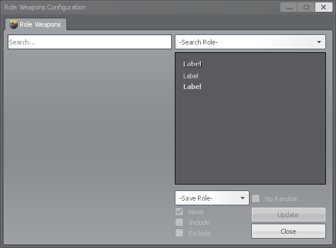

# Configurations

## Table of Contents
1. [Server Configurations](#Server-Configurations)
1. [Client Configurations](#Client-Configurations)
1. [Role Weapon Shop](#Role-Weapon-Shop)
   1. [Configuration by UI](#Configuration-by-UI)
       1. [Explanation](#Explanation)
       1. [Example](#Example)
   1. [Configuration by Files](#Configuration-by-Files)
       1. [Weapons](#Weapons)
          1. [Adding Weapons](#Adding-Weapons)
          1. [Removing Weapons](#Removing-Weapons)
          1. [Bypassing Weapon Randomization](#Bypassing-Weapon-Randomization)
          1. [Finding a Weapon's Class](#Finding-a-Weapons-Class)
       1. [Equipment](#Equipment)
          1. [Adding Equipment](#Adding-Equipment)
          1. [Removing Equipment](#Removing-Equipment)
          1. [Finding an Equipment Item's Name](#Finding-an-Equipment-Items-Name)
1. [Renaming Roles](#Renaming-Roles)

## Server Configurations

See below for the full list of convars that are added or modified by Custom Roles for TTT. For default TTT settings, see [here](https://www.troubleinterroristtown.com/config/settings/).

Add any of the following that you want to change to your server.cfg (for dedicated servers) or listenserver.cfg (for peer-to-peer servers) in the cfg folder of your Garry's Mod install:

```cpp
// ----------------------------------------
// Custom Role Settings
// ----------------------------------------

// ROLE SPAWN REQUIREMENTS
ttt_traitor_pct                             0.25    // Percentage of players, rounded up, that can spawn as a traitor or "special traitor"
ttt_traitor_max                             32      // The maximum number of players that can spawn as a traitor or "special traitor"
ttt_detective_pct                           0.13    // Percentage of players, rounded up, that can spawn as a detective role
ttt_detective_max                           32      // The maximum number of players that can spawn as a detective role
ttt_detective_min_players                   8       // The minimum number of players required to spawn a detective role
ttt_detective_karma_min                     600     // The minimum amount of karma required for a player to be selected to spawn as a detective role
ttt_special_traitor_pct                     0.33    // Percentage of traitors, rounded up, that can spawn as a "special traitor" (e.g. hypnotist, impersonator, etc.)
ttt_special_traitor_chance                  0.5     // The chance that a "special traitor" will spawn in each available slot made by "ttt_special_traitor_pct"
ttt_special_innocent_pct                    0.33    // Percentage of innocents, rounded up, that can spawn as a "special innocent" (e.g. glitch, phantom, etc.)
ttt_special_innocent_chance                 0.5     // The chance that a "special innocent" will spawn in each available slot made by "ttt_special_innocent_pct"
ttt_special_detective_pct                   0.33    // Percentage of detectives, rounded up, that can spawn as a "special detectives" (e.g. paladin, tracker, etc.)
ttt_special_detective_chance                0.5     // The chance that a "special detectives" will spawn in each available slot made by "ttt_special_detectives_pct"
ttt_monster_max                             1       // The maximum number of players that can spawn as a "monster" (e.g. zombie, vampire)
ttt_monster_pct                             0.33    // Percentage of innocents, rounded up, that can spawn as a "monster" (e.g. zombie, vampire)
ttt_monster_chance                          0.5     // The chance that a "monster" will spawn in each available slot made by "ttt_monster_pct"
ttt_independent_chance                      0.5     // The chance that a single independent (or jester if ttt_single_jester_independent is enabled) will spawn in a round. Only used if ttt_multiple_jesters_independents is disabled
ttt_jester_chance                           0.5     // The chance that a single jester will spawn in a round. Only used if ttt_single_jester_independent and ttt_multiple_jesters_independents are disabled
ttt_multiple_jesters_independents           0       // Whether more than one jester/independent should be allowed to spawn in each round. Enabling this will ignore ttt_independent_chance, ttt_jester_chance, ttt_single_jester_independent, and ttt_single_jester_independent_max_players
ttt_jester_independent_pct                  0.13    // Percentage of players, rounded up, that can spawn as a jester or independent. Only used if ttt_multiple_jesters_independents is enabled
ttt_jester_independent_max                  2       // The maximum number of players that can spawn as a jester or independent. Only used if ttt_multiple_jesters_independents is enabled
ttt_jester_independent_chance               0.5     // The chance that a jester or independent will spawn in a round. Only used if ttt_multiple_jesters_independents is enabled
// (Note: Only one independent or jester can spawn per round by default.)

// Enable/Disable Individual Roles
ttt_hypnotist_enabled                       0       // Whether or not the hypnotist should spawn
ttt_impersonator_enabled                    0       // Whether or not the impersonator should spawn
ttt_assassin_enabled                        0       // Whether or not the assassin should spawn
ttt_vampire_enabled                         0       // Whether or not the vampire should spawn
ttt_quack_enabled                           0       // Whether or not the quack should spawn
ttt_parasite_enabled                        0       // Whether or not the parasite should spawn
ttt_informant_enabled                       0       // Whether or not the informant should spawn
ttt_spy_enabled                             0       // Whether or not the spy should spawn
ttt_glitch_enabled                          0       // Whether or not the glitch should spawn
ttt_phantom_enabled                         0       // Whether or not the phantom should spawn
ttt_revenger_enabled                        0       // Whether or not the revenger should spawn
ttt_deputy_enabled                          0       // Whether or not the deputy should spawn
ttt_mercenary_enabled                       0       // Whether or not the mercenary should spawn
ttt_veteran_enabled                         0       // Whether or not the veteran should spawn
ttt_doctor_enabled                          0       // Whether or not the doctor should spawn
ttt_trickster_enabled                       0       // Whether or not the trickster should spawn
ttt_paramedic_enabled                       0       // Whether or not the paramedic should spawn
ttt_turncoat_enabled                        0       // Whether or not the turncoat should spawn
ttt_infected_enabled                        0       // Whether or not the infected should spawn
ttt_vindicator_enabled                      0       // Whether or not the vindicator should spawn
ttt_paladin_enabled                         0       // Whether or not the paladin should spawn
ttt_tracker_enabled                         0       // Whether or not the tracker should spawn
ttt_medium_enabled                          0       // Whether or not the medium should spawn
ttt_sapper_enabled                          0       // Whether or not the sapper should spawn
ttt_marshal_enabled                         0       // Whether or not the marshal should spawn
ttt_quartermaster_enabled                   0       // Whether or not the quartermaster should spawn
ttt_jester_enabled                          0       // Whether or not the jester should spawn
ttt_swapper_enabled                         0       // Whether or not the swapper should spawn
ttt_clown_enabled                           0       // Whether or not the clown should spawn
ttt_beggar_enabled                          0       // Whether or not the beggar should spawn
ttt_bodysnatcher_enabled                    0       // Whether or not the bodysnatcher should spawn
ttt_lootgoblin_enabled                      0       // Whether or not the loot goblin should spawn
ttt_cupid_enabled                           0       // Whether or not the cupid should spawn
ttt_sponge_enabled                          0       // Whether or not the sponge should spawn
ttt_guesser_enabled                         0       // Whether or not the guesser should spawn
ttt_drunk_enabled                           0       // Whether or not the drunk should spawn
ttt_oldman_enabled                          0       // Whether or not the old man should spawn
ttt_killer_enabled                          0       // Whether or not the killer should spawn
ttt_zombie_enabled                          0       // Whether or not the zombie should spawn
ttt_madscientist_enabled                    0       // Whether or not the mad scientist should spawn
ttt_shadow_enabled                          0       // Whether or not the shadow should spawn
ttt_arsonist_enabled                        0       // Whether or not the arsonist should spawn
ttt_hivemind_enabled                        0       // Whether or not the hive mind should spawn

// Individual Role Spawn Weights
ttt_hypnotist_spawn_weight                  1       // The weight assigned to spawning the hypnotist
ttt_impersonator_spawn_weight               1       // The weight assigned to spawning the impersonator
ttt_assassin_spawn_weight                   1       // The weight assigned to spawning the assassin
ttt_vampire_spawn_weight                    1       // The weight assigned to spawning the vampire
ttt_quack_spawn_weight                      1       // The weight assigned to spawning the quack
ttt_parasite_spawn_weight                   1       // The weight assigned to spawning the parasite
ttt_informant_spawn_weight                  1       // The weight assigned to spawning the informant
ttt_spy_spawn_weight                        1       // The weight assigned to spawning the spy
ttt_glitch_spawn_weight                     1       // The weight assigned to spawning the glitch
ttt_phantom_spawn_weight                    1       // The weight assigned to spawning the phantom
ttt_revenger_spawn_weight                   1       // The weight assigned to spawning the revenger
ttt_deputy_spawn_weight                     1       // The weight assigned to spawning the deputy
ttt_mercenary_spawn_weight                  1       // The weight assigned to spawning the mercenary
ttt_veteran_spawn_weight                    1       // The weight assigned to spawning the veteran
ttt_doctor_spawn_weight                     1       // The weight assigned to spawning the doctor
ttt_trickster_spawn_weight                  1       // The weight assigned to spawning the trickster
ttt_paramedic_spawn_weight                  1       // The weight assigned to spawning the paramedic
ttt_turncoat_spawn_weight                   1       // The weight assigned to spawning the turncoat
ttt_infected_spawn_weight                   1       // The weight assigned to spawning the infected
ttt_vindicator_spawn_weight                 1       // The weight assigned to spawning the vindicator
ttt_paladin_spawn_weight                    1       // The weight assigned to spawning the paladin
ttt_tracker_spawn_weight                    1       // The weight assigned to spawning the tracker
ttt_medium_spawn_weight                     1       // The weight assigned to spawning the medium
ttt_sapper_spawn_weight                     1       // The weight assigned to spawning the sapper
ttt_marshal_spawn_weight                    1       // The weight assigned to spawning the marshal
ttt_quartermaster_spawn_weight              1       // The weight assigned to spawning the quartermaster
ttt_jester_spawn_weight                     1       // The weight assigned to spawning the jester
ttt_swapper_spawn_weight                    1       // The weight assigned to spawning the swapper
ttt_clown_spawn_weight                      1       // The weight assigned to spawning the clown
ttt_beggar_spawn_weight                     1       // The weight assigned to spawning the beggar
ttt_bodysnatcher_spawn_weight               1       // The weight assigned to spawning the bodysnatcher
ttt_lootgoblin_spawn_weight                 1       // The weight assigned to spawning the loot goblin
ttt_cupid_spawn_weight                      1       // The weight assigned to spawning the cupid
ttt_sponge_spawn_weight                     1       // The weight assigned to spawning the sponge
ttt_guesser_spawn_weight                    1       // The weight assigned to spawning the guesser
ttt_drunk_spawn_weight                      1       // The weight assigned to spawning the drunk
ttt_oldman_spawn_weight                     1       // The weight assigned to spawning the old man
ttt_killer_spawn_weight                     1       // The weight assigned to spawning the killer
ttt_zombie_spawn_weight                     1       // The weight assigned to spawning the zombie
ttt_madscientist_spawn_weight               1       // The weight assigned to spawning the mad scientist
ttt_shadow_spawn_weight                     1       // The weight assigned to spawning the shadow
ttt_arsonist_spawn_weight                   1       // The weight assigned to spawning the arsonist
ttt_hivemind_spawn_weight                   1       // The weight assigned to spawning the hive mind

// (Note: Each role is limited to one player per round.)

// Individual Role Minimum Player Requirements
ttt_hypnotist_min_players                   0       // The minimum number of players required to spawn the hypnotist
ttt_impersonator_min_players                0       // The minimum number of players required to spawn the impersonator
ttt_assassin_min_players                    0       // The minimum number of players required to spawn the assassin
ttt_vampire_min_players                     0       // The minimum number of players required to spawn the vampire
ttt_quack_min_players                       0       // The minimum number of players required to spawn the quack
ttt_parasite_min_players                    0       // The minimum number of players required to spawn the parasite
ttt_informant_min_players                   0       // The minimum number of players required to spawn the informant
ttt_spy_min_players                         0       // The minimum number of players required to spawn the spy
ttt_glitch_min_players                      0       // The minimum number of players required to spawn the glitch
ttt_phantom_min_players                     0       // The minimum number of players required to spawn the phantom
ttt_revenger_min_players                    0       // The minimum number of players required to spawn the revenger
ttt_deputy_min_players                      0       // The minimum number of players required to spawn the deputy
ttt_mercenary_min_players                   0       // The minimum number of players required to spawn the mercenary
ttt_veteran_min_players                     0       // The minimum number of players required to spawn the veteran
ttt_doctor_min_players                      0       // The minimum number of players required to spawn the doctor
ttt_trickster_min_players                   0       // The minimum number of players required to spawn the trickster
ttt_paramedic_min_players                   0       // The minimum number of players required to spawn the paramedic
ttt_turncoat_min_players                    0       // The minimum number of players required to spawn the turncoat
ttt_infected_min_players                    0       // The minimum number of players required to spawn the infected
ttt_vindicator_min_players                  0       // The minimum number of players required to spawn the vindicator
ttt_paladin_min_players                     0       // The minimum number of players required to spawn the paladin
ttt_tracker_min_players                     0       // The minimum number of players required to spawn the tracker
ttt_medium_min_players                      0       // The minimum number of players required to spawn the medium
ttt_sapper_min_players                      0       // The minimum number of players required to spawn the sapper
ttt_marshal_min_players                     0       // The minimum number of players required to spawn the marshal
ttt_quartermaster_min_players               0       // The minimum number of players required to spawn the quartermaster
ttt_jester_min_players                      0       // The minimum number of players required to spawn the jester
ttt_swapper_min_players                     0       // The minimum number of players required to spawn the swapper
ttt_clown_min_players                       0       // The minimum number of players required to spawn the clown
ttt_beggar_min_players                      0       // The minimum number of players required to spawn the beggar
ttt_bodysnatcher_min_players                0       // The minimum number of players required to spawn the bodysnatcher
ttt_lootgoblin_min_players                  0       // The minimum number of players required to spawn the loot goblin
ttt_cupid_min_players                       0       // The minimum number of players required to spawn the cupid
ttt_sponge_min_players                      0       // The minimum number of players required to spawn the sponge
ttt_guesser_min_players                     0       // The minimum number of players required to spawn the guesser
ttt_drunk_min_players                       0       // The minimum number of players required to spawn the drunk
ttt_oldman_min_players                      0       // The minimum number of players required to spawn the old man
ttt_killer_min_players                      0       // The minimum number of players required to spawn the killer
ttt_zombie_min_players                      0       // The minimum number of players required to spawn the zombie
ttt_madscientist_min_players                0       // The minimum number of players required to spawn the mad scientist
ttt_shadow_min_players                      0       // The minimum number of players required to spawn the shadow
ttt_arsonist_min_players                    0       // The minimum number of players required to spawn the arsonist
ttt_hivemind_min_players                    0       // The minimum number of players required to spawn the hive mind

// ----------------------------------------

// TRAITOR TEAM SETTINGS
ttt_traitors_vision_enabled                 0       // Whether members of the traitor team can see other members of the traitor team (including Glitches) through walls via a highlight effect
ttt_traitors_credits_timer                  0       // How often in seconds to give members of the traitor team a credit (set to 0 to disable)

// Traitor
ttt_traitor_phantom_cure                    0       // Whether to allow the traitor to buy the phantom exorcism device which can remove a haunting phantom. Server must be restarted for changes to take effect

// Impersonator
ttt_impersonator_damage_penalty             0       // Damage penalty that the impersonator has before being promoted (e.g. 0.5 = 50% less damage)
ttt_impersonator_credits_starting           1       // The number of credits an impersonator should start with
ttt_impersonator_use_detective_icon         1       // Whether a promoted impersonator should show the detective icon over their head instead of the impersonator icon (only for traitors, non-traitors will use the equivalent deputy setting)
ttt_impersonator_without_detective          0       // Whether an impersonator can spawn without a detective in the round. Will automatically promote the impersonator when they spawn
ttt_impersonator_activation_credits         0       // The number of credits to give the impersonator when they are activated
ttt_impersonator_detective_chance           0       // The chance that a detective will spawn as a promoted impersonator instead (e.g. 0.5 = 50% chance)
ttt_single_deputy_impersonator              0       // Whether only a single deputy or impersonator should spawn in a round
ttt_single_deputy_impersonator_chance       0.5     // The chance that a deputy should have an opportunity to spawn instead of an impersonator (e.g. 0.7 = 70% chance for deputy, 30% chance for impersonator. Only applies if ttt_single_deputy_impersonator is enabled)
ttt_deputy_impersonator_promote_any_death   0       // Whether deputy/impersonator should be promoted when any detective dies rather than only after all detectives have died
ttt_deputy_impersonator_start_promoted      0       // Whether deputy/impersonator should start the round promoted

// Hypnotist
ttt_hypnotist_credits_starting              1       // The number of credits a hypnotist should start with
ttt_hypnotist_device_loadout                1       // Whether the hypnotist's defib should be given to them when they spawn. Server must be restarted for changes to take effect
ttt_hypnotist_device_shop                   0       // Whether the hypnotist's defib should be purchasable in the shop. Server must be restarted for changes to take effect
ttt_hypnotist_device_shop_rebuyable         0       // Whether the hypnotist's defib should be purchaseable multiple times (requires "ttt_hypnotist_device_shop" to be enabled). Server must be restarted for changes to take effect
ttt_hypnotist_convert_detectives            0       // Whether to convert detectives and deputies (only if ttt_deputy_use_detective_icon is enabled) to impersonator instead of just a regular traitor. Target will be automatically promoted to appear as a detective if appropriate
ttt_hypnotist_device_time                   8       // The amount of time (in seconds) the hypnotist's device takes to use
ttt_single_paramedic_hypnotist              0       // Whether only a single paramedic or hypnotist should spawn in a round
ttt_single_paramedic_hypnotist_chance       0.5     // The chance that a paramedic should have an opportunity to spawn instead of a hypnotist (e.g. 0.7 = 70% chance for paramedic, 30% chance for hypnotist. Only applies if ttt_single_paramedic_hypnotist is enabled)

// Assassin
ttt_assassin_show_target_icon               0       // Whether assassins have an icon over their target's heads showing who to kill. Server or round must be restarted for changes to take effect
ttt_assassin_target_vision_enabled          0       // Whether assassins have a visible aura around their target, visible through walls
ttt_assassin_next_target_delay              5       // The delay (in seconds) before an assassin is assigned their next target
ttt_assassin_target_damage_bonus            1       // Damage bonus that the assassin has against their target (e.g. 0.5 = 50% extra damage)
ttt_assassin_target_bonus_bought            1       // Whether the damage bonus that the assassin has against their target should apply on weapons bought from the shop
ttt_assassin_wrong_damage_penalty           0.5     // Damage penalty that the assassin has when attacking someone who is not their target (e.g. 0.5 = 50% less damage)
ttt_assassin_failed_damage_penalty          0.5     // Damage penalty that the assassin has after they have failed their contract by killing the wrong person (e.g. 0.5 = 50% less damage)
ttt_assassin_shop_roles_last                0       // Whether the assassin should target the shop roles right before Detective or not
ttt_assassin_credits_starting               1       // The number of credits an assassin should start with
ttt_assassin_allow_lootgoblin_kill          1       // Whether the assassin can kill a loot goblin without penalty, even if it is not their target
ttt_assassin_allow_zombie_kill              1       // Whether the assassin can kill a zombie without penalty, even if it is not their target
ttt_assassin_allow_vampire_kill             1       // Whether the assassin can kill a vampire without penalty, even if it is not their target

// Vampire
ttt_vampire_is_monster                      0       // Whether vampires should be treated as members of the monster team (rather than the traitor team)
ttt_vampire_is_independent                  0       // Whether vampires should be treated as members of the independent team (rather than the traitor team)
ttt_vampire_vision_enabled                  0       // Whether vampires have their special vision highlights enabled
ttt_vampire_drain_enabled                   1       // Whether vampires have the ability to drain a living target's blood using their fangs
ttt_vampire_drain_first                     0       // Whether vampires should drain a living target's blood first rather than converting first
ttt_vampire_drain_credits                   0       // How many credits a vampire should get for draining a living target
ttt_vampire_drain_mute_target               0       // Whether players being drained by a vampire should be muted
ttt_vampire_convert_enabled                 0       // Whether vampires have the ability to convert living targets to a vampire thrall using their fangs
ttt_vampire_show_target_icon                0       // Whether vampires have an icon over other players' heads showing who to kill. Server or round must be restarted for changes to take effect.
ttt_vampire_damage_reduction                0       // The fraction an attacker's bullet damage will be reduced by when they are shooting a vampire
ttt_vampire_fang_timer                      5       // The amount of time fangs must be used to fully drain a target's blood
ttt_vampire_fang_dead_timer                 0       // The amount of time fangs must be used to fully drain a dead target's blood. Set to 0 to use the same time as "ttt_vampire_fang_timer"
ttt_vampire_fang_heal                       50      // The amount of health a vVampire will heal by when they fully drain a target's blood
ttt_vampire_fang_overheal                   25      // The amount over the vampire's normal maximum health (e.g. 100 + this ConVar) that the vampire can heal to by drinking blood.
ttt_vampire_fang_overheal_living            -1      // The amount of overheal (see "ttt_vampire_fang_overheal") to give if the vampire's target is living. Set to -1 to use the same amount as "ttt_vampire_fang_overheal" instead
ttt_vampire_fang_unfreeze_delay             2       // The number of seconds before players who were frozen in place by the fangs should be released if the vampire stops using the fangs on them
ttt_vampire_prime_death_mode                0       // What to do when the prime vampire(s) (e.g. players who spawn as vampires originally) are killed. 0 - Do nothing. 1 - Kill all vampire thralls (non-prime vampires). 2 - Revert all vampire thralls (non-prime vampires) to their original role
ttt_vampire_prime_only_convert              1       // Whether only prime vampires (e.g. players who spawn as vampire originally) are allowed to convert other players
ttt_vampire_kill_credits                    1       // Whether the vampire receives credits when they kill another player. (Only applies when ttt_vampire_is_independent and ttt_vampire_is_monster are both disabled)
ttt_vampire_credits_award_pct               0.35    // When this percentage of the innocent players are dead, vampires are awarded more credits. (Only applies when ttt_vampire_is_monster or ttt_vampire_is_independent is enabled)
ttt_vampire_credits_award_size              1       // The number of credits awarded. (Only applies when ttt_vampire_is_monster or ttt_vampire_is_independent is enabled)
ttt_vampire_credits_award_repeat            1       // Whether the credit award is handed out multiple times. if for example you set the percentage to 0.25, and enable this, vampires will be awarded credits at 25% killed, 50% killed, and 75% killed. (Only applies when ttt_vampire_is_monster or ttt_vampire_is_independent is enabled)
ttt_vampire_loot_credits                    1       // Whether the vampire can loot credits from a dead player
ttt_vampire_prime_friendly_fire             0       // How to handle friendly fire damage to the prime vampire(s) from their thralls. 0 - Do nothing. 1 - Reflect damage back to the attacker (non-prime vampire). 2 - Negate damage to the prime vampire.
ttt_vampire_credits_starting                1       // The number of credits a vampire should start with
ttt_vampire_can_see_jesters                 1       // Whether jesters are revealed (via head icons, color/icon on the scoreboard, etc.) to vampires (Only applies if ttt_vampire_is_independent is enabled)
ttt_vampire_update_scoreboard               1       // Whether vampires show dead players as missing in action (Only applies if ttt_vampire_is_independent is enabled)

// Quack
ttt_quack_credits_starting                  1       // The number of credits a quack should start with
ttt_quack_fake_cure_mode                    0       // How to handle using a fake parasite cure on someone who is not infected. 0 - Kill nobody (But use up the cure), 1 - Kill the person who uses the cure, 2 - Kill the person the cure is used on
ttt_quack_fake_cure_time                    -1      // The amount of time (in seconds) the fake parasite cure takes to use. If set to -1, the ttt_parasite_cure_time value will be used instead
ttt_quack_phantom_cure                      0       // Whether to allow the quack to buy the phantom exorcism device which can remove a haunting phantom. Server must be restarted for changes to take effect
ttt_quack_station_bomb                      0       // Whether the quack should be able to buy a device which converts a health station to a bomb station
ttt_quack_station_bomb_time                 4       // The amount of time (in seconds) the station bomb takes to plant
ttt_single_doctor_quack                     0       // Whether only a single doctor or quack should spawn in a round
ttt_single_doctor_quack_chance              0.5     // The chance that a doctor should have an opportunity to spawn instead of a quack (e.g. 0.7 = 70% chance for doctor, 30% chance for quack. Only applies if ttt_single_doctor_quack is enabled)

// Parasite
ttt_parasite_is_monster                     0       // Whether the parasite should be treated as a member of the monster team (rather than the traitor team)
ttt_parasite_infection_time                 45      // The time it takes in seconds for the parasite to fully infect someone
ttt_parasite_infection_warning_time         0       // The time in seconds after infection to warn the victim with an ambiguous message. Set to 0 to disable.
ttt_parasite_infection_transfer             0       // Whether the parasite's infection will transfer if the parasite's killer is killed by another player
ttt_parasite_infection_transfer_reset       1       // Whether the parasite's infection progress will reset if their infection is transferred to another player
ttt_parasite_infection_suicide_mode         0       // The way to handle when a player infected by the parasite kills themselves. 0 - Do nothing. 1 - Respawn the parasite. 2 - Respawn the parasite ONLY IF the infected player killed themselves with a console command like "kill"
ttt_parasite_respawn_mode                   0       // The way in which the parasite respawns. 0 - Take over host. 1 - Respawn at the parasite's body. 2 - Respawn at a random location.
ttt_parasite_respawn_health                 100     // The health on which the parasite respawns
ttt_parasite_announce_infection             0       // Whether players are notified immediately when they are infected with the parasite
ttt_parasite_cure_mode                      2       // How to handle using a parasite cure on someone who is not infected. 0 - Kill nobody (But use up the cure), 1 - Kill the person who uses the cure, 2 - Kill the person the cure is used on
ttt_parasite_cure_time                      3       // The amount of time (in seconds) the parasite cure takes to use
ttt_parasite_infection_saves_lover          1       // Whether the parasite's lover should survive if the parasite is infecting a player
ttt_parasite_credits_starting               1       // The number of credits a parasite should start with
ttt_single_phantom_parasite                 0       // Whether only a single phantom or parasite should spawn in a round
ttt_single_phantom_parasite_chance          0.5     // The chance that a phantom should have an opportunity to spawn instead of a parasite (e.g. 0.7 = 70% chance for phantom, 30% chance for parasite. Only applies if ttt_single_phantom_parasite is enabled)

// Informant
ttt_informant_share_scans                   1       // Whether the informant should automatically share their information with fellow traitors or not
ttt_informant_can_scan_jesters              0       // Whether the informant should be able to scan jesters
ttt_informant_can_scan_glitches             0       // Whether the informant should be able to scan glitches
ttt_informant_requires_scanner              0       // Whether the informant needs to hold the scanner item to be able to scan players
ttt_informant_scanner_time                  8       // The amount of time (in seconds) the informant's scanner takes to use
ttt_informant_scanner_float_time            1       // The amount of time (in seconds) it takes for the informant's scanner to lose it's target without line of sight
ttt_informant_scanner_cooldown              3       // The amount of time (in seconds) the informant's tracker goes on cooldown for after losing it's target
ttt_informant_scanner_distance              2500    // The maximum distance away the scanner target can be

// Spy
ttt_spy_steal_model                         1       // Whether the spy should change to the victim's playermodel after killing a player
ttt_spy_steal_model_hands                   1       // Whether the spy should change to the victim's playermodel's 1st-person hands after killing a player
ttt_spy_steal_model_alert                   1       // Whether the spy should see an alert message displaying who they are disguised as after killing a player
ttt_spy_steal_name                          1       // Whether the spy should change to the victim's name after killing a player (When other players look at the spy and see their info under the crosshair)
ttt_spy_flare_gun_loadout                   1       // Whether the spy should have a flare gun given to them when they spawn. Server must be restarted for changes to take effect
ttt_spy_flare_gun_shop                      0       // Whether the spy should have a flare gun be purchasable in the shop. Server must be restarted for changes to take effect
ttt_spy_flare_gun_shop_rebuyable            0       // Whether the spy should be able to purchase the flare gun multiple times (requires "ttt_spy_flare_gun_shop" to be enabled). Server must be restarted for changes to take effect

// ----------------------------------------

// INNOCENT TEAM SETTINGS
// Glitch
ttt_glitch_mode                             0       // The way in which the glitch appears to traitors. 0 - Appears as a regular traitor. 1 - Can appear as a special traitor. 2 - Causes all traitors, regular or special, to appear as regular traitors and appears as a regular traitor themselves.
ttt_glitch_use_traps                        0       // Whether glitches can see and use traitor traps. This also allows them to loot credits for traps that require them.

// Phantom
ttt_phantom_respawn_health                  50      // The amount of health a phantom will respawn with
ttt_phantom_weaker_each_respawn             0       // Whether a phantom respawns weaker (1/2 as much HP) each time they respawn, down to a minimum of 1
ttt_phantom_announce_death                  0       // Whether to announce to detectives (and promoted deputies and impersonators) that a phantom has been killed or respawned
ttt_phantom_killer_smoke                    0       // Whether to show smoke on the player who killed the phantom
ttt_phantom_killer_footstep_time            0       // The amount of time a phantom's killer's footsteps should show before fading. Set to 0 to disable
ttt_phantom_killer_haunt                    1       // Whether to have the phantom haunt their killer
ttt_phantom_killer_haunt_power_max          100     // The maximum amount of power a phantom can have when haunting their killer
ttt_phantom_killer_haunt_power_rate         10      // The amount of power to regain per second when a phantom is haunting their killer
ttt_phantom_killer_haunt_power_starting     0       // The amount of power to the phantom starts with
ttt_phantom_killer_haunt_move_cost          25      // The amount of power to spend when a phantom is moving their killer via a haunting. Set to 0 to disable
ttt_phantom_killer_haunt_jump_cost          50      // The amount of power to spend when a phantom is making their killer jump via a haunting. Set to 0 to disable
ttt_phantom_killer_haunt_drop_cost          75      // The amount of power to spend when a phantom is making their killer drop their weapon via a haunting. Set to 0 to disable
ttt_phantom_killer_haunt_attack_cost        100     // The amount of power to spend when a phantom is making their killer attack via a haunting. Set to 0 to disable
ttt_phantom_killer_haunt_without_body       1       // Whether the phantom can use their powers after their body is destroyed
ttt_phantom_cure_time                       3       // The amount of time (in seconds) the phantom exorcism device takes to use. See "ttt_traitor_phantom_cure" and "ttt_quack_phantom_cure" to enable the device itself
ttt_phantom_haunt_saves_lover               1       // Whether the phantom's lover should survive if the phantom is haunting a player

// Revenger
ttt_revenger_radar_timer                    15      // The amount of time between radar pings for the revenger's lover's killer
ttt_revenger_damage_bonus                   0       // Extra damage that the revenger deals to their lover's killer (e.g. 0.5 = 50% extra damage)
ttt_revenger_drain_health_to                -1      // The amount of health to drain the revenger down to after their lover has died. Setting to 0 will kill them. Set to -1 to disable
ttt_revenger_drain_health_rate              3       // How often, in seconds, health will be drained from a revenger whose lover has died

// Deputy
ttt_deputy_damage_penalty                   0       // Damage penalty that the deputy has before being promoted (e.g. 0.5 = 50% less damage)
ttt_deputy_credits_starting                 0       // The number of credits a deputy should start with
ttt_deputy_use_detective_icon               1       // Whether a promoted deputy should show the detective icon over their head instead of the deputy icon
ttt_deputy_without_detective                0       // Whether a deputy can spawn without a detective in the round. Will automatically promote the deputy when they spawn
ttt_deputy_shop_active_only                 1       // Whether the deputy's shop should be available only after they activate
ttt_deputy_shop_delay                       0       // Whether the deputy's purchased shop items should be held until they activate
ttt_deputy_activation_credits               0       // The number of credits to give the deputy when they are activated

// Mercenary
ttt_mercenary_credits_starting              1       // The number of credits a mercenary should start with

// Veteran
ttt_veteran_damage_bonus                    0.5     // Damage bonus that the veteran has when they are the last innocent alive (e.g. 0.5 = 50% more damage)
ttt_veteran_full_heal                       1       // Whether the veteran gets a full heal upon becoming the last remaining innocent or not
ttt_veteran_heal_bonus                      0       // The amount of bonus health to give the veteran when they are healed as the last remaining innocent
ttt_veteran_announce                        0       // Whether to announce to all other living players when the veteran is the last remaining innocent
ttt_veteran_shop_active_only                1       // Whether the veteran's shop should be available only after they activate
ttt_veteran_shop_delay                      0       // Whether the veteran's purchased shop items should be held until they activate
ttt_veteran_activation_credits              0       // The number of credits to give the veteran when they are activated

// Doctor
ttt_doctor_credits_starting                 1       // The number of credits a doctor should start with

// Paramedic
ttt_paramedic_defib_as_innocent             0       // Whether the paramedic's defib brings back everyone as a vanilla innocent role
ttt_paramedic_device_loadout                1       // Whether the paramedic's defib should be given to them when they spawn. Server must be restarted for changes to take effect
ttt_paramedic_device_shop                   0       // Whether the paramedic's defib should be purchasable in the shop (requires "ttt_shop_for_all" to be enabled). Server must be restarted for changes to take effect
ttt_paramedic_device_shop_rebuyable         0       // Whether the paramedic's defib should be purchaseable multiple times (requires "ttt_paramedic_device_shop" to be enabled). Server must be restarted for changes to take effect
ttt_paramedic_defib_time                    8       // The amount of time (in seconds) the paramedic's defib takes to use

// Trickster
ttt_trickster_credits_starting              0       // The number of credits a trickster should start with

// Turncoat
ttt_turncoat_change_health                  10      // The amount of health to set the turncoat to when they change teams
ttt_turncoat_change_max_health              1       // Whether to change the turncoat's max health when they change teams
ttt_turncoat_change_innocent_kill           0       // Whether to change the turncoat's team when they kill a member of the innocent team

// Infected
ttt_infected_succumb_time                   180     // Time in seconds for the infected to succumb to their disease
ttt_infected_full_health                    1       // Whether the infected's health is refilled when they become a zombie
ttt_infected_prime                          1       // Whether the infected will become a prime zombie
ttt_infected_respawn_enabled                0       // Whether the infected will respawn as a zombie when killed
ttt_infected_show_icon                      1       // Whether to show the infected icon over their head for zombies and zombie allies
ttt_infected_cough_enabled                  1       // Whether the infected coughs periodically
ttt_infected_cough_timer_min                30      // The minimum time between infected coughs
ttt_infected_cough_timer_max                60      // The maximum time between infected coughs

// Vindicator
ttt_vindicator_respawn_delay                5       // Delay between the vindicator dying and respawning in seconds
ttt_vindicator_respawn_health               100     // The amount of health a vindicator will respawn with
ttt_vindicator_announcement_mode            1       // Who is notified when the vindicator respawns (0: No one, 1: The vindicator's killer, 2: Everyone)
ttt_vindicator_prevent_revival              0       // Whether the vindicator should be killed if they are revived after having died due to failing or succeeding in killing their target
ttt_vindicator_target_suicide_success       1       // Whether the vindicator's killer killing themselves should count as a win for the vindicator
ttt_vindicator_kill_on_fail                 1       // Whether the vindicator should be killed if they fail to kill their target
ttt_vindicator_kill_on_success              0       // Whether the vindicator should be killed after they kill their target
ttt_vindicator_can_see_jesters              0       // Whether jesters are revealed (via head icons, color/icon on the scoreboard, etc.) to vindicators when they are on the independent team
ttt_vindicator_update_scoreboard            0       // Whether vindicators show dead players as missing in action when they are on the independent team


// ----------------------------------------

// DETECTIVE TEAM SETTINGS
// All Detective Roles
ttt_detectives_search_only                  1       // Whether only detectives can search bodies or not
ttt_detectives_search_only_c4               0       // Whether only detectives can reveal a body's C4 disarm code. Once a detective searches a body, this information will be available to all players. Ignored when "ttt_detectives_search_only" is enabled.
ttt_detectives_search_only_dmg              0       // Whether only detectives can reveal the type of damage used to kill a body. Once a detective searches a body, this information will be available to all players. Ignored when "ttt_detectives_search_only" is enabled.
ttt_detectives_search_only_dtime            0       // Whether only detectives can reveal a body's death time. Once a detective searches a body, this information will be available to all players. Ignored when "ttt_detectives_search_only" is enabled.
ttt_detectives_search_only_equipment        0       // Whether only detectives can reveal a body's equipment. Once a detective searches a body, this information will be available to all players. Ignored when "ttt_detectives_search_only" is enabled.
ttt_detectives_search_only_head             0       // Whether only detectives can reveal whether a body was killed by a head shot. Once a detective searches a body, this information will be available to all players. Ignored when "ttt_detectives_search_only" is enabled.
ttt_detectives_search_only_kills            0       // Whether only detectives can reveal a body's kills. Once a detective searches a body, this information will be available to all players. Ignored when "ttt_detectives_search_only" is enabled.
ttt_detectives_search_only_lastid           0       // Whether only detectives can reveal the last player a body saw before death. Once a detective searches a body, this information will be available to all players. Ignored when "ttt_detectives_search_only" is enabled.
ttt_detectives_search_only_nick             0       // Whether only detectives can reveal a body's name. Once a detective searches a body, this information will be available to all players. Ignored when "ttt_detectives_search_only" is enabled.
ttt_detectives_search_only_role             0       // Whether only detectives can reveal a body's role. Once a detective searches a body, this information will be available to all players. Ignored when "ttt_detectives_search_only" is enabled.
ttt_detectives_search_only_team             0       // Whether only detectives can reveal a body's tea,. Once a detective searches a body, this information will be available to all players. Ignored when "ttt_detectives_search_only" is enabled or "ttt_detectives_search_only_role" is disabled.
ttt_detectives_search_only_stime            0       // Whether only detectives can reveal a body's DNA decay time. Once a detective searches a body, this information will be available to all players. Ignored when "ttt_detectives_search_only" is enabled.
ttt_detectives_search_only_wep              0       // Whether only detectives can reveal the weapon used to kill a body. Once a detective searches a body, this information will be available to all players. Ignored when "ttt_detectives_search_only" is enabled.
ttt_detectives_search_only_words            0       // Whether only detectives can reveal a body's last words (if last words is enabled). Once a detective searches a body, this information will be available to all players. Ignored when "ttt_detectives_search_only" is enabled.
ttt_detectives_disable_looting              0       // Whether to disable a detective role's ability to loot credits from bodies
ttt_detectives_hide_special_mode            0       // How to handle special detective role information. 0 - Show the special detective's role to everyone. 1 - Hide the special detective's role from everyone (just show detective instead). 2 - Hide the special detective's role for everyone but themselves (only they can see their true role)
ttt_detectives_glow_enabled                 0       // Whether members of the detective team (and active detective-like players) can be seen through walls via a highlight effect
ttt_special_detectives_armor_loadout        1       // Whether special detectives (all detective roles other than the original detective itself) get armor automatically for free
ttt_all_search_postround                    1       // Whether non-detectives can search bodies post-round or not
ttt_all_search_binoc                        0       // Whether non-detectives can search bodies if they are using binoculars
ttt_detectives_credits_timer                0       // How often in seconds to give members of the detective team a credit (set to 0 to disable)

// Paladin
ttt_paladin_aura_radius                     5       // The radius of the paladin's aura in meters
ttt_paladin_damage_reduction                0.3     // The fraction an attacker's damage will be reduced by when they are shooting a player inside the paladin's aura
ttt_paladin_heal_rate                       1       // The amount of health a player inside the paladin's aura will heal each second
ttt_paladin_protect_self                    0       // Whether the paladin's damage reduction aura will protect themselves or not
ttt_paladin_heal_self                       1       // Whether the paladin's healing aura will heal themselves or not
ttt_paladin_credits_starting                1       // The number of credits a paladin should start with

// Tracker
ttt_tracker_footstep_time                   15      // The amount of time players' footsteps should show to the tracker before fading. Set to 0 to disable
ttt_tracker_footstep_color                  1       // Whether players' footsteps should have different colors
ttt_tracker_credits_starting                1       // The number of credits a tracker should start with

// Medium
ttt_medium_spirit_color                     1       // Whether players' spirits should have different colors
ttt_medium_spirit_vision                    1       // Whether players' spirits should be able to see each other
ttt_medium_dead_notify                      1       // Whether player should be notified that there is a medium when they die
ttt_medium_credits_starting                 1       // The number of credits a medium should start with

// Sapper
ttt_sapper_aura_radius                      5       // The radius of the sapper's aura in meters
ttt_sapper_protect_self                     1       // Whether the sapper's protection aura will protect themselves or not
ttt_sapper_fire_immune                      0       // Whether sapper's protection aura also grands fire immunity
ttt_sapper_can_see_c4                       0       // Whether the sapper can see C4 pings on their radar like traitors
ttt_sapper_c4_guaranteed_defuse             0       // Whether the sapper is guaranteed to always successfully defuse C4
ttt_sapper_credits_starting                 1       // The number of credits a sapper should start with

// Marshal
ttt_marshal_independent_deputy_chance       0.5     // The chance that a independent will become a deputy. -1 to disable
ttt_marshal_jester_deputy_chance            0.5     // The chance that a jester will become a deputy. -1 to disable
ttt_marshal_monster_deputy_chance           0.5     // The chance that a monster will become a deputy. -1 to disable
ttt_marshal_announce_deputy                 1       // Whether a player being deputized will be announced to everyone
ttt_marshal_badge_time                      8       // The amount of time (in seconds) the marshal's badge takes to use
ttt_marshal_credits_starting                1       // The number of credits a marshal should start with

// Quartermaster
ttt_quartermaster_limited_loot              0       // Whether players should be limited to looting a single quartermaster crate per round
ttt_quartermaster_credits_starting          3       // The number of credits a quartermaster should start with

// ----------------------------------------

// JESTER TEAM SETTINGS
ttt_single_jester_independent               1       // Whether a single jester OR independent should spawn in a round. If disabled, both a jester AND an independent can spawn at the same time
ttt_single_jester_independent_max_players   0       // The maximum players to have a single jester OR independent spawn in a row. If there are more players than this both a jester AND an independent can spawn in the same row. Set to 0 to disable. Not used if "ttt_single_jester_independent" is disabled.
ttt_jesters_trigger_traitor_testers         1       // Whether jesters trigger traitor testers as if they were traitors
ttt_jesters_visible_to_traitors             1       // Whether jesters are revealed (via head icons, color/icon on the scoreboard, etc.) to members of the traitor team
ttt_jesters_visible_to_monsters             1       // Whether jesters are revealed (via head icons, color/icon on the scoreboard, etc.) to members of the monster team

// Jester
ttt_jester_win_by_traitors                  1       // Whether the jester will win the round if they are killed by a traitor
ttt_jester_notify_mode                      0       // The logic to use when notifying players that a jester is killed. 0 - Don't notify anyone. 1 - Only notify traitors and detective. 2 - Only notify traitors. 3 - Only notify detective. 4 - Notify everyone.
ttt_jester_notify_sound                     0       // Whether to play a cheering sound when a jester is killed
ttt_jester_notify_confetti                  0       // Whether to throw confetti when a jester is a killed
ttt_jester_credits_starting                 0       // The number of credits a jester should start with
ttt_jester_healthstation_reduce_max         1       // Whether the jester's max health should be reduced to match their current health when using a health station, instead of being healed
ttt_single_jester_swapper                   0       // Whether only a single jester or swapper should spawn in a round (Only applies if ttt_multiple_jesters_independents is enabled)
ttt_single_jester_swapper_chance            0.5     // The chance that a jester should have an opportunity to spawn instead of a swapper (e.g. 0.7 = 70% chance for jester, 30% chance for swapper. Only applies if ttt_single_jester_swapper is enabled)

// Swapper
ttt_swapper_respawn_health                  100     // What amount of health to give the swapper when they are killed and respawned
ttt_swapper_weapon_mode                     1       // How to handle weapons when the Swapper is killed. 0 - Don't swap anything. 1 - Swap role weapons (if there are any). 2 - Swap all weapons.
ttt_swapper_notify_mode                     0       // The logic to use when notifying players that a swapper is killed. 0 - Don't notify anyone. 1 - Only notify traitors and detective. 2 - Only notify traitors. 3 - Only notify detective. 4 - Notify everyone
ttt_swapper_notify_sound                    0       // Whether to play a cheering sound when a swapper is killed
ttt_swapper_notify_confetti                 0       // Whether to throw confetti when a swapper is a killed
ttt_swapper_killer_health                   100     // The amount of health the swapper's killer should set to. Set to "0" to kill them
ttt_swapper_killer_max_health               0       // The maximum health value to set on the swapper's killer. Set to "0" to use the swapper's default
ttt_swapper_credits_starting                0       // The number of credits a swapper should start with
ttt_swapper_healthstation_reduce_max        1       // Whether the swapper's max health should be reduced to match their current health when using a health station, instead of being healed
ttt_swapper_swap_lovers                     1       // Whether the swapper should swap lovers with their attacker or not

// Clown
ttt_clown_damage_bonus                      0       // Damage bonus that the clown has after being activated (e.g. 0.5 = 50% more damage)
ttt_clown_activation_credits                0       // The number of credits to give the clown when they are activated
ttt_clown_hide_when_active                  0       // Whether the clown should be hidden from other players' Target ID (overhead icons) when they are activated. Server or round must be restarted for changes to take effect
ttt_clown_use_traps_when_active             0       // Whether the clown can see and use traitor traps when they are activated
ttt_clown_show_target_icon                  0       // Whether the clown has an icon over other players' heads showing who to kill. Server or round must be restarted for changes to take effect
ttt_clown_heal_on_activate                  0       // Whether the clown should fully heal when they activate or not
ttt_clown_heal_bonus                        0       // The amount of bonus health to give the clown if they are healed when they are activated
ttt_clown_activation_pct                    0       // The percentage of players remaining before the clown is activated (e.g. 0.5 = 50% of players remain). Set to 0 to only activate when a team would win
ttt_clown_shop_active_only                  1       // Whether the clown's shop should be available only after they activate
ttt_clown_shop_delay                        0       // Whether the clown's purchased shop items should be held until they activate
ttt_clown_credits_starting                  0       // The number of credits a clown should start with
ttt_clown_can_see_jesters                   1       // Whether jesters are revealed (via head icons, color/icon on the scoreboard, etc.) to the clown after they activate
ttt_clown_update_scoreboard                 1       // Whether the clown shows dead players as missing in action after they activate
ttt_single_drunk_clown                      0       // Whether only a single drunk or clown should spawn in a round (Only applies if ttt_single_jester_independent is disabled)
ttt_single_drunk_clown_chance               0.5     // The chance that a drunk should have an opportunity to spawn instead of a clown (e.g. 0.7 = 70% chance for drunk, 30% chance for clown. Only applies if ttt_single_drunk_clown is enabled)

// Beggar
ttt_beggar_is_independent                   0       // Whether beggars should be treated as members of the independent team (rather than the jester team)
ttt_beggar_reveal_traitor                   1       // Who the beggar is revealed to when they join the traitor team. 0 - No one. 1 - Everyone. 2 - Traitors. 3 - Innocents. 4 - Roles that can see jesters
ttt_beggar_reveal_innocent                  2       // Who the beggar is revealed to when they join the innocent team. 0 - No one. 1 - Everyone. 2 - Traitors. 3 - Innocents. 4 - Roles that can see jesters
ttt_beggar_respawn                          0       // Whether the beggar respawns when they are killed before joining another team
ttt_beggar_respawn_delay                    3       // The delay to use when respawning the beggar (if "ttt_beggar_respawn" is enabled)
ttt_beggar_respawn_limit                    0       // The maximum number of times the beggar can respawn (if "ttt_beggar_respawn" is enabled). Set to 0 to allow infinite respawns
ttt_beggar_respawn_change_role              0       // Whether to change the role of the respawning the beggar (if "ttt_beggar_respawn" is enabled). Their role will be Traitor if killed by an innocent player and Innocent otherwise
ttt_beggar_notify_mode                      0       // The logic to use when notifying players that a beggar is killed. 0 - Don't notify anyone. 1 - Only notify traitors and detective. 2 - Only notify traitors. 3 - Only notify detective. 4 - Notify everyone
ttt_beggar_notify_sound                     0       // Whether to play a cheering sound when a beggar is killed
ttt_beggar_notify_confetti                  0       // Whether to throw confetti when a beggar is a killed
ttt_beggar_scan                             0       // Whether the beggar can scan players to see if they are traitors. 0 - Disabled. 1 - Can only scan traitors. 2 - Can scan any role that has a shop.
ttt_beggar_scan_time                        15      // The amount of time (in seconds) the beggar's scanner takes to use
ttt_beggar_scan_float_time                  1       // The amount of time (in seconds) it takes for the beggar's scanner to lose it's target without line of sight
ttt_beggar_scan_cooldown                    3       // The amount of time (in seconds) the beggar's tracker goes on cooldown for after losing it's target
ttt_beggar_scan_distance                    2500    // The maximum distance away the scanner target can be
ttt_beggar_can_see_jesters                  0       // Whether jesters are revealed (via head icons, color/icon on the scoreboard, etc.) to the beggar (Only applies if ttt_beggar_is_independent is enabled)
ttt_beggar_update_scoreboard                0       // Whether the beggar shows dead players as missing in action (Only applies if ttt_beggar_is_independent is enabled)
ttt_beggar_announce_delay                   0       // How long the delay between role change and announcement should be

// Bodysnatcher
ttt_bodysnatcher_is_independent             0       // Whether bodysnatchers should be treated as members of the independent team (rather than the jester team)
ttt_bodysnatcher_destroy_body               0       // Whether the bodysnatching device destroys the body it is used on or not
ttt_bodysnatcher_show_role                  1       // Whether the bodysnatching device shows the role of the corpse it is used on or not
ttt_bodysnatcher_reveal_traitor             1       // Who the bodysnatcher is revealed to when they join the traitor team. 0 - No one. 1 - Everyone. 2 - Their new team. 3 - Roles that can see jesters
ttt_bodysnatcher_reveal_innocent            1       // Who the bodysnatcher is revealed to when they join the innocent team. 0 - No one. 1 - Everyone. 2 - Their new team. 3 - Roles that can see jesters
ttt_bodysnatcher_reveal_monster             1       // Who the bodysnatcher is revealed to when they join the monster team. 0 - No one. 1 - Everyone. 2 - Their new team. 3 - Roles that can see jesters
ttt_bodysnatcher_reveal_independent         1       // Who the bodysnatcher is revealed to when they join the independent team. 0 - No one. 1 - Everyone. 2 - Their new team. 3 - Roles that can see jesters
ttt_bodysnatcher_reveal_jester              1       // Who the bodysnatcher is revealed to when they join the jester team. 0 - No one. 1 - Everyone. 2 - Their new team. 3 - Roles that can see jesters
ttt_bodysnatcher_respawn                    0       // Whether the bodysnatcher respawns when they are killed before joining another team
ttt_bodysnatcher_respawn_delay              3       // The delay to use when respawning the bodysnatcher (if "ttt_bodysnatcher_respawn" is enabled)
ttt_bodysnatcher_respawn_limit              0       // The maximum number of times the bodysnatcher can respawn (if "ttt_bodysnatcher_respawn" is enabled). Set to 0 to allow infinite respawns
ttt_bodysnatcher_notify_mode                0       // The logic to use when notifying players that a bodysnatcher is killed. 0 - Don't notify anyone. 1 - Only notify traitors and detective. 2 - Only notify traitors. 3 - Only notify detective. 4 - Notify everyone
ttt_bodysnatcher_notify_sound               0       // Whether to play a cheering sound when a bodysnatcher is killed
ttt_bodysnatcher_notify_confetti            0       // Whether to throw confetti when a bodysnatcher is a killed
ttt_bodysnatcher_device_time                5       // The amount of time (in seconds) the bodysnatcher's device takes to use
ttt_bodysnatcher_can_see_jesters            0       // Whether jesters are revealed (via head icons, color/icon on the scoreboard, etc.) to the bodysnatcher (Only applies if ttt_bodysnatcher_is_independent is enabled)
ttt_bodysnatcher_update_scoreboard          0       // Whether the bodysnatcher shows dead players as missing in action (Only applies if ttt_bodysnatcher_is_independent is enabled)

// Loot Goblin
ttt_lootgoblin_activation_timer             30      // Minimum time in seconds before the loot goblin is revealed
ttt_lootgoblin_activation_timer_max         60      // Maximum time in seconds before the loot goblin is revealed
ttt_lootgoblin_announce                     4       // The logic to use when notifying players that a loot goblin has been revealed. 0 - Don't notify anyone. 1 - Only notify traitors and detective. 2 - Only notify traitors. 3 - Only notify detective. 4 - Notify everyone
ttt_lootgoblin_size                         0.5     // The size multiplier for the loot goblin to use when they are revealed (e.g. 0.5 = 50% size)
ttt_lootgoblin_cackle_enabled               1       // Whether to play a cackle sound periodically when a loot goblin is activated
ttt_lootgoblin_cackle_timer_min             4       // The minimum time between loot goblin cackles
ttt_lootgoblin_cackle_timer_max             12      // The maximum time between loot goblin cackles
ttt_lootgoblin_weapons_dropped              8       // How many weapons the loot goblin drops when they are killed
ttt_lootgoblin_jingle_enabled               1       // Whether to play a jingle sound when an activated loot goblin is moving
ttt_lootgoblin_speed_mult                   1.2     // The multiplier to use on the loot goblin's movement speed when they are activated (e.g. 1.2 = 120% normal speed)
ttt_lootgoblin_sprint_recovery              0.12    // The amount of stamina to recover per tick when the loot goblin is activated
ttt_lootgoblin_notify_mode                  4       // The logic to use when notifying players that a loot goblin is killed. 0 - Don't notify anyone. 1 - Only notify traitors and detective. 2 - Only notify traitors. 3 - Only notify detective. 4 - Notify everyone
ttt_lootgoblin_notify_sound                 1       // Whether to play a cheering sound when a loot goblin is killed
ttt_lootgoblin_notify_confetti              1       // Whether to throw confetti when a loot goblin is a killed
ttt_lootgoblin_regen_mode                   2       // Whether the loot goblin should regenerate health and using what logic. 0 - No regeneration. 1 - Constant regen while active. 2 - Regen while standing still. 3 - Regen after taking damage
ttt_lootgoblin_regen_rate                   3       // How often (in seconds) a loot goblin should regain health while regenerating
ttt_lootgoblin_regen_delay                  0       // The length of the delay (in seconds) before the loot goblin's health will start to regenerate
ttt_lootgoblin_radar_enabled                0       // Whether the radar ping for the loot goblin should be enabled or not
ttt_lootgoblin_radar_timer                  15      // How often (in seconds) the radar ping for the loot goblin should update
ttt_lootgoblin_radar_delay                  15      // How delayed (in seconds) the radar ping for the loot goblin should be
ttt_lootgoblin_radar_beep_sound_override    0       // Forces all players to have the loot goblin radar sound on/off, 0 - let user decide, 1 - force on, 2 - force off
ttt_lootgoblin_active_display               1       // Whether to show the loot goblin's information over their head and on the scoreboard once they are activated
ttt_lootgoblin_drop_timer                   0       // How often (in seconds) the loot goblin should drop a piece of loot behind them

// Cupid
ttt_cupid_is_independent                    0       // Whether cupids should be treated as members of the independent team (rather than the jester team)
ttt_cupid_lovers_notify_mode                1       // Who is notified with cupid makes two players fall in love 0 - No one. 1 - Everyone. 2 - Traitors. 3 - Innocents
ttt_cupid_can_damage_lovers                 0       // Whether cupid should be able to damage the lovers
ttt_cupid_lovers_can_damage_lovers          1       // Whether the lovers should be able to damage each other
ttt_cupid_lovers_can_damage_cupid           0       // Whether the lovers should be able to damage cupid
ttt_cupid_lover_vision_enabled              1       // Whether the lovers can see outlines of each other through walls
ttt_cupid_notify_mode                       0       // The logic to use when notifying players that a cupid is killed. 0 - Don't notify anyone. 1 - Only notify traitors and detective. 2 - Only notify traitors. 3 - Only notify detective. 4 - Notify everyone
ttt_cupid_notify_sound                      0       // Whether to play a cheering sound when a cupid is killed
ttt_cupid_notify_confetti                   0       // Whether to throw confetti when a cupid is a killed
ttt_cupid_can_see_jesters                   0       // Whether jesters are revealed (via head icons, color/icon on the scoreboard, etc.) to cupid (Only applies if ttt_cupid_is_independent is enabled)
ttt_cupid_update_scoreboard                 0       // Whether cupid shows dead players as missing in action (Only applies if ttt_cupid_is_independent is enabled)

// Sponge
ttt_sponge_aura_radius                      5       // The radius of the sponge's aura in meters
ttt_sponge_notify_mode                      0       // The logic to use when notifying players that the sponge is killed. 0 - Don't notify anyone. 1 - Only notify traitors and detective. 2 - Only notify traitors. 3 - Only notify detective. 4 - Notify everyone
ttt_sponge_notify_sound                     0       // Whether to play a cheering sound when a sponge is killed
ttt_sponge_notify_confetti                  0       // Whether to throw confetti when a sponge is a killed

// Guesser
ttt_guesser_can_guess_detectives            0       // Whether the guesser is allowed to guess detectives
ttt_guesser_minimum_radius                  5       // The minimum radius of the guesser's device in meters. Set to 0 to disable
ttt_guesser_show_team_threshold             50      // The amount of damage that needs to be dealt to a guesser before they learn the attacker's team
ttt_guesser_show_role_threshold             100     // The amount of damage that needs to be dealt to a guesser before they learn the attacker's role
ttt_guesser_notify_mode                     0       // The logic to use when notifying players that a guesser is killed. 0 - Don't notify anyone. 1 - Only notify traitors and detective. 2 - Only notify traitors. 3 - Only notify detective. 4 - Notify everyone
ttt_guesser_notify_sound                    0       // Whether to play a cheering sound when a guesser is killed
ttt_guesser_notify_confetti                 0       // Whether to throw confetti when a guesser is a killed
ttt_guesser_unguessable_roles               "lootgoblin,zombie" // Names of roles that cannot be guessed by the guesser, separated with commas. Do not include spaces or capital letters.
ttt_guesser_warn_all                        0       // Whether all players are warned when there's a guesser in a round

// ----------------------------------------

// INDEPENDENT TEAM SETTINGS
ttt_independents_trigger_traitor_testers    0       // Whether independents trigger traitor testers as if they were traitors

// Drunk
ttt_drunk_sober_time                        180     // Time in seconds for the drunk to remember their role
ttt_drunk_innocent_chance                   0.7     // Chance that the drunk will become an innocent role when remembering their role
ttt_drunk_traitor_chance                    0       // Chance that the drunk will become a traitor role when remembering their role and ttt_drunk_any_role is enabled. If disabled (0), player chance of becoming a traitor is equal to every other non-innocent role
ttt_drunk_become_clown                      0       // Whether the drunk should become a clown (instead of joining the losing team) if the round would end before they sober up
ttt_drunk_notify_mode                       0       // The logic to use when notifying players that a drunk has sobered up. 0 - Don't notify anyone. 1 - Only notify traitors and detective. 2 - Only notify traitors. 3 - Only notify detective. 4 - Notify everyone
ttt_drunk_any_role                          0       // Whether the drunk can become any enabled role (other than the drunk, the glitch, or roles that were already used this round). The ttt_drunk_can_be_* convars below can be used to prevent the drunk from becoming specific roles
ttt_drunk_any_role_include_disabled         0       // Whether disabled roles (e.g., roles with their ttt_*_enabled convar set to 0) should be included in the list of possible roles for the drunk to sober up to. Only used when ttt_drunk_any_role is enabled. Does not ignore ttt_drunk_can_be_* convars
ttt_drunk_join_losing_team                  0       // Whether the drunk should join the losing team when their sober timer runs out. Please note this isn't 100% accurate as we can't know for sure which team is losing but we can try based on the available information
ttt_drunk_can_see_jesters                   0       // Whether jesters are revealed (via head icons, color/icon on the scoreboard, etc.) to the drunk
ttt_drunk_update_scoreboard                 0       // Whether the drunk shows dead players as missing in action
ttt_drunk_can_be_traitor                    1       // Whether the drunk can become a traitor
ttt_drunk_can_be_hypnotist                  1       // Whether the drunk can become a hypnotist
ttt_drunk_can_be_impersonator               1       // Whether the drunk can become an impersonator
ttt_drunk_can_be_assassin                   1       // Whether the drunk can become an assassin
ttt_drunk_can_be_vampire                    1       // Whether the drunk can become a vampire
ttt_drunk_can_be_quack                      1       // Whether the drunk can become a quack
ttt_drunk_can_be_parasite                   1       // Whether the drunk can become a parasite
ttt_drunk_can_be_informant                  1       // Whether the drunk can become an informant
ttt_drunk_can_be_innocent                   1       // Whether the drunk can become an innocent
ttt_drunk_can_be_phantom                    1       // Whether the drunk can become a phantom
ttt_drunk_can_be_revenger                   1       // Whether the drunk can become a revenger
ttt_drunk_can_be_deputy                     1       // Whether the drunk can become a deputy
ttt_drunk_can_be_mercenary                  1       // Whether the drunk can become a mercenary
ttt_drunk_can_be_veteran                    1       // Whether the drunk can become a veteran
ttt_drunk_can_be_doctor                     1       // Whether the drunk can become a doctor
ttt_drunk_can_be_trickster                  1       // Whether the drunk can become a trickster
ttt_drunk_can_be_paramedic                  1       // Whether the drunk can become a paramedic
ttt_drunk_can_be_turncoat                   1       // Whether the drunk can become a turncoat
ttt_drunk_can_be_infected                   1       // Whether the drunk can become an infected
ttt_drunk_can_be_detective                  1       // Whether the drunk can become a detective
ttt_drunk_can_be_paladin                    1       // Whether the drunk can become a paladin
ttt_drunk_can_be_tracker                    1       // Whether the drunk can become a tracker
ttt_drunk_can_be_medium                     1       // Whether the drunk can become a medium
ttt_drunk_can_be_sapper                     1       // Whether the drunk can become a sapper
ttt_drunk_can_be_marshal                    1       // Whether the drunk can become a marshal
ttt_drunk_can_be_jester                     1       // Whether the drunk can become a jester
ttt_drunk_can_be_swapper                    1       // Whether the drunk can become a swapper
ttt_drunk_can_be_clown                      1       // Whether the drunk can become a clown
ttt_drunk_can_be_beggar                     1       // Whether the drunk can become a beggar
ttt_drunk_can_be_bodysnatcher               1       // Whether the drunk can become a bodysnatcher
ttt_drunk_can_be_lootgoblin                 1       // Whether the drunk can become a loot goblin
ttt_drunk_can_be_cupid                      1       // Whether the drunk can become a cupid
ttt_drunk_can_be_sponge                     1       // Whether the drunk can become a sponge
ttt_drunk_can_be_oldman                     1       // Whether the drunk can become an old man
ttt_drunk_can_be_killer                     1       // Whether the drunk can become a killer
ttt_drunk_can_be_zombie                     1       // Whether the drunk can become a zombie
ttt_drunk_can_be_madscientist               1       // Whether the drunk can become a mad scientist
ttt_drunk_can_be_shadow                     1       // Whether the drunk can become a shadow
ttt_drunk_can_be_arsonist                   1       // Whether the drunk can become a arsonist
ttt_drunk_can_be_spy                        1       // Whether the drunk can become a spy
ttt_drunk_can_be_hivemind                   1       // Whether the drunk can become the hive mind
ttt_drunk_can_be_guesser                    1       // Whether the drunk can become a guesser
ttt_drunk_can_be_quartermaster              1       // Whether the drunk can become a quartermaster

// Old Man
ttt_oldman_drain_health_to                  0       // The amount of health to drain the old man down to. Set to 0 to disable
ttt_oldman_adrenaline_rush                  5       // The time in seconds the old mans adrenaline rush lasts for. Set to 0 to disable
ttt_oldman_adrenaline_shotgun               1       // Whether the old man is given a double barrel shotgun when their adrenaline rush is triggered
ttt_oldman_adrenaline_shotgun_damage        10      // How much damage the double barrel shotgun should do
ttt_oldman_adrenaline_ramble                1       // Whether the rambling speech sound plays when the old man is having their adrenaline rush
ttt_oldman_hide_when_active                 0       // Whether the old man should be hidden from other players' Target ID (overhead icons) when their adrenaline rush is triggered. Server or round must be restarted for changes to take effect
ttt_oldman_can_see_jesters                  0       // Whether jesters are revealed (via head icons, color/icon on the scoreboard, etc.) to the old man
ttt_oldman_update_scoreboard                0       // Whether the old man shows dead players as missing in action

// Killer
ttt_killer_knife_enabled                    1       // Whether the killer knife is enabled
ttt_killer_knife_damage                     65      // How much damage the killer knife does. Server or round must be restarted for changes to take effect
ttt_killer_knife_delay                      0.8     // The amount of time between knife attacks for a killer. Server or round must be restarted for changes to take effect
ttt_killer_crowbar_enabled                  1       // Whether the killer throwable crowbar is enabled
ttt_killer_crowbar_damage                   20      // How much damage the crowbar should do when the killer bashes another player with it. Server or round must be restarted for changes to take effect
ttt_killer_crowbar_thrown_damage            50      // How much damage the crowbar should do when the killer throws it at another player. Server or round must be restarted for changes to take effect
ttt_killer_smoke_enabled                    1       // Whether the killer smoke is enabled
ttt_killer_smoke_timer                      60      // Number of seconds before a killer will start to smoke after their last kill
ttt_killer_show_target_icon                 1       // Whether killers have an icon over other players' heads showing who to kill. Server or round must be restarted for changes to take effect
ttt_killer_damage_penalty                   0.25    // The fraction a killer's damage will be scaled by when they are attacking without using their knife
ttt_killer_damage_reduction                 0       // The fraction an attacker's bullet damage will be reduced by when they are shooting a killer
ttt_killer_warn_all                         0       // Whether to warn all players if there is a killer. If 0, only traitors will be warned
ttt_killer_vision_enabled                   1       // Whether killers have their special vision highlights enabled
ttt_killer_credits_starting                 2       // The number of credits a killer should start with
ttt_killer_can_see_jesters                  1       // Whether jesters are revealed (via head icons, color/icon on the scoreboard, etc.) to the killer
ttt_killer_update_scoreboard                1       // Whether the killer shows dead players as missing in action
ttt_killer_credits_award_pct                0.35    // When this percentage of the innocent players are dead, the killer is awarded more credits.
ttt_killer_credits_award_size               1       // The number of credits awarded.
ttt_killer_credits_award_repeat             1       // Whether the credit award is handed out multiple times. if for example you set the percentage to 0.25, and enable this, the killer will be awarded credits at 25% killed, 50% killed, and 75% killed.

// Zombie
ttt_zombie_is_monster                       0       // Whether zombies should be treated as members of the monster team (rather than the independent team)
ttt_zombie_is_traitor                       0       // Whether zombies should be treated as members of the traitors team (rather than the independent team)
ttt_zombie_round_chance                     0.1     // The chance that a "zombie round" will occur where all players who would have been traitors are made zombies instead. Only usable when "ttt_zombie_is_traitor" is set to "1"
ttt_zombie_vision_enabled                   0       // Whether zombies have their special vision highlights enabled
ttt_zombie_spit_enabled                     1       // Whether zombies have their spit attack enabled
ttt_zombie_spit_convert                     0       // Whether players killed by a spitting Zombie will be converted to be a Zombie themselves
ttt_zombie_leap_enabled                     1       // Whether zombies have their leap attack enabled
ttt_zombie_show_target_icon                 0       // Whether zombies have an icon over other players' heads showing who to kill. Server or round must be restarted for changes to take effect
ttt_zombie_damage_penalty                   0.5     // The fraction a zombie's damage will be scaled by when they are attacking without using their claws. For example, setting this to 0.25 will let the zombie deal 75% of normal gun damage, and 0.66 will let the zombie deal 33% of normal damage
ttt_zombie_damage_reduction                 0       // The fraction an attacker's bullet damage will be reduced by when they are shooting a zombie
ttt_zombie_prime_only_weapons               1       // Whether only prime zombies (e.g. players who spawn as zombies originally) are allowed to pick up weapons
ttt_zombie_prime_attack_damage              65      // The amount of a damage a prime zombie (e.g. player who spawned as a zombie originally) does with their claws. Server or round must be restarted for changes to take effect
ttt_zombie_prime_attack_delay               0.7     // The amount of time between claw attacks for a prime zombie (e.g. player who spawned as a zombie originally). Server or round must be restarted for changes to take effect
ttt_zombie_prime_speed_bonus                0.35    // The amount of bonus speed a prime zombie (e.g. player who spawned as a zombie originally) should get when using their claws. Server or round must be restarted for changes to take effect
ttt_zombie_thrall_attack_damage             45      // The amount of a damage a zombie thrall (e.g. non-prime zombie) does with their claws. Server or round must be restarted for changes to take effect
ttt_zombie_thrall_attack_delay              1.4     // The amount of time between claw attacks for a zombie thrall (e.g. non-prime zombie). Server or round must be restarted for changes to take effect
ttt_zombie_thrall_speed_bonus               0.15    // The amount of bonus speed a zombie thrall (e.g. non-prime zombie) should get when using their claws. Server or round must be restarted for changes to take effect
ttt_zombie_respawn_health                   100     // The amount of health a player should respawn with when they are converted to a zombie thrall
ttt_zombie_prime_convert_chance             1.0     // The chance that a prime zombie (e.g. player who spawned as a zombie originally) will convert other players who are killed by their claws to be zombies as well. Set to 0 to disable
ttt_zombie_thrall_convert_chance            1.0     // The chance that a zombie thrall (e.g. non-prime zombie) will convert other players who are killed by their claws to be zombies as well. Set to 0 to disable
ttt_zombie_friendly_fire                    2       // How to handle friendly fire damage between zombies. 0 - Do nothing. 1 - Reflect the damage back to the attacker. 2 - Negate the damage.
ttt_zombie_respawn_block_win                0       // Whether a player respawning as a zombie blocks the round from ending, allowing them to join the winning team
ttt_zombie_can_see_jesters                  1       // Whether jesters are revealed (via head icons, color/icon on the scoreboard, etc.) to zombies (Only applies if ttt_zombie_is_monster and ttt_zombie_is_traitor are not enabled)
ttt_zombie_update_scoreboard                1       // Whether the zombies show dead players as missing in action (Only applies if ttt_zombie_is_monster and ttt_zombie_is_traitor are not enabled)

// Mad Scientist
ttt_madscientist_is_monster                 0       // Whether the mad scientist should be treated as a member of the monster team (rather than the independent team)
ttt_madscientist_device_time                4       // The amount of time (in seconds) the mad scientist's device takes to use
ttt_madscientist_respawn_enabled            0       // Whether the mad scientist should respawn as a zombie when they are killed
ttt_madscientist_can_see_jesters            1       // Whether jesters are revealed (via head icons, color/icon on the scoreboard, etc.) to the mad scientist (Only applies if ttt_madscientist_is_monster is not enabled)
ttt_madscientist_update_scoreboard          1       // Whether the mad scientist shows dead players as missing in action (Only applies if ttt_madscientist_is_monster is not enabled)

// Shadow
ttt_shadow_start_timer                      30      // How much time (in seconds) the shadow has to find their target at the start of the round
ttt_shadow_buffer_timer                     7       // How much time (in seconds) the shadow can stay out of their target's radius without dying
ttt_shadow_alive_radius                     8       // The radius (in meters) from the living target that the shadow has to stay within
ttt_shadow_dead_radius                      3       // The radius (in meters) from the death target that the shadow has to stay within
ttt_shadow_target_buff                      4       // The type of buff to shadow's target should get. 0 - None. 1 - Heal over time. 2 - Single respawn. 3 - Damage bonus. 4 - Team join.
ttt_shadow_target_buff_notify               0       // Whether the shadow's target should be notified when they are buffed
ttt_shadow_target_buff_delay                90      // How long (in seconds) the shadow needs to be near their target before the buff takes effect
ttt_shadow_target_buff_heal_amount          5       // The amount of health the shadow's target should be healed per-interval
ttt_shadow_target_buff_heal_interval        10      // How often (in seconds) the shadow's target should be healed
ttt_shadow_target_buff_respawn_delay        10      // How often (in seconds) before the shadow's target should respawn
ttt_shadow_target_buff_damage_bonus         0.15    // Damage bonus the shadow's target should get (e.g. 0.15 = 15% extra damage)
ttt_shadow_target_buff_role_copy            0       // Whether the shadow should instead copy the role of their target if the team join buff is enabled
ttt_shadow_speed_mult                       1.1     // The minimum multiplier to use on the shadow's sprint speed when they are outside of their target radius (e.g. 1.1 = 110% normal speed)
ttt_shadow_speed_mult_max                   1.5     // The maximum multiplier to use on the shadow's sprint speed when they are FAR outside of their target radius (e.g. 1.5 = 150% normal speed)
ttt_shadow_sprint_recovery                  0.1     // The minimum amount of stamina to recover per tick when the shadow is outside of their target radius
ttt_shadow_sprint_recovery_max              0.5     // The maximum amount of stamina to recover per tick when the shadow is FAR outside of their target radius
ttt_shadow_target_jester                    1       // Whether the shadow should be able to target a member of the jester team
ttt_shadow_target_independent               1       // Whether the shadow should be able to target an independent player
ttt_shadow_target_notify_mode               0       // How the shadow's target should be notified they have a shadow. 0 - Don't notify. 1 - Anonymously notify. 2 - Identify the shadow.
ttt_shadow_soul_link                        0       // Whether the shadow should die when their target dies and vice-versa
ttt_shadow_weaken_health_to                 0       // How low to reduce the shadow's health to when they are outside of the target circle instead of killing them. Set to 0 to disable, meaning the shadow will be killed
ttt_shadow_weaken_timer                     3       // How often (in seconds) to adjust the shadow's health when they are outside of the target circle
ttt_shadow_can_see_jesters                  0       // Whether jesters are revealed (via head icons, color/icon on the scoreboard, etc.) to the shadow
ttt_shadow_update_scoreboard                0       // Whether the shadow shows dead players as missing in action

// Arsonist
ttt_arsonist_douse_time                     8       // The amount of time (in seconds) the arsonist takes to douse someone
ttt_arsonist_douse_distance                 250     // The maximum distance away the dousing target can be
ttt_arsonist_douse_notify_delay_min         10      // The minimum delay before a player is notified they've been doused
ttt_arsonist_douse_notify_delay_max         30      // The maximum delay before a player is notified they've been doused
ttt_arsonist_early_ignite                   0       // Whether to allow the arsonist to use their igniter without dousing everyone first
ttt_arsonist_corpse_ignite_time             10      // The amount of time (in seconds) to ignite doused dead player corpses for before destroying them
ttt_arsonist_can_see_jesters                1       // Whether jesters are revealed (via head icons, color/icon on the scoreboard, etc.) to the arsonist
ttt_arsonist_update_scoreboard              1       // Whether the arsonist shows dead players as missing in action
ttt_detectives_search_only_arsonistdouse    0       // Whether only detectives can see information about whether a corpse was doused by an arsonist and when. Once a detective searches a body, this information will be available to all players. Ignored when "ttt_detectives_search_only" is enabled.

// Hive Mind
ttt_hivemind_is_monster                     0       // Whether the hive mind should be treated as a member of the monster team (rather than the independent team)
ttt_hivemind_vision_enabled                 1       // Whether the hive mind's member highlighting is enabled
ttt_hivemind_friendly_fire                  0       // Whether a member of the hive mind can damage other members of the hive mind
ttt_hivemind_join_heal_pct                  0.25    // The percentage a new member's maximum health that the hive mind should be healed (e.g. 0.25 = 25% of their health healed)
ttt_hivemind_regen_timer                    0       // The amount of time (in seconds) between each health regeneration
ttt_hivemind_regen_per_member_amt           1       // The amount of health per-member of the hive mind that they should regenerate over time
ttt_hivemind_regen_max_pct                  0.5     // The percentage of the hive mind's maximum health to heal them up to (e.g. 0.5 = 50% of their max health)
ttt_hivemind_can_see_jesters                1       // Whether jesters are revealed (via head icons, color/icon on the scoreboard, etc.) to the hive mind
ttt_hivemind_update_scoreboard              1       // Whether the hive mind shows dead players as missing in action
// ----------------------------------------

// WEAPON SHOP SETTINGS
ttt_shop_for_all                            0       // Whether all roles should have a shop. Roles that normally do not have a shop will need to have items added via the roleweapon system (see below). Also note that all supporting shop-related convars (such as ttt_*_credits_starting, ttt_*_shop_random_percent, ttt_*_shop_random_enabled, and ttt_*_shop_sync or ttt_*_shop_mode where applicable) will be automatically created but are not documented here to avoid confusion. Server must be restarted for changes to take effect
// Random Shop Restriction Percent
ttt_shop_random_percent                     50      // The percent chance that a weapon in the shop will be not be shown
ttt_shop_random_position                    0       // Whether to randomize the position of the items in the shop

// Role Specific Random Shop Restriction Percent
ttt_traitor_shop_random_percent             0       // The percent chance that a weapon in the shop will be not be shown for traitors
ttt_detective_shop_random_percent           0       // The percent chance that a weapon in the shop will be not be shown for detectives
ttt_hypnotist_shop_random_percent           0       // The percent chance that a weapon in the shop will be not be shown for hypnotists
ttt_impersonator_shop_random_percent        0       // The percent chance that a weapon in the shop will be not be shown for impersonators
ttt_assassin_shop_random_percent            0       // The percent chance that a weapon in the shop will be not be shown for assassins
ttt_vampire_shop_random_percent             0       // The percent chance that a weapon in the shop will be not be shown for vampires
ttt_quack_shop_random_percent               0       // The percent chance that a weapon in the shop will be not be shown for quacks
ttt_parasite_shop_random_percent            0       // The percent chance that a weapon in the shop will be not be shown for parasites
ttt_informant_shop_random_percent           0       // The percent chance that a weapon in the shop will be not be shown for informants
ttt_spy_shop_random_percent                 0       // The percent chance that a weapon in the shop will be not be shown for spies
ttt_deputy_shop_random_percent              0       // The percent chance that a weapon in the shop will be not be shown for deputies
ttt_mercenary_shop_random_percent           0       // The percent chance that a weapon in the shop will be not be shown for mercenaries
ttt_veteran_shop_random_percent             0       // The percent chance that a weapon in the shop will be not be shown for veterans
ttt_doctor_shop_random_percent              0       // The percent chance that a weapon in the shop will be not be shown for doctors
ttt_paladin_shop_random_percent             0       // The percent chance that a weapon in the shop will be not be shown for paladins
ttt_tracker_shop_random_percent             0       // The percent chance that a weapon in the shop will be not be shown for trackers
ttt_medium_shop_random_percent              0       // The percent chance that a weapon in the shop will be not be shown for mediums
ttt_sapper_shop_random_percent              0       // The percent chance that a weapon in the shop will be not be shown for sappers
ttt_marshal_shop_random_percent             0       // The percent chance that a weapon in the shop will be not be shown for marshals
ttt_jester_shop_random_percent              0       // The percent chance that a weapon in the shop will be not be shown for jesters
ttt_swapper_shop_random_percent             0       // The percent chance that a weapon in the shop will be not be shown for swappers
ttt_clown_shop_random_percent               0       // The percent chance that a weapon in the shop will be not be shown for clowns
ttt_killer_shop_random_percent              0       // The percent chance that a weapon in the shop will be not be shown for killers
ttt_zombie_shop_random_percent              0       // The percent chance that a weapon in the shop will be not be shown for zombies
ttt_hivemind_shop_random_percent            0       // The percent chance that a weapon in the shop will be not be shown for the hive mind
ttt_quartermaster_shop_random_percent       0       // The percent chance that a weapon in the shop will be not be shown for the quartermaster

// Enable/Disable Individual Role Random Shop Restrictions
ttt_traitor_shop_random_enabled             0       // Whether role shop randomization is enabled for traitors
ttt_detective_shop_random_enabled           0       // Whether role shop randomization is enabled for detectives
ttt_hypnotist_shop_random_enabled           0       // Whether role shop randomization is enabled for hypnotists
ttt_impersonator_shop_random_enabled        0       // Whether role shop randomization is enabled for impersonators
ttt_assassin_shop_random_enabled            0       // Whether role shop randomization is enabled for assassins
ttt_vampire_shop_random_enabled             0       // Whether role shop randomization is enabled for vampires
ttt_quack_shop_random_enabled               0       // Whether role shop randomization is enabled for quacks
ttt_parasite_shop_random_enabled            0       // Whether role shop randomization is enabled for parasites
ttt_informant_shop_random_enabled           0       // Whether role shop randomization is enabled for informants
ttt_spy_shop_random_enabled                 0       // Whether role shop randomization is enabled for spies
ttt_deputy_shop_random_enabled              0       // Whether role shop randomization is enabled for deputies
ttt_mercenary_shop_random_enabled           0       // Whether role shop randomization is enabled for mercenaries
ttt_veteran_shop_random_enabled             0       // Whether role shop randomization is enabled for veterans
ttt_doctor_shop_random_enabled              0       // Whether role shop randomization is enabled for doctors
ttt_paladin_shop_random_enabled             0       // Whether role shop randomization is enabled for paladins
ttt_tracker_shop_random_enabled             0       // Whether role shop randomization is enabled for trackers
ttt_medium_shop_random_enabled              0       // Whether role shop randomization is enabled for mediums
ttt_sapper_shop_random_enabled              0       // Whether role shop randomization is enabled for sappers
ttt_marshal_shop_random_enabled             0       // Whether role shop randomization is enabled for marshals
ttt_jester_shop_random_enabled              0       // Whether role shop randomization is enabled for jesters
ttt_swapper_shop_random_enabled             0       // Whether role shop randomization is enabled for swappers
ttt_clown_shop_random_enabled               0       // Whether role shop randomization is enabled for clowns
ttt_killer_shop_random_enabled              0       // Whether role shop randomization is enabled for killers
ttt_zombie_shop_random_enabled              0       // Whether role shop randomization is enabled for zombies
ttt_hivemind_shop_random_enabled            0       // Whether role shop randomization is enabled for the hive mind
ttt_quartermaster_shop_random_enabled       0       // Whether role shop randomization is enabled for the quartermaster

// Role Shop Mode (Server or round must be restarted for changes to take effect)
// Mode explanation:
// 0 (Disable) - No additional weapons
// 1 (Union) - All weapons available to EITHER the traitor or the detective
// 2 (Intersect) - Only weapons available to BOTH the traitor and the detective
// 3 (Detective) - All weapons available to the detective
// 4 (Traitor) - All weapons available to the traitor

// Examples:
// Assuming the detective can buy "radar" and the "juggernaut suit" and the traitor can buy "radar" and the "banana bomb"
// Then the modes would produce the following results:
// 0 (Disable) - No additional weapons
// 1 (Union) - "radar", "juggernaut suit", and "banana bomb"
// 2 (Intersect) - "radar"
// 3 (Detective) - "radar" and "juggernaut suit"
// 4 (Traitor) - "radar" and "banana bomb"

ttt_mercenary_shop_mode                     2       // What additional items are available to the mercenary in the shop (See above for possible values)
ttt_clown_shop_mode                         0       // What additional items are available to the clown in the shop (See above for possible values)
ttt_veteran_shop_mode                       0       // What additional items are available to the veteran in the shop (See above for possible values)
ttt_killer_shop_mode                        0       // What additional items are available to the killer in the shop (See above for possible values)
ttt_hivemind_shop_mode                      0       // What additional items are available to the hive mind in the shop (See above for possible values)

// Traitor Role Shop Sync (Server or round must be restarted for changes to take effect)
ttt_hypnotist_shop_sync                     0       // Whether hypnotists should have all weapons that vanilla traitors have in their weapon shop
ttt_impersonator_shop_sync                  0       // Whether impersonators should have all weapons that vanilla traitors have in their weapon shop
ttt_assassin_shop_sync                      0       // Whether assassins should have all weapons that vanilla traitors have in their weapon shop
ttt_vampire_shop_sync                       0       // Whether vampires should have all weapons that vanilla traitors have in their weapon shop (if they are a traitor)
ttt_zombie_shop_sync                        0       // Whether zombies should have all weapons that vanilla traitors have in their weapon shop (if they are a traitor)
ttt_quack_shop_sync                         0       // Whether quacks should have all weapons that vanilla traitors have in their weapon shop
ttt_parasite_shop_sync                      0       // Whether parasites should have all weapons that vanilla traitors have in their weapon shop
ttt_informant_shop_sync                     0       // Whether informants should have all weapons that vanilla traitors have in their weapon shop
ttt_spy_shop_sync                           0       // Whether spies should have all weapons that vanilla traitors have in their weapon shop

// Detective Role Shop Sync (Server or round must be restarted for changes to take effect)
ttt_paladin_shop_sync                       0       // Whether paladins should have all weapons that vanilla detectives have in their weapon shop
ttt_tracker_shop_sync                       0       // Whether trackers should have all weapons that vanilla detectives have in their weapon shop
ttt_medium_shop_sync                        0       // Whether mediums should have all weapons that vanilla detectives have in their weapon shop
ttt_sapper_shop_sync                        0       // Whether sappers should have all weapons that vanilla detectives have in their weapon shop
ttt_marshal_shop_sync                       0       // Whether marshals should have all weapons that vanilla detectives have in their weapon shop
ttt_quartermaster_shop_sync                 0       // Whether quartermasters should have all weapons that vanilla detectives have in their weapon shop

// ----------------------------------------

// OTHER SETTINGS
// Individual Role Starting Health. Set to 0 or -1 to use the game's default starting health.
ttt_traitor_starting_health                 100     // The amount of health a traitor starts with
ttt_hypnotist_starting_health               100     // The amount of health the hypnotist starts with
ttt_impersonator_starting_health            100     // The amount of health the impersonator starts with
ttt_assassin_starting_health                100     // The amount of health the assassin starts with
ttt_vampire_starting_health                 100     // The amount of health the vampire starts with
ttt_quack_starting_health                   100     // The amount of health the quack starts with
ttt_parasite_starting_health                100     // The amount of health the parasite starts with
ttt_informant_starting_health               100     // The amount of health the informant starts with
ttt_innocent_starting_health                100     // The amount of health an innocent starts with
ttt_glitch_starting_health                  100     // The amount of health the glitch starts with
ttt_phantom_starting_health                 100     // The amount of health the phantom starts with
ttt_revenger_starting_health                100     // The amount of health the revenger starts with
ttt_deputy_starting_health                  100     // The amount of health the deputy starts with
ttt_mercenary_starting_health               100     // The amount of health the mercenary starts with
ttt_veteran_starting_health                 100     // The amount of health the veteran starts with
ttt_doctor_starting_health                  100     // The amount of health the doctor starts with
ttt_trickster_starting_health               100     // The amount of health the trickster starts with
ttt_paramedic_starting_health               100     // The amount of health the paramedic starts with
ttt_turncoat_starting_health                100     // The amount of health the turncoat starts with
ttt_infected_starting_health                100     // The amount of health the infected starts with
ttt_detective_starting_health               100     // The amount of health the detective starts with
ttt_paladin_starting_health                 100     // The amount of health the paladin starts with
ttt_tracker_starting_health                 100     // The amount of health the tracker starts with
ttt_medium_starting_health                  100     // The amount of health the medium starts with
ttt_sapper_starting_health                  100     // The amount of health the sapper starts with
ttt_marshal_starting_health                 100     // The amount of health the marshal starts with
ttt_jester_starting_health                  100     // The amount of health the jester starts with
ttt_swapper_starting_health                 100     // The amount of health the swapper starts with
ttt_clown_starting_health                   100     // The amount of health the clown starts with
ttt_beggar_starting_health                  100     // The amount of health the beggar starts with
ttt_bodysnatcher_starting_health            100     // The amount of health the bodysnatcher starts with
ttt_lootgoblin_starting_health              50      // The amount of health the loot goblin starts with
ttt_cupid_starting_health                   100     // The amount of health the cupid starts with
ttt_sponge_starting_health                  150     // The amount of health the sponge starts with
ttt_drunk_starting_health                   100     // The amount of health the drunk starts with
ttt_oldman_starting_health                  1       // The amount of health the old man starts with
ttt_killer_starting_health                  150     // The amount of health the killer starts with
ttt_zombie_starting_health                  100     // The amount of health the zombie starts with
ttt_madscientist_starting_health            100     // The amount of health the mad scientist starts with
ttt_shadow_starting_health                  100     // The amount of health the shadow starts with
ttt_arsonist_starting_health                100     // The amount of health the arsonist starts with
ttt_spy_starting_health                     100     // The amount of health the spy starts with
ttt_hivemind_starting_health                100     // The amount of health the hive mind starts with
ttt_guesser_starting_health                 100     // The amount of health the guesser starts with
ttt_quartermaster_starting_health           100     // The amount of health the quartermaster starts with

// Individual Role Max Health. Set to 0 or -1 to use the game's default maximum health.
ttt_traitor_max_health                      100     // The maximum amount of health a traitor can have
ttt_hypnotist_max_health                    100     // The maximum amount of health the hypnotist can have
ttt_impersonator_max_health                 100     // The maximum amount of health the impersonator can have
ttt_assassin_max_health                     100     // The maximum amount of health the assassin can have
ttt_vampire_max_health                      100     // The maximum amount of health the vampire can have
ttt_quack_max_health                        100     // The maximum amount of health the quack can have
ttt_parasite_max_health                     100     // The maximum amount of health the parasite can have
ttt_informant_max_health                    100     // The maximum amount of health the informant can have
ttt_innocent_max_health                     100     // The maximum amount of health an innocent can have
ttt_glitch_max_health                       100     // The maximum amount of health the glitch can have
ttt_phantom_max_health                      100     // The maximum amount of health the phantom can have
ttt_revenger_max_health                     100     // The maximum amount of health the revenger can have
ttt_deputy_max_health                       100     // The maximum amount of health the deputy can have
ttt_mercenary_max_health                    100     // The maximum amount of health the mercenary can have
ttt_veteran_max_health                      100     // The maximum amount of health the veteran can have
ttt_doctor_max_health                       100     // The maximum amount of health the doctor can have
ttt_trickster_max_health                    100     // The maximum amount of health the trickster can have
ttt_paramedic_max_health                    100     // The maximum amount of health the paramedic can have
ttt_turncoat_max_health                     100     // The maximum amount of health the turncoat can have
ttt_infected_max_health                     100     // The maximum amount of health the infected can have
ttt_detective_max_health                    100     // The maximum amount of health the detective can have
ttt_paladin_max_health                      100     // The maximum amount of health the paladin can have
ttt_tracker_max_health                      100     // The maximum amount of health the tracker can have
ttt_medium_max_health                       100     // The maximum amount of health the medium can have
ttt_sapper_max_health                       100     // The maximum amount of health the sapper can have
ttt_marshal_max_health                      100     // The maximum amount of health the marshal can have
ttt_jester_max_health                       100     // The maximum amount of health the jester can have
ttt_swapper_max_health                      100     // The maximum amount of health the swapper can have
ttt_clown_max_health                        100     // The maximum amount of health the clown can have
ttt_beggar_max_health                       100     // The maximum amount of health the beggar can have
ttt_bodysnatcher_max_health                 100     // The maximum amount of health the bodysnatcher can have
ttt_lootgoblin_max_health                   50      // The maximum amount of health the loot goblin can have
ttt_cupid_max_health                        100     // The maximum amount of health the cupid can have
ttt_sponge_max__health                      150     // The maximum amount of health the sponge can have
ttt_drunk_max_health                        100     // The maximum amount of health the drunk can have
ttt_oldman_max_health                       1       // The maximum amount of health the old man can have
ttt_killer_max_health                       150     // The maximum amount of health the killer can have
ttt_zombie_max_health                       100     // The maximum amount of health the zombie can have
ttt_madscientist_max_health                 100     // The maximum amount of health the mad scientist can have
ttt_shadow_max_health                       100     // The maximum amount of health the shadow can have
ttt_arsonist_max_health                     100     // The maximum amount of health the arsonist can have
ttt_spy_max_health                          100     // The maximum amount of health the spy can have
ttt_hivemind_max_health                     100     // The maximum amount of health the hive can have
ttt_guesser_max_health                      100     // The maximum amount of health the guesser can have
ttt_quartermaster_max_health                100     // The maximum amount of health the quartermaster can have

// Round Time
ttt_roundtime_win_draw                      0       // Whether a round that ends because the round time limit has passed counts as a draw. If it is not a draw, the traitor team loses

// Logging
ttt_debug_logkills                          1       // Whether to log when a player is killed in the console
ttt_debug_logroles                          1       // Whether to log what roles players are assigned in the console

// Karma    
ttt_karma_jesterkill_penalty                50      // Karma penalty for killing the jester
ttt_karma_jesterdmg_ratio                   0.5     // Ratio of damage to jesters, to be taken from karma

// Sprint
ttt_sprint_enabled                          1       // Whether sprint is enabled
ttt_sprint_bonus_rel                        0.4     // The relative speed bonus given while sprinting (e.g. 0.4 = 40% speed increase)
ttt_sprint_regenerate_innocent              0.08    // Stamina regeneration for non-traitors
ttt_sprint_regenerate_traitor               0.12    // Stamina regeneration for traitors
ttt_sprint_consume                          0.2     // Stamina consumption speed

// Better Equipment Menu
ttt_bem_allow_change                        1       // Allow clients to change the look of the shop menu
ttt_bem_sv_cols                             4       // Sets the number of columns in the shop menu's item list (server-side)
ttt_bem_sv_rows                             5       // Sets the number of rows in the shop menu's item list (server-side)
ttt_bem_sv_size                             64      // Sets the item size in the shop menu's item list (server-side)

// Scoreboard
ttt_scoreboard_deaths                       0       // Whether to show the deaths column on the scoreboard. Server must be restarted for changes to take effect
ttt_scoreboard_score                        0       // Whether to show the score column on the scoreboard. Server must be restarted for changes to take effect

// Round Summary
ttt_round_summary_tabs                      summary,hilite,events,scores // The tabs to show in the round summary screen. Changing the order of the values will change the order of the tabs. Excluding a value from the comma-delimited list will prevent that tab from showing. Invalid values will be ignored. Round must be restarted for changes to take effect

// Misc.
ttt_death_notifier_enabled                  1       // Whether the name and role of a player's killer should be shown to the victim
ttt_smokegrenade_extinguish                 1       // Whether smoke grenades should extinguish fire
ttt_player_set_color                        1       // Whether player colors are set each time that player spawns
ttt_dna_scan_on_dialog                      1       // Whether to show a button to open the DNA scanner on the body search dialog
```

Thanks to [KarlOfDuty](https://github.com/KarlOfDuty) for their original version of this document, [here](https://github.com/KarlOfDuty/TTT-Custom-Roles/blob/patch-1/README.md).

## Client Configurations

The below role settings are for each player to set individually. They are all available on the F1 Help and Settings menu in the Roles tab

```cpp
// ----------------------------------------
// Custom Role Settings
// ----------------------------------------

// TRAITOR TEAM SETTINGS
// Informant
ttt_informant_show_scan_radius              0       // Whether to show the ring that shows the approximate radius of the informant's scanner

// JESTER TEAM SETTINGS
// Beggar
ttt_beggar_show_scan_radius                 0       // Whether to show the ring that shows the approximate radius of the beggar's traitor scanner (when it's enabled)

// Loot Goblin
ttt_lootgoblin_radar_beep_sound             1       // Whether to play a sound when the loot goblin radar location updates
```

## Role Weapon Shop

In TTT some roles have shops where they are allowed to purchase weapons. Given the prevalence of custom weapons from the workshop, the ability to add more weapons to each role's shop has been added.

### Configuration by UI

The easiest way to configure the role shops is via a user interface usable by administrators directly from a running game. To open the interface, run the `ttt_roleweapons` command from your console. The window that opens should look something like this:



#### **Explanation**

This window was made to closely resemble the role equipment shop so parts of it should be fairly intuitive to use. For example: the search bar, the weapon list, and the weapon info panel are all directly copied from the weapon shop.

Apart from those familiar pieces, this window also adds a few more controls specifically for configuring the role weapons shops:
- *Search Role* - This dropdown in the top right of the window allows you to choose which role's shop to display and search through
- The bottom right of the window houses the controls for targeting and saving the configuration changes
  - *Save Role* - This dropdown allows you to choose which role you would update
  - *Weapon State Checkboxes* - These checkboxes allow you to change how a weapon behaves in the role's shop
    - *None* - Use the default buying configuration for the weapon
    - *Include* - Mark this weapon as explicitly buyable
    - *Exclude* - Mark this weapon as explicitly NOT buyable
  - *No Random* - Ensure this weapon stays in the shop, regardless of randomization
  - *Update* - Save the configuration changes
- *Close* - This button will close the window, discarding any unsaved changes

#### **Example**

To help understand the functionality of this window it might be easier to walk through an example: we are going to find the Health Station (which we know the Detective can buy) and add it to the Veteran's shop. The Veteran gets a shop when they are activated, but only if weapons are actually available to them. This is where the role weapons system comes into play.

First things first: we open the window and select "Detective" from the "Search Roles" dropdown. From there we can either scroll through the list of weapons or use the search text box to search for "health". We then choose "Veteran" from the "Save Role" dropdown and click the "Include" checkbox. With all that done the window should look like this:


From here, the last step is to click the "Update" button and we're done -- The Veteran now has the ability to buy a Health Station.

### Configuration by Files

If you cannot or do not want to use the in-game UI to set up the role shop, it is also doable by manual file manipulation. This may be useful for server operators using Docker who want to have the configurations embedded in their server image. 

*NOTE*: Using the configuration UI still creates and deletes files in the backend. Given that, you can use the UI on your local game and then copy the files to a server or Docker image build as needed.

#### **Weapons**

#### *Adding Weapons*

To add weapons to a role (that already has a shop), create an empty .txt file with the weapon class (e.g. weapon_ttt_somethingcool.txt) in the garrysmod/data/roleweapons/{rolename} folder.\
**NOTE**: If the _roleweapons_ folder does not already exist in garrysmod/data, create it.\
**NOTE**: The name of the role must be all lowercase for cross-operating system compatibility. For example: garrysmod/data/roleweapons/detective/weapon_ttt_somethingcool.txt

Also note the ttt_shop_* ConVars that are available above which can help control some of the role weapon shop lists.

#### *Removing Weapons*

At the same time, there are some workshop weapons that are given to multiple roles that maybe you don't want to be available to certain roles. In order to handle that case, the ability to exclude weapons from a role's weapon shop has been added.

To remove weapons from a role's shop, create an empty .exclude.txt file with the weapon class (e.g. weapon_ttt_somethingcool.exclude.txt) in the garrysmod/data/roleweapons/{rolename} folder.\
**NOTE**: If the _roleweapons_ folder does not already exist in garrysmod/data, create it.\
**NOTE**: The name of the role must be all lowercase for cross-operating system compatibility. For example: garrysmod/data/roleweapons/detective/weapon_ttt_somethingcool.exclude.txt

#### *Bypassing Weapon Randomization*

With the addition of the Shop Randomization feature (and the ttt_shop_random_* ConVars), weapons may not always appear in the shop (which is the point). If, however, you want certain weapons to _always_ be in the shop while other weapons are randomized, the ability to bypass shop randomization for a weapon in a role's weapon shop has been added.

To stop a weapon from being removed from a role's shop via randomization, create an empty .norandom.txt file with the weapon class (e.g. weapon_ttt_somethingcool.norandom.txt) in the garrysmod/data/roleweapons/{rolename} folder.\
**NOTE**: If the _roleweapons_ folder does not already exist in garrysmod/data, create it.\
**NOTE**: The name of the role must be all lowercase for cross-operating system compatibility. For example: garrysmod/data/roleweapons/detective/weapon_ttt_somethingcool.norandom.txt

#### *Finding a Weapon's Class*

To find the class name of a weapon to use above, follow the steps below
1. Start a local server with TTT as the selected gamemode
2. Spawn 1 bot by using the _bot_ command in console
3. Obtain the weapon whose class you want. If it is already available to buy from a certain role's shop, either force yourself to be that role via the _ttt\_force\_*_ commands or via a ULX plugin.
4. Run the following command in console to get a list of all of your weapon classes: `lua_run PrintTable(player.GetHumans()[1]:GetWeapons())`

#### **Equipment**
#### *Adding Equipment*

Equipment are items that a role can use that do not take up a weapon slot, such as the body armor or radar. To add equipment items to a role (that already has a shop), create an empty .txt file with the equipment item's name (e.g. "bruh bunker.txt") in the garrysmod/data/roleweapons/{rolename} folder.\
**NOTE**: If the _roleweapons_ folder does not already exist in garrysmod/data, create it.\
**NOTE**: The name of the role must be all lowercase for cross-operating system compatibility. For example: garrysmod/data/roleweapons/detective/bruh bunker.txt

#### *Removing Equipment*

Similarly there are some equipment items that you want to prevent a specific role from buying. To handle that case, the addon has the ability to exclude specific equipment items from the shop in a similar way.

To remove equipment from a role's shop, create an empty .exclude.txt file with the item's name (e.g. "bruh bunker.exclude.txt") in the garrysmod/data/roleweapons/{rolename} folder.\
**NOTE**: If the _roleweapons_ folder does not already exist in garrysmod/data, create it.\
**NOTE**: The name of the role must be all lowercase for cross-operating system compatibility. For example: garrysmod/data/roleweapons/detective/bruh bunker.exclude.txt

#### *Finding an Equipment Item's Name*

To find the name of an equipment item to use above, follow the steps below
1. Start a local server with TTT as the selected gamemode
2. Spawn 1 bot by using the _bot_ command in console
3. Obtain the equipment item whose name you want. If it is already available to buy from a certain role's shop, either force yourself to be that role via the _ttt\_force\_*_ commands or via a ULX plugin.
4. Run the following command in console to get a full list of your equipment item names: `lua_run GetEquipmentItemById(EQUIP_RADAR); lua_run for id, e in pairs(EquipmentCache) do if player.GetHumans()[1]:HasEquipmentItem(id) then print(id .. " = " .. e.name) end end`

## Renaming Roles

If you would like to rename roles in game you can do so with specific ConVars. This effect works server side ONLY and will automatically network the role names with any clients playing on your server.\
To rename a role set the ConVar ttt_ROLENAME_name to whatever you would like that role to be called. (e.g. _ttt_quack_name "Death Doctor"_ will rename the Quack to the Death Doctor.)

**NOTE**: The game will try its best to automatically generate articles and plurals for any new names but it is not always successful. If this is the case you can use ttt_ROLENAME_name_article and ttt_ROLENAME_name_plural to manually fix this.
* Setting the Old Man's name to "Old Woman" will show "Old Womans" as the plural form by default. Setting _ttt_oldman_name_plural_ to "Old Women" will fix this.
* Setting the Innocent's name to "Honest Man" will show "a Honest Man" with "a" as the article by default. Setting _ttt_innocent_name_article_ to "an" will fix this and properly show "an Honest Man".
