# Configurations

## Table of Contents
1. [Server Configurations](#Server-Configurations)
1. [Client Configurations](#Client-Configurations)
1. [Role Weapon Shop](#Role-Weapon-Shop)
   1. [Configuration by UI](#Configuration-by-UI)
       1. [Explanation](#Explanation)
       1. [Example](#Example)
   1. [Configuration by Files](#Configuration-by-Files)
       1. [Preparing a Role for Configuration](#preparing-a-role-for-configuration)
       1. [Weapons](#Weapons)
          1. [Adding Weapons](#Adding-Weapons)
          1. [Removing Weapons](#Removing-Weapons)
          1. [Bypassing Weapon Randomization](#Bypassing-Weapon-Randomization)
          1. [Adding Weapons to a Role's Loadout](#Adding-Weapons-to-a-Roles-Loadout)
          1. [Finding a Weapon's Class](#Finding-a-Weapons-Class)
       1. [Equipment](#Equipment)
          1. [Adding Equipment](#Adding-Equipment)
          1. [Removing Equipment](#Removing-Equipment)
          1. [Adding Equipment to a Role's Loadout](#Adding-Equipment-to-a-Roles-Loadout)
          1. [Finding an Equipment Item's Name](#Finding-an-Equipment-Items-Name)
1. [Role Packs](#Role-Packs)
   1. [Overall](#role-pack-overall)
   1. [Roles](#role-pack-roles)
       1. [Adding a new Role Slot](#adding-a-new-role-slot)
       1. [Configuring a Role Slot Role](#configuring-a-role-slot-role)
   1. [Role Pack Role Blocks](#role-pack-role-blocks)
   1. [Weapons](#role-pack-weapons)
   1. [ConVars](#role-pack-convars)
1. [Role Blocks](#Role-Blocks)
   1. [Adding a new Blocking Group](#adding-a-new-blocking-group)
   1. [Configuring a Blocking Group Role](#configuring-a-blocking-group-role)
1. [Renaming Roles](#Renaming-Roles)

## Server Configurations

See below for the full list of convars that are added or modified by Custom Roles for TTT. For default TTT settings, see [here](https://www.troubleinterroristtown.com/config/settings/).

Add any of the following that you want to change to your server.cfg (for dedicated servers) or listenserver.cfg (for peer-to-peer servers) in the cfg folder of your Garry's Mod install:

```cpp
// ----------------------------------------
// Custom Role Settings
// ----------------------------------------

// ROLE SPAWN REQUIREMENTS
ttt_traitor_pct                                0.25    // Percentage of players, rounded up, that can spawn as a Traitor or "special traitor"
ttt_traitor_max                                32      // The maximum number of players that can spawn as a Traitor or "special traitor"
ttt_detective_pct                              0.13    // Percentage of players, rounded up, that can spawn as a detective role
ttt_detective_max                              32      // The maximum number of players that can spawn as a detective role
ttt_detective_min_players                      8       // The minimum number of players required to spawn a detective role
ttt_detective_karma_min                        600     // The minimum amount of karma required for a player to be selected to spawn as a detective role
ttt_special_traitor_pct                        0.33    // Percentage of Traitors, rounded up, that can spawn as a "special traitor" (e.g. Hypnotist, Impersonator, etc.)
ttt_special_traitor_chance                     0.5     // The chance that a "special traitor" will spawn in each available slot made by "ttt_special_traitor_pct"
ttt_special_innocent_pct                       0.33    // Percentage of Innocents, rounded up, that can spawn as a "special innocent" (e.g. Glitch, Phantom, etc.)
ttt_special_innocent_chance                    0.5     // The chance that a "special innocent" will spawn in each available slot made by "ttt_special_innocent_pct"
ttt_special_detective_pct                      0.33    // Percentage of Detectives, rounded up, that can spawn as a "special detectives" (e.g. Paladin, tracker, etc.)
ttt_special_detective_chance                   0.5     // The chance that a "special detectives" will spawn in each available slot made by "ttt_special_detectives_pct"
ttt_monster_max                                1       // The maximum number of players that can spawn as a "monster" (e.g. Zombie, Vampire)
ttt_monster_pct                                0.33    // Percentage of innocents, rounded up, that can spawn as a "monster" (e.g. Zombie, Vampire)
ttt_monster_chance                             0.5     // The chance that a "monster" will spawn in each available slot made by "ttt_monster_pct"
ttt_independent_chance                         0.5     // The chance that a single independent (or jester if ttt_single_jester_independent is enabled) will spawn in a round. Only used if ttt_multiple_jesters_independents is disabled
ttt_jester_chance                              0.5     // The chance that a single jester will spawn in a round. Only used if ttt_single_jester_independent and ttt_multiple_jesters_independents are disabled
ttt_multiple_jesters_independents              0       // Whether more than one jester/independent should be allowed to spawn in each round. Enabling this will ignore ttt_independent_chance, ttt_jester_chance, ttt_single_jester_independent, and ttt_single_jester_independent_max_players
ttt_jester_independent_pct                     0.13    // Percentage of players, rounded up, that can spawn as a jester or independent. Only used if ttt_multiple_jesters_independents is enabled
ttt_jester_independent_max                     2       // The maximum number of players that can spawn as a jester or independent. Only used if ttt_multiple_jesters_independents is enabled
ttt_jester_independent_chance                  0.5     // The chance that a jester or independent will spawn in a round. Only used if ttt_multiple_jesters_independents is enabled
// (Note: Only one independent or jester can spawn per round by default.)

// Enable/Disable Individual Roles
ttt_hypnotist_enabled                          0       // Whether or not the Hypnotist should spawn
ttt_impersonator_enabled                       0       // Whether or not the Impersonator should spawn
ttt_assassin_enabled                           0       // Whether or not the Assassin should spawn
ttt_vampire_enabled                            0       // Whether or not the Vampire should spawn
ttt_quack_enabled                              0       // Whether or not the Quack should spawn
ttt_parasite_enabled                           0       // Whether or not the Parasite should spawn
ttt_informant_enabled                          0       // Whether or not the Informant should spawn
ttt_spy_enabled                                0       // Whether or not the Spy should spawn
ttt_glitch_enabled                             0       // Whether or not the Glitch should spawn
ttt_phantom_enabled                            0       // Whether or not the Phantom should spawn
ttt_revenger_enabled                           0       // Whether or not the Revenger should spawn
ttt_deputy_enabled                             0       // Whether or not the Deputy should spawn
ttt_mercenary_enabled                          0       // Whether or not the Mercenary should spawn
ttt_veteran_enabled                            0       // Whether or not the Veteran should spawn
ttt_doctor_enabled                             0       // Whether or not the Doctor should spawn
ttt_trickster_enabled                          0       // Whether or not the Trickster should spawn
ttt_paramedic_enabled                          0       // Whether or not the Paramedic should spawn
ttt_turncoat_enabled                           0       // Whether or not the Turncoat should spawn
ttt_infected_enabled                           0       // Whether or not the Infected should spawn
ttt_vindicator_enabled                         0       // Whether or not the Vindicator should spawn
ttt_scout_enabled                              0       // Whether or not the Scout should spawn
ttt_paladin_enabled                            0       // Whether or not the Paladin should spawn
ttt_tracker_enabled                            0       // Whether or not the Tracker should spawn
ttt_medium_enabled                             0       // Whether or not the Medium should spawn
ttt_sapper_enabled                             0       // Whether or not the Sapper should spawn
ttt_marshal_enabled                            0       // Whether or not the Marshal should spawn
ttt_quartermaster_enabled                      0       // Whether or not the Quartermaster should spawn
ttt_illusionist_enabled                        0       // Whether or not the Illusionist should spawn
ttt_jester_enabled                             0       // Whether or not the Jester should spawn
ttt_swapper_enabled                            0       // Whether or not the Swapper should spawn
ttt_clown_enabled                              0       // Whether or not the Clown should spawn
ttt_beggar_enabled                             0       // Whether or not the Beggar should spawn
ttt_bodysnatcher_enabled                       0       // Whether or not the Bodysnatcher should spawn
ttt_lootgoblin_enabled                         0       // Whether or not the Loot Goblin should spawn
ttt_cupid_enabled                              0       // Whether or not the Cupid should spawn
ttt_sponge_enabled                             0       // Whether or not the Sponge should spawn
ttt_guesser_enabled                            0       // Whether or not the Guesser should spawn
ttt_cannibal_enabled                           0       // Whether or not the Cannibal should spawn
ttt_drunk_enabled                              0       // Whether or not the Drunk should spawn
ttt_oldman_enabled                             0       // Whether or not the Old Man should spawn
ttt_killer_enabled                             0       // Whether or not the Killer should spawn
ttt_zombie_enabled                             0       // Whether or not the Zombie should spawn
ttt_madscientist_enabled                       0       // Whether or not the Mad Scientist should spawn
ttt_shadow_enabled                             0       // Whether or not the Shadow should spawn
ttt_arsonist_enabled                           0       // Whether or not the Arsonist should spawn
ttt_hivemind_enabled                           0       // Whether or not the Hive Mind should spawn
ttt_plaguemaster_enabled                       0       // Whether or not the Plaguemaster should spawn
ttt_taskmaster_enabled                         0       // Whether or not the Taskmaster should spawn

// Individual Role Spawn Weights
ttt_hypnotist_spawn_weight                     1       // The weight assigned to spawning the Hypnotist
ttt_impersonator_spawn_weight                  1       // The weight assigned to spawning the Impersonator
ttt_assassin_spawn_weight                      1       // The weight assigned to spawning the Assassin
ttt_vampire_spawn_weight                       1       // The weight assigned to spawning the Vampire
ttt_quack_spawn_weight                         1       // The weight assigned to spawning the Quack
ttt_parasite_spawn_weight                      1       // The weight assigned to spawning the Parasite
ttt_informant_spawn_weight                     1       // The weight assigned to spawning the Informant
ttt_spy_spawn_weight                           1       // The weight assigned to spawning the Spy
ttt_glitch_spawn_weight                        1       // The weight assigned to spawning the Glitch
ttt_phantom_spawn_weight                       1       // The weight assigned to spawning the Phantom
ttt_revenger_spawn_weight                      1       // The weight assigned to spawning the Revenger
ttt_deputy_spawn_weight                        1       // The weight assigned to spawning the Deputy
ttt_mercenary_spawn_weight                     1       // The weight assigned to spawning the Mercenary
ttt_veteran_spawn_weight                       1       // The weight assigned to spawning the Veteran
ttt_doctor_spawn_weight                        1       // The weight assigned to spawning the Doctor
ttt_trickster_spawn_weight                     1       // The weight assigned to spawning the Trickster
ttt_paramedic_spawn_weight                     1       // The weight assigned to spawning the Paramedic
ttt_turncoat_spawn_weight                      1       // The weight assigned to spawning the Turncoat
ttt_infected_spawn_weight                      1       // The weight assigned to spawning the Infected
ttt_vindicator_spawn_weight                    1       // The weight assigned to spawning the Vindicator
ttt_scout_spawn_weight                         1       // The weight assigned to spawning the Scout
ttt_paladin_spawn_weight                       1       // The weight assigned to spawning the Paladin
ttt_tracker_spawn_weight                       1       // The weight assigned to spawning the Tracker
ttt_medium_spawn_weight                        1       // The weight assigned to spawning the Medium
ttt_sapper_spawn_weight                        1       // The weight assigned to spawning the Sapper
ttt_marshal_spawn_weight                       1       // The weight assigned to spawning the Marshal
ttt_quartermaster_spawn_weight                 1       // The weight assigned to spawning the Quartermaster
ttt_illusionist_spawn_weight                   1       // The weight assigned to spawning the Illusionist
ttt_jester_spawn_weight                        1       // The weight assigned to spawning the Jester
ttt_swapper_spawn_weight                       1       // The weight assigned to spawning the Swapper
ttt_clown_spawn_weight                         1       // The weight assigned to spawning the Clown
ttt_beggar_spawn_weight                        1       // The weight assigned to spawning the Beggar
ttt_bodysnatcher_spawn_weight                  1       // The weight assigned to spawning the Bodysnatcher
ttt_lootgoblin_spawn_weight                    1       // The weight assigned to spawning the Loot Goblin
ttt_cupid_spawn_weight                         1       // The weight assigned to spawning the Cupid
ttt_sponge_spawn_weight                        1       // The weight assigned to spawning the Sponge
ttt_guesser_spawn_weight                       1       // The weight assigned to spawning the Guesser
ttt_cannibal_spawn_weight                      1       // The weight assigned to spawning the Cannibal
ttt_drunk_spawn_weight                         1       // The weight assigned to spawning the Drunk
ttt_oldman_spawn_weight                        1       // The weight assigned to spawning the Old Man
ttt_killer_spawn_weight                        1       // The weight assigned to spawning the Killer
ttt_zombie_spawn_weight                        1       // The weight assigned to spawning the Zombie
ttt_madscientist_spawn_weight                  1       // The weight assigned to spawning the Mad Scientist
ttt_shadow_spawn_weight                        1       // The weight assigned to spawning the Shadow
ttt_arsonist_spawn_weight                      1       // The weight assigned to spawning the Arsonist
ttt_hivemind_spawn_weight                      1       // The weight assigned to spawning the Hive Mind
ttt_plaguemaster_spawn_weight                  1       // The weight assigned to spawning the Plaguemaster
ttt_taskmaster_spawn_weight                    1       // The weight assigned to spawning the Taskmaster

// (Note: Each role is limited to one player per round.)

// Individual Role Minimum Player Requirements
ttt_hypnotist_min_players                      0       // The minimum number of players required to spawn the Hypnotist
ttt_impersonator_min_players                   0       // The minimum number of players required to spawn the Impersonator
ttt_assassin_min_players                       0       // The minimum number of players required to spawn the Assassin
ttt_vampire_min_players                        0       // The minimum number of players required to spawn the Vampire
ttt_quack_min_players                          0       // The minimum number of players required to spawn the Quack
ttt_parasite_min_players                       0       // The minimum number of players required to spawn the Parasite
ttt_informant_min_players                      0       // The minimum number of players required to spawn the Informant
ttt_spy_min_players                            0       // The minimum number of players required to spawn the Spy
ttt_glitch_min_players                         0       // The minimum number of players required to spawn the Glitch
ttt_phantom_min_players                        0       // The minimum number of players required to spawn the Phantom
ttt_revenger_min_players                       0       // The minimum number of players required to spawn the Revenger
ttt_deputy_min_players                         0       // The minimum number of players required to spawn the Deputy
ttt_mercenary_min_players                      0       // The minimum number of players required to spawn the Mercenary
ttt_veteran_min_players                        0       // The minimum number of players required to spawn the Veteran
ttt_doctor_min_players                         0       // The minimum number of players required to spawn the Doctor
ttt_trickster_min_players                      0       // The minimum number of players required to spawn the Trickster
ttt_paramedic_min_players                      0       // The minimum number of players required to spawn the Paramedic
ttt_turncoat_min_players                       0       // The minimum number of players required to spawn the Turncoat
ttt_infected_min_players                       0       // The minimum number of players required to spawn the Infected
ttt_vindicator_min_players                     0       // The minimum number of players required to spawn the Vindicator
ttt_scout_min_players                          0       // The minimum number of players required to spawn the Scout
ttt_paladin_min_players                        0       // The minimum number of players required to spawn the Paladin
ttt_tracker_min_players                        0       // The minimum number of players required to spawn the Tracker
ttt_medium_min_players                         0       // The minimum number of players required to spawn the Medium
ttt_sapper_min_players                         0       // The minimum number of players required to spawn the Sapper
ttt_marshal_min_players                        0       // The minimum number of players required to spawn the Marshal
ttt_quartermaster_min_players                  0       // The minimum number of players required to spawn the Quartermaster
ttt_illusionist_min_players                    0       // The minimum number of players required to spawn the Illusionist
ttt_jester_min_players                         0       // The minimum number of players required to spawn the Jester
ttt_swapper_min_players                        0       // The minimum number of players required to spawn the Swapper
ttt_clown_min_players                          0       // The minimum number of players required to spawn the Clown
ttt_beggar_min_players                         0       // The minimum number of players required to spawn the Beggar
ttt_bodysnatcher_min_players                   0       // The minimum number of players required to spawn the Bodysnatcher
ttt_lootgoblin_min_players                     0       // The minimum number of players required to spawn the Loot Goblin
ttt_cupid_min_players                          0       // The minimum number of players required to spawn the Cupid
ttt_sponge_min_players                         0       // The minimum number of players required to spawn the Sponge
ttt_guesser_min_players                        0       // The minimum number of players required to spawn the Guesser
ttt_cannibal_min_players                       0       // The minimum number of players required to spawn the Cannibal
ttt_drunk_min_players                          0       // The minimum number of players required to spawn the Drunk
ttt_oldman_min_players                         0       // The minimum number of players required to spawn the Old Man
ttt_killer_min_players                         0       // The minimum number of players required to spawn the Killer
ttt_zombie_min_players                         0       // The minimum number of players required to spawn the Zombie
ttt_madscientist_min_players                   0       // The minimum number of players required to spawn the Mad Scientist
ttt_shadow_min_players                         0       // The minimum number of players required to spawn the Shadow
ttt_arsonist_min_players                       0       // The minimum number of players required to spawn the Arsonist
ttt_hivemind_min_players                       0       // The minimum number of players required to spawn the Hive Mind
ttt_plaguemaster_min_players                   0       // The minimum number of players required to spawn the Plaguemaster
ttt_taskmaster_min_players                     0       // The minimum number of players required to spawn the Taskmaster

// Grouped Role Spawn Settings
ttt_twins_enabled                              0       // Whether or not the Twins should spawn
ttt_twins_spawn_chance                         0.1     // The chance that the Twins will spawn in a round
ttt_twins_min_players                          0       // The minimum number of players required to spawn the Twins

// ----------------------------------------

// TRAITOR TEAM SETTINGS
ttt_traitors_vision_enabled                    0       // Whether members of the traitor team can see other members of the traitor team (including Glitches) through walls via a highlight effect
ttt_traitors_credits_timer                     0       // How often in seconds to give members of the traitor team a credit (set to 0 to disable)

// Traitor
ttt_traitor_phantom_cure                       0       // Whether to allow the Traitor to buy the Phantom exorcism device which can remove a haunting Phantom. Server must be restarted for changes to take effect

// Impersonator
ttt_impersonator_damage_penalty                0       // Damage penalty that the Impersonator has before being promoted (e.g. 0.5 = 50% less damage)
ttt_impersonator_credits_starting              1       // The number of credits an Impersonator should start with
ttt_impersonator_use_detective_icon            1       // Whether a promoted Impersonator should show the Detective icon over their head instead of the Impersonator icon (only for traitors, non-traitors will use the equivalent Deputy setting)
ttt_impersonator_without_detective             0       // Whether an Impersonator can spawn without a detective in the round. Will automatically promote the Impersonator when they spawn
ttt_impersonator_activation_credits            0       // The number of credits to give the Impersonator when they are activated
ttt_impersonator_detective_chance              0       // The chance that a detective will spawn as a promoted Impersonator instead (e.g. 0.5 = 50% chance)
ttt_deputy_impersonator_promote_any_death      0       // Whether Deputy/Impersonator should be promoted when any detective dies rather than only after all detectives have died
ttt_deputy_impersonator_start_promoted         0       // Whether Deputy/Impersonator should start the round promoted

// Hypnotist
ttt_hypnotist_credits_starting                 1       // The number of credits a Hypnotist should start with
ttt_hypnotist_device_loadout                   1       // Whether the Hypnotist's defib should be given to them when they spawn. Server must be restarted for changes to take effect
ttt_hypnotist_device_shop                      0       // Whether the Hypnotist's defib should be purchasable in the shop. Server must be restarted for changes to take effect
ttt_hypnotist_device_shop_rebuyable            0       // Whether the Hypnotist's defib should be purchaseable multiple times (requires "ttt_hypnotist_device_shop" to be enabled). Server must be restarted for changes to take effect
ttt_hypnotist_convert_detectives               0       // Whether to convert detectives and Deputies (only if ttt_deputy_use_detective_icon is enabled) to Impersonator instead of just a regular Traitor. Target will be automatically promoted to appear as a detective if appropriate
ttt_hypnotist_device_time                      8       // The amount of time (in seconds) the Hypnotist's device takes to use
ttt_hypnotist_brainwash_muted                  0       // Whether players brainwashed by the Hypnotist should be muted
ttt_hypnotist_brainwash_credits                0       // How many credits a hypnotized player should get

// Assassin
ttt_assassin_is_independent                    0       // Whether Assassins should be treated as members of the independent team (rather than the traitor team)
ttt_assassin_show_target_icon                  0       // Whether Assassins have an icon over their target's heads showing who to kill. Server or round must be restarted for changes to take effect
ttt_assassin_target_vision_enabled             0       // Whether Assassins have a visible aura around their target, visible through walls
ttt_assassin_next_target_delay                 5       // The delay (in seconds) before an Assassin is assigned their next target
ttt_assassin_target_damage_bonus               1       // Damage bonus that the Assassin has against their target (e.g. 0.5 = 50% extra damage)
ttt_assassin_target_bonus_bought               1       // Whether the damage bonus that the Assassin has against their target should apply on weapons bought from the shop
ttt_assassin_wrong_damage_penalty              0.5     // Damage penalty that the Assassin has when attacking someone who is not their target (e.g. 0.5 = 50% less damage)
ttt_assassin_failed_damage_penalty             0.5     // Damage penalty that the Assassin has after they have failed their contract by killing the wrong person (e.g. 0.5 = 50% less damage)
ttt_assassin_damage_penalty_complete           1       // Whether to apply the damage penalties after an Assassin has completed their assignments
ttt_assassin_shop_roles_last                   0       // Whether the Assassin should target the shop roles right before Detective or not
ttt_assassin_credits_starting                  1       // The number of credits an Assassin should start with
ttt_assassin_allow_jesters_kill                1       // Whether the Assassin can kill a member of the jester team without damage penalty, even if it is not their target
ttt_assassin_allow_independents_kill           1       // Whether the Assassin can kill an independent role without damage penalty, even if it is not their target
ttt_assassin_allow_monsters_kill               1       // Whether the Assassin can kill a member of the monster team without damage penalty, even if it is not their target
ttt_assassin_allow_jester_kill                 0       // Whether the Assassin can kill a Jester without damage penalty, even if it is not their target
ttt_assassin_allow_swapper_kill                0       // Whether the Assassin can kill a Swapper without damage penalty, even if it is not their target
ttt_assassin_allow_clown_kill                  1       // Whether the Assassin can kill a Clown without damage penalty, even if it is not their target
ttt_assassin_allow_beggar_kill                 0       // Whether the Assassin can kill a Beggar without damage penalty, even if it is not their target
ttt_assassin_allow_bodysnatcher_kill           0       // Whether the Assassin can kill a Bodysnatcher without damage penalty, even if it is not their target
ttt_assassin_allow_lootgoblin_kill             1       // Whether the Assassin can kill a Loot Goblin without damage penalty, even if it is not their target
ttt_assassin_allow_cupid_kill                  0       // Whether the Assassin can kill a Cupid without damage penalty, even if it is not their target
ttt_assassin_allow_sponge_kill                 0       // Whether the Assassin can kill a Sponge without damage penalty, even if it is not their target
ttt_assassin_allow_guesser_kill                0       // Whether the Assassin can kill a Guesser without damage penalty, even if it is not their target
ttt_assassin_allow_oldman_kill                 0       // Whether the Assassin can kill an Old Man without damage penalty, even if it is not their target
ttt_assassin_allow_killer_kill                 0       // Whether the Assassin can kill a Killer without damage penalty, even if it is not their target
ttt_assassin_allow_zombie_kill                 1       // Whether the Assassin can kill a Zombie without damage penalty, even if it is not their target (only created and used when "ttt_zombie_is_monster" is enabled or "ttt_zombie_is_traitor" is disabled)
ttt_assassin_allow_madscientist_kill           0       // Whether the Assassin can kill a Mad Scientist without damage penalty, even if it is not their target
ttt_assassin_allow_shadow_kill                 0       // Whether the Assassin can kill a Shadow without damage penalty, even if it is not their target
ttt_assassin_allow_arsonist_kill               0       // Whether the Assassin can kill an Arsonist without damage penalty, even if it is not their target
ttt_assassin_allow_hivemind_kill               0       // Whether the Assassin can kill a member of the Hive Mind without damage penalty, even if it is not their target
ttt_assassin_allow_plaguemaster_kill           0       // Whether the Assassin can kill a Plaguemaster without damage penalty, even if it is not their target
ttt_assassin_allow_cannibal_kill               0       // Whether the Assassin can kill a Cannibal without damage penalty, even if it is not their target
ttt_assassin_allow_vindicator_kill             1       // Whether the Assassin can kill a Vindicator without damage penalty, even if it is not their target
ttt_assassin_allow_vampire_kill                1       // Whether the Assassin can kill a Vampire without damage penalty, even if it is not their target (only created and used when "ttt_vampire_is_monster" or "ttt_vampire_is_independent" is enabled)

// Vampire
ttt_vampire_is_monster                         0       // Whether Vampires should be treated as members of the monster team (rather than the traitor team)
ttt_vampire_is_independent                     0       // Whether Vampires should be treated as members of the independent team (rather than the traitor team)
ttt_vampire_vision_enabled                     0       // Whether Vampires have their special vision highlights enabled
ttt_vampire_drain_enabled                      1       // Whether Vampires have the ability to drain a living target's blood using their fangs
ttt_vampire_drain_first                        0       // Whether Vampires should drain a living target's blood first rather than converting first
ttt_vampire_drain_credits                      0       // How many credits a Vampire should get for draining a living target
ttt_vampire_drain_mute_target                  0       // Whether players being drained by a Vampire should be muted
ttt_vampire_convert_enabled                    0       // Whether Vampires have the ability to convert living targets to a Vampire thrall using their fangs
ttt_vampire_drop_bones                         1       // Whether Vampires should drop bones when draining a player or a corpse
ttt_vampire_show_target_icon                   0       // Whether Vampires have an icon over other players' heads showing who to kill. Server or round must be restarted for changes to take effect.
ttt_vampire_damage_reduction                   0       // The fraction an attacker's bullet damage will be reduced by when they are shooting a Vampire
ttt_vampire_fang_timer                         5       // The amount of time fangs must be used to fully drain a target's blood
ttt_vampire_fang_dead_timer                    0       // The amount of time fangs must be used to fully drain a dead target's blood. Set to 0 to use the same time as "ttt_vampire_fang_timer"
ttt_vampire_fang_heal                          50      // The amount of health a Vampire will heal by when they fully drain a target's blood
ttt_vampire_fang_overheal                      25      // The amount over the Vampire's normal maximum health (e.g. 100 + this ConVar) that the Vampire can heal to by drinking blood.
ttt_vampire_fang_overheal_living               -1      // The amount of overheal (see "ttt_vampire_fang_overheal") to give if the Vampire's target is living. Set to -1 to use the same amount as "ttt_vampire_fang_overheal" instead
ttt_vampire_fang_overheal_mode                 0       // How to handle healing a vampire over their maximum health. 0 - Increase health. 1 - Increase max health. 2 - Increase both.
ttt_vampire_fang_unfreeze_delay                2       // The number of seconds before players who were frozen in place by the fangs should be released if the Vampire stops using the fangs on them
ttt_vampire_prime_death_mode                   0       // What to do when the prime Vampire(s) (e.g. players who spawn as Vampires originally) are killed. 0 - Do nothing. 1 - Kill all Vampire thralls (non-prime Vampires). 2 - Revert all Vampire thralls (non-prime Vampires) to their original role
ttt_vampire_prime_only_convert                 1       // Whether only prime Vampires (e.g. players who spawn as Vampire originally) are allowed to convert other players
ttt_vampire_kill_credits                       1       // Whether the Vampire receives credits when they kill another player. (Only applies when ttt_vampire_is_independent and ttt_vampire_is_monster are both disabled)
ttt_vampire_credits_award_pct                  0.35    // When this percentage of the innocent players are dead, Vampires are awarded more credits. (Only applies when ttt_vampire_is_monster or ttt_vampire_is_independent is enabled)
ttt_vampire_credits_award_size                 1       // The number of credits awarded. (Only applies when ttt_vampire_is_monster or ttt_vampire_is_independent is enabled)
ttt_vampire_credits_award_repeat               1       // Whether the credit award is handed out multiple times. if for example you set the percentage to 0.25, and enable this, Vampires will be awarded credits at 25% killed, 50% killed, and 75% killed. (Only applies when ttt_vampire_is_monster or ttt_vampire_is_independent is enabled)
ttt_vampire_loot_credits                       1       // Whether the Vampire can loot credits from a dead player
ttt_vampire_prime_friendly_fire                0       // How to handle friendly fire damage to the prime Vampire(s) from their thralls. 0 - Do nothing. 1 - Reflect damage back to the attacker (non-prime Vampire). 2 - Negate damage to the prime Vampire.
ttt_vampire_credits_starting                   1       // The number of credits a Vampire should start with
ttt_vampire_can_see_jesters                    1       // Whether jesters are revealed (via head icons, color/icon on the scoreboard, etc.) to Vampires (Only applies if ttt_vampire_is_independent is enabled)
ttt_vampire_update_scoreboard                  1       // Whether Vampires show dead players as missing in action (Only applies if ttt_vampire_is_independent is enabled)

// Quack
ttt_quack_credits_starting                     1       // The number of credits a Quack should start with
ttt_quack_fake_cure_mode                       0       // How to handle using a fake cure on someone who is not Infected. 0 - Kill nobody (But use up the cure), 1 - Kill the person who uses the cure, 2 - Kill the person the cure is used on
ttt_quack_fake_cure_time                       -1      // The amount of time (in seconds) the fake Parasite cure takes to use. If set to -1, the ttt_doctor_cure_time value will be used instead
ttt_quack_fake_cure_rebuyable                  0       // Whether the fake cure can be bought multiple times
ttt_quack_phantom_cure                         0       // Whether to allow the Quack to buy the Phantom exorcism device which can remove a haunting Phantom. Server must be restarted for changes to take effect
ttt_quack_station_bomb                         0       // Whether the Quack should be able to buy a device which converts a health station to a bomb station
ttt_quack_station_bomb_time                    4       // The amount of time (in seconds) the station bomb takes to plant

// Parasite
ttt_parasite_is_monster                        0       // Whether the Parasite should be treated as a member of the monster team (rather than the traitor team)
ttt_parasite_infection_time                    45      // The time it takes in seconds for the Parasite to fully infect someone. Set to 0 to only respawn the Parasite when their killer is killed
ttt_parasite_infection_warning_time            0       // The time in seconds after infection to warn the victim with an ambiguous message. Set to 0 to disable.
ttt_parasite_infection_transfer                0       // Whether the Parasite's infection will transfer if the Parasite's killer is killed by another player. Only used when ttt_parasite_infection_time is higher than 0
ttt_parasite_infection_transfer_reset          1       // Whether the Parasite's infection progress will reset if their infection is transferred to another player
ttt_parasite_infection_suicide_mode            0       // The way to handle when a player Infected by the Parasite kills themselves. 0 - Do nothing. 1 - Respawn the Parasite. 2 - Respawn the Parasite ONLY IF the Infected player killed themselves with a console command like "kill"
ttt_parasite_respawn_mode                      0       // The way in which the Parasite respawns. 0 - Take over host. 1 - Respawn at the Parasite's body. 2 - Respawn at a random location.
ttt_parasite_respawn_health                    100     // The health on which the Parasite respawns
ttt_parasite_respawn_limit                     0       // The amount of times a Parasite can respawn. Set to 0 to have no limit
ttt_parasite_announce_infection                0       // Whether players are notified immediately when they are Infected with the Parasite
ttt_parasite_infection_saves_lover             1       // Whether the Parasite's lover should survive if the Parasite is infecting a player
ttt_parasite_killer_smoke                      0       // Whether to show smoke on the player who killed the Parasite
ttt_parasite_killer_footstep_time              0       // The amount of time a Parasite's killer's footsteps should show before fading. Set to 0 to disable
ttt_parasite_credits_starting                  1       // The number of credits a Parasite should start with

// Informant
ttt_informant_share_scans                      1       // Whether the Informant should automatically share their information with fellow traitors or not
ttt_informant_can_scan_jesters                 0       // Whether the Informant should be able to scan jesters
ttt_informant_can_scan_glitches                0       // Whether the Informant should be able to scan Glitches
ttt_informant_requires_scanner                 0       // Whether the Informant needs to hold the scanner item to be able to scan players
ttt_informant_scanner_time                     8       // The amount of time (in seconds) the Informant's scanner takes to use
ttt_informant_scanner_float_time               1       // The amount of time (in seconds) it takes for the Informant's scanner to lose its target without line of sight
ttt_informant_scanner_cooldown                 3       // The amount of time (in seconds) the Informant's tracker goes on cooldown for after losing its target
ttt_informant_scanner_distance                 2500    // The maximum distance away the scanner target can be
ttt_informant_scanner_innocent_mult            1       // The multiplier to use with the scanner time when the target is an innocent (e.g. 0.5 = 50% scanner time)
ttt_informant_scanner_traitor_mult             1       // The multiplier to use with the scanner time when the target is a traitor (e.g. 0.5 = 50% scanner time)
ttt_informant_scanner_jester_mult              1       // The multiplier to use with the scanner time when the target is a jester (e.g. 0.5 = 50% scanner time)
ttt_informant_scanner_independent_mult         1       // The multiplier to use with the scanner time when the target is an independent (e.g. 0.5 = 50% scanner time)
ttt_informant_scanner_monster_mult             1       // The multiplier to use with the scanner time when the target is a monster (e.g. 0.5 = 50% scanner time)

// Spy
ttt_spy_steal_mode                             1       // When a spy should steal their victim's identity. 0 - Never. 1 - When they kill a player. 2 - When they inspect a body.
ttt_spy_steal_model                            1       // Whether the Spy should change to the victim's playermodel after killing a player
ttt_spy_steal_model_hands                      1       // Whether the Spy should change to the victim's playermodel's 1st-person hands after killing a player
ttt_spy_steal_model_alert                      1       // Whether the Spy should see an alert message displaying who they are disguised as after killing a player
ttt_spy_steal_name                             1       // Whether the Spy should change to the victim's name after killing a player (When other players look at the Spy and see their info under the crosshair)
ttt_spy_steal_from_respawning                  1       // Whether the Spy should steal the identity of their victim even if that player is respawning
ttt_spy_flare_gun_loadout                      1       // Whether the Spy should have a flare gun given to them when they spawn. Server must be restarted for changes to take effect
ttt_spy_flare_gun_shop                         0       // Whether the Spy should have a flare gun be purchasable in the shop. Server must be restarted for changes to take effect
ttt_spy_flare_gun_shop_rebuyable               0       // Whether the Spy should be able to purchase the flare gun multiple times (Requires "ttt_spy_flare_gun_shop" to be enabled). Server must be restarted for changes to take effect

// ----------------------------------------

// INNOCENT TEAM SETTINGS
// Glitch
ttt_glitch_mode                                0       // The way in which the Glitch appears to traitors. 0 - Appears as a regular Traitor. 1 - Can appear as a special traitor. 2 - Causes all traitors, regular or special, to appear as regular Traitors and appears as a regular Traitor themselves.
ttt_glitch_use_traps                           0       // Whether Glitches can see and use traitor traps. This also allows them to loot credits for traps that require them.
ttt_glitch_chat_block_mode                     1       // How to handle Glitch chat blocking. 0 - Don't block. 1 - Always block when there's a Glitch. 2 - Block while a Glitch is alive. 3 - Block until all Glitches are confirmed by inspecting their body.

// Phantom
ttt_phantom_respawn                            1       // Whether the Phantom should respawn when their killer is killed
ttt_phantom_respawn_health                     50      // The amount of health a Phantom will respawn with
ttt_phantom_respawn_limit                      0       // The amount of times a Phantom can respawn. Set to 0 to have no limit
ttt_phantom_weaker_each_respawn                0       // Whether a Phantom respawns weaker (1/2 as much HP) each time they respawn, down to a minimum of 1
ttt_phantom_announce_death                     0       // Whether to announce to detectives (and promoted Deputies and Impersonators) that a Phantom has been killed or respawned
ttt_phantom_killer_smoke                       0       // Whether to show smoke on the player who killed the Phantom
ttt_phantom_killer_footstep_time               0       // The amount of time a Phantom's killer's footsteps should show before fading. Set to 0 to disable
ttt_phantom_killer_haunt                       1       // Whether to have the Phantom haunt their killer
ttt_phantom_killer_haunt_power_max             100     // The maximum amount of power a Phantom can have when haunting their killer
ttt_phantom_killer_haunt_power_rate            10      // The amount of power to regain per second when a Phantom is haunting their killer
ttt_phantom_killer_haunt_power_starting        0       // The amount of power to the Phantom starts with
ttt_phantom_killer_haunt_move_cost             25      // The amount of power to spend when a Phantom is moving their killer via a haunting. Set to 0 to disable
ttt_phantom_killer_haunt_jump_cost             50      // The amount of power to spend when a Phantom is making their killer jump via a haunting. Set to 0 to disable
ttt_phantom_killer_haunt_drop_cost             75      // The amount of power to spend when a Phantom is making their killer drop their weapon via a haunting. Set to 0 to disable
ttt_phantom_killer_haunt_attack_cost           100     // The amount of power to spend when a Phantom is making their killer attack via a haunting. Set to 0 to disable
ttt_phantom_killer_haunt_without_body          1       // Whether the Phantom can use their powers after their body is destroyed
ttt_phantom_cure_time                          3       // The amount of time (in seconds) the Phantom exorcism device takes to use. See "ttt_traitor_phantom_cure" and "ttt_quack_phantom_cure" to enable the device itself
ttt_phantom_haunt_saves_lover                  1       // Whether the Phantom's lover should survive if the Phantom is haunting a player

// Revenger
ttt_revenger_radar_timer                       15      // The amount of time between radar pings for the Revenger's lover's killer
ttt_revenger_damage_bonus                      0       // Extra damage that the Revenger deals to their lover's killer (e.g. 0.5 = 50% extra damage)
ttt_revenger_drain_health_to                   -1      // The amount of health to drain the Revenger down to after their lover has died. Setting to 0 will kill them. Set to -1 to disable
ttt_revenger_drain_health_rate                 3       // How often, in seconds, health will be drained from a Revenger whose lover has died

// Deputy
ttt_deputy_damage_penalty                      0       // Damage penalty that the Deputy has before being promoted (e.g. 0.5 = 50% less damage)
ttt_deputy_credits_starting                    0       // The number of credits a Deputy should start with
ttt_deputy_use_detective_icon                  1       // Whether a promoted Deputy should show the Detective icon over their head instead of the Deputy icon
ttt_deputy_without_detective                   0       // Whether a Deputy can spawn without a detective in the round. Will automatically promote the Deputy when they spawn
ttt_deputy_shop_active_only                    1       // Whether the Deputy's shop should be available only after they activate
ttt_deputy_shop_delay                          0       // Whether the Deputy's purchased shop items should be held until they activate
ttt_deputy_activation_credits                  0       // The number of credits to give the Deputy when they are activated

// Mercenary
ttt_mercenary_credits_starting                 1       // The number of credits a Mercenary should start with
ttt_mercenary_armor_loadout                    1       // Whether the mercenary should get body armor as part of their loadout

// Veteran
ttt_veteran_damage_bonus                       0.5     // Damage bonus that the Veteran has when they are the last innocent alive (e.g. 0.5 = 50% more damage)
ttt_veteran_full_heal                          1       // Whether the Veteran gets a full heal upon becoming the last remaining innocent or not
ttt_veteran_heal_bonus                         0       // The amount of bonus health to give the Veteran when they are healed as the last remaining innocent
ttt_veteran_announce                           0       // Whether to announce to all other living players when the Veteran is the last remaining innocent
ttt_veteran_shop_active_only                   1       // Whether the Veteran's shop should be available only after they activate
ttt_veteran_shop_delay                         0       // Whether the Veteran's purchased shop items should be held until they activate
ttt_veteran_activation_credits                 0       // The number of credits to give the Veteran when they are activated

// Doctor
ttt_doctor_credits_starting                    1       // The number of credits a Doctor should start with
ttt_doctor_cure_mode                           2       // How to handle using a cure on someone who is not Infected. 0 - Kill nobody (But use up the cure), 1 - Kill the person who uses the cure, 2 - Kill the person the cure is used on
ttt_doctor_cure_time                           3       // The amount of time (in seconds) the cure takes to use
ttt_doctor_cure_rebuyable                      0       // Whether the cure can be bought multiple times

// Paramedic
ttt_paramedic_defib_as_innocent                0       // Whether the Paramedic's defib brings back everyone as a vanilla Innocent role
ttt_paramedic_defib_as_is                      0       // Whether the Paramedic's defib brings back everyone as their previous role
ttt_paramedic_defib_detectives_as_deputy       0       // Whether the Paramedic's defib brings back detective roles as a promoted Deputy
ttt_paramedic_device_loadout                   1       // Whether the Paramedic's defib should be given to them when they spawn. Server must be restarted for changes to take effect
ttt_paramedic_device_shop                      0       // Whether the Paramedic's defib should be purchasable in the shop (requires "ttt_shop_for_all" to be enabled). Server must be restarted for changes to take effect
ttt_paramedic_device_shop_rebuyable            0       // Whether the Paramedic's defib should be purchaseable multiple times (requires "ttt_paramedic_device_shop" to be enabled). Server must be restarted for changes to take effect
ttt_paramedic_defib_time                       8       // The amount of time (in seconds) the Paramedic's defib takes to use
ttt_paramedic_revive_muted                     0       // Whether players revived by the Paramedic should be muted

// Trickster
ttt_trickster_credits_starting                 0       // The number of credits a Trickster should start with

// Turncoat
ttt_turncoat_change_health                     10      // The amount of health to set the Turncoat to when they change teams
ttt_turncoat_change_max_health                 1       // Whether to change the Turncoat's max health when they change teams
ttt_turncoat_change_innocent_kill              0       // Whether to change the Turncoat's team when they kill a member of the innocent team

// Infected
ttt_infected_is_jester                         0       // Whether the Infected should be treated as a jester
ttt_infected_is_independent                    0       // Whether the Infected should be treated as an independent
ttt_infected_block_win                         0       // Blocks other teams from winning and causes the Infected to succumb immediately when they would have. Only used when "ttt_infected_is_jester" or "ttt_infected_is_independent" are enabled
ttt_infected_succumb_time                      180     // Time in seconds for the Infected to succumb to their disease
ttt_infected_full_health                       1       // Whether the Infected's health is refilled when they become a Zombie
ttt_infected_prime                             1       // Whether the Infected will become a prime Zombie
ttt_infected_respawn_enabled                   0       // Whether the Infected will respawn as a Zombie when killed
ttt_infected_show_icon                         1       // Whether to show the Infected icon over their head for Zombies and Zombie allies
ttt_infected_cough_enabled                     1       // Whether the Infected coughs periodically
ttt_infected_cough_timer_min                   30      // The minimum time between Infected coughs
ttt_infected_cough_timer_max                   60      // The maximum time between Infected coughs

// Vindicator
ttt_vindicator_respawn_delay                   5       // Delay between the Vindicator dying and respawning in seconds
ttt_vindicator_respawn_health                  100     // The amount of health a Vindicator will respawn with
ttt_vindicator_announcement_mode               1       // Who is notified when the Vindicator respawns. 0 - No one, 1 - The Vindicator's killer, 2 - Everyone
ttt_vindicator_prevent_revival                 0       // Whether the Vindicator should be killed if they are revived after having died due to failing or succeeding in killing their target
ttt_vindicator_target_suicide_success          1       // Whether the Vindicator's killer killing themselves should count as a win for the Vindicator
ttt_vindicator_kill_on_fail                    1       // Whether the Vindicator should be killed if they fail to kill their target
ttt_vindicator_kill_on_success                 0       // Whether the Vindicator should be killed after they kill their target (Not used when `ttt_vindicator_reset_on_success` is enabled)
ttt_vindicator_reset_on_success                0       // Whether the Vindicator should be reset to the innocent team after they kill their target
ttt_vindicator_reset_win_on_success            0       // Whether the Vindicator, when they are reset to the innocent team after killing their target, should only win with the innocent team. When disabled, the Vindicator will also have a solo secondary win. (Requires `ttt_vindicator_reset_on_success` to be enabled)
ttt_vindicator_can_see_jesters                 0       // Whether jesters are revealed (via head icons, color/icon on the scoreboard, etc.) to Vindicators when they are on the independent team
ttt_vindicator_update_scoreboard               0       // Whether Vindicators show dead players as missing in action when they are on the independent team

// Scout
ttt_scout_reveal_jesters                       0       // Whether jester roles should also be revealed to the Scout.
ttt_scout_reveal_independents                  0       // Whether independent roles should also be revealed to the Scout.
ttt_scout_reveal_monsters                      1       // Whether monster roles should also be revealed to the Scout.
ttt_scout_delay_intel                          0       // How long (in seconds) to delay the information that is given to the Scout.
ttt_scout_alert_targets                        0       // Whether players whose roles are revealed by the Scout should be notified.
ttt_scout_hidden_roles                         ""      // Names of roles that cannot be revealed by the Scout, separated with commas. Do not include spaces or capital letters.

// ----------------------------------------

// DETECTIVE TEAM SETTINGS
// All Detective Roles
ttt_detectives_search_only                     1       // Whether only detectives can search bodies or not
ttt_detectives_search_only_c4                  0       // Whether only detectives can reveal a body's C4 disarm code. Once a detective searches a body, this information will be available to all players. Ignored when "ttt_detectives_search_only" is enabled.
ttt_detectives_search_only_dmg                 0       // Whether only detectives can reveal the type of damage used to kill a body. Once a detective searches a body, this information will be available to all players. Ignored when "ttt_detectives_search_only" is enabled.
ttt_detectives_search_only_dtime               0       // Whether only detectives can reveal a body's death time. Once a detective searches a body, this information will be available to all players. Ignored when "ttt_detectives_search_only" is enabled.
ttt_detectives_search_only_equipment           0       // Whether only detectives can reveal a body's equipment. Once a detective searches a body, this information will be available to all players. Ignored when "ttt_detectives_search_only" is enabled.
ttt_detectives_search_only_head                0       // Whether only detectives can reveal whether a body was killed by a head shot. Once a detective searches a body, this information will be available to all players. Ignored when "ttt_detectives_search_only" is enabled.
ttt_detectives_search_only_kills               0       // Whether only detectives can reveal a body's kills. Once a detective searches a body, this information will be available to all players. Ignored when "ttt_detectives_search_only" is enabled.
ttt_detectives_search_only_killer              0       // Whether only detectives can reveal information about the body's killer. Once a detective searches a body, this information will be available to all players. Ignored when "ttt_detectives_search_only" is enabled. Only used when at last one of the ttt_corpse_search_killer_team_text_* team convars is enabled.
ttt_detectives_search_only_lastid              0       // Whether only detectives can reveal the last player a body saw before death. Once a detective searches a body, this information will be available to all players. Ignored when "ttt_detectives_search_only" is enabled.
ttt_detectives_search_only_nick                0       // Whether only detectives can reveal a body's name. Once a detective searches a body, this information will be available to all players. Ignored when "ttt_detectives_search_only" is enabled.
ttt_detectives_search_only_role                0       // Whether only detectives can reveal a body's role. Once a detective searches a body, this information will be available to all players. Ignored when "ttt_detectives_search_only" is enabled.
ttt_detectives_search_only_team                0       // Whether only detectives can reveal a body's tea,. Once a detective searches a body, this information will be available to all players. Ignored when "ttt_detectives_search_only" is enabled or "ttt_detectives_search_only_role" is disabled.
ttt_detectives_search_only_stime               0       // Whether only detectives can reveal a body's DNA decay time. Once a detective searches a body, this information will be available to all players. Ignored when "ttt_detectives_search_only" is enabled.
ttt_detectives_search_only_wep                 0       // Whether only detectives can reveal the weapon used to kill a body. Once a detective searches a body, this information will be available to all players. Ignored when "ttt_detectives_search_only" is enabled.
ttt_detectives_search_only_words               0       // Whether only detectives can reveal a body's last words (if last words is enabled). Once a detective searches a body, this information will be available to all players. Ignored when "ttt_detectives_search_only" is enabled.
ttt_detectives_corpse_call_expiration          45      // How many seconds before detective corpse calls should expire. Set to 0 to disable
ttt_detectives_disable_looting                 0       // Whether to disable a detective role's ability to loot credits from bodies
ttt_detectives_hide_special_mode               0       // How to handle special detective role information. 0 - Show the special detective's role to everyone. 1 - Hide the special detective's role from everyone (just show Detective instead). 2 - Hide the special detective's role for everyone but themselves (only they can see their true role)
ttt_detectives_glow_enabled                    0       // Whether members of the detective team (and active detective-like players) can be seen through walls via a highlight effect
ttt_special_detectives_armor_loadout           1       // Whether special detectives (all detective roles other than the original detective itself) get armor automatically for free
ttt_all_search_postround                       1       // Whether non-detectives can search bodies post-round or not
ttt_all_search_binoc                           0       // Whether non-detectives can search bodies if they are using binoculars
ttt_all_search_dnascanner                      0       // Whether non-detectives can search bodies if they are holding the DNA scanner
ttt_detectives_credits_timer                   0       // How often in seconds to give members of the detective team a credit. Set to 0 to disable.
ttt_detectives_search_credits                  0       // How many credits a detective should get for searching a corpse. Set to 0 to disable.
ttt_detectives_search_credits_friendly         0       // Whether detectives should get credits for searching friendly corpses
ttt_detectives_search_credits_share            0       // Whether all detectives should get credits for searching corpses. If disabled, only the searching detective gets credits

// Paladin
ttt_paladin_aura_radius                        6       // The radius of the Paladin's aura in meters
ttt_paladin_damage_reduction                   0.3     // The fraction an attacker's damage will be reduced by when they are shooting a player inside the Paladin's aura
ttt_paladin_heal_rate                          1       // The amount of health a player inside the Paladin's aura will heal each second
ttt_paladin_protect_self                       0       // Whether the Paladin's damage reduction aura will protect themselves or not
ttt_paladin_heal_self                          1       // Whether the Paladin's healing aura will heal themselves or not
ttt_paladin_credits_starting                   1       // The number of credits a Paladin should start with

// Tracker
ttt_tracker_is_innocent                        0       // Whether the Tracker should be treated as a special innocent
ttt_tracker_footstep_time                      15      // The amount of time players' footsteps should show to the Tracker before fading. Set to 0 to disable
ttt_tracker_footstep_color                     1       // Whether players' footsteps should have different colors
ttt_tracker_credits_starting                   1       // The number of credits a Tracker should start with
ttt_tracker_radar_loadout                      0       // Whether the Tracker should get the tracking radar automatically for free. Server or round must be restarted for changes to take effect
ttt_tracker_minimap_enabled                    1       // Whether the minimap should be purchasable in the Tracker's shop. Server or round must be restarted for changes to take effect
ttt_tracker_minimap_loadout                    0       // Whether the Tracker should get the minimap automatically for free. Server or round must be restarted for changes to take effect
ttt_tracker_minimap_range_multiplier           1      // Multiplier for the in-game radius the minimap represents
ttt_tracker_minimap_show_colors                1      // Whether players' icons are colored
ttt_tracker_minimap_show_facing                1      // Whether players are shown as arrows or blips
ttt_tracker_minimap_show_outside_range         1      // Whether players off the minimap edge are shown
ttt_tracker_minimap_show_names                 0      // Whether players' names are shown below their icons
ttt_tracker_minimap_allow_enlarge              1      // Whether an enlarged minimap is shown beneath the scoreboard

// Medium
ttt_medium_spirit_color                        1       // Whether players' spirits should have different colors
ttt_medium_spirit_vision                       1       // Whether players' spirits should be able to see each other
ttt_medium_dead_notify                         1       // Whether player should be notified that there is a Medium when they die
ttt_medium_seance_time                         8       // The amount of time (in seconds) it takes for the Medium to finish a seance
ttt_medium_seance_float_time                   1       // The amount of time (in seconds) it takes for the Medium's seance to lose its target after getting out of range
ttt_medium_seance_cooldown                     3       // The amount of time (in seconds) the Medium's seance goes on cooldown for after losing its target
ttt_medium_seance_distance                     150     // The maximum distance away the seance target can be
ttt_medium_seance_max_info                     0       // The maximum amount of information the Medium can learn from performing a seance. 0 - None, 1 - Name, 2 - Team, 3 - Role
ttt_medium_hide_killer_role                    0       // Whether to hide the role of a player's killer when there is a Medium in the round
ttt_medium_credits_starting                    1       // The number of credits a Medium should start with

// Sapper
ttt_sapper_is_innocent                         0       // Whether the Sapper should be treated as a special innocent
ttt_sapper_aura_radius                         6       // The radius of the Sapper's aura in meters
ttt_sapper_protect_self                        1       // Whether the Sapper's protection aura will protect themselves or not
ttt_sapper_fire_immune                         0       // Whether Sapper's protection aura also grands fire immunity
ttt_sapper_can_see_c4                          0       // Whether the Sapper can see C4 pings on their radar like traitors
ttt_sapper_c4_guaranteed_defuse                0       // Whether the Sapper is guaranteed to always successfully defuse C4
ttt_sapper_credits_starting                    1       // The number of credits a Sapper should start with

// Marshal
ttt_marshal_independent_deputy_chance          0.5     // The chance that a independent will become a Deputy. -1 to disable
ttt_marshal_jester_deputy_chance               0.5     // The chance that a jester will become a Deputy. -1 to disable
ttt_marshal_monster_deputy_chance              0.5     // The chance that a monster will become a Deputy. -1 to disable
ttt_marshal_announce_deputy                    1       // Whether a player being deputized will be announced to everyone
ttt_marshal_prevent_deputy                     1       // Whether to only spawn the Marshal when there isn't already a Deputy or Impersonator in the round
ttt_marshal_badge_time                         8       // The amount of time (in seconds) the Marshal's badge takes to use
ttt_marshal_badge_loadout                      1       // Whether the Marshal's badge should be given to them when they spawn. Server must be restarted for changes to take effect   
ttt_marshal_badge_shop                         0       // Whether the Marshal's badge should be purchasable in the shop. Server must be restarted for changes to take effect
ttt_marshal_badge_shop_rebuyable               0       // Whether the Marshal's badge should be purchaseable multiple times (requires "ttt_marshal_badge_shop" to be enabled). Server must be restarted for changes to take effect
ttt_marshal_credits_starting                   1       // The number of credits a Marshal should start with

// Quartermaster
ttt_quartermaster_limited_loot                 0       // Whether players should be limited to looting a single Quartermaster crate per round
ttt_quartermaster_set_crate_owner              0       // Whether crates given by the Quartermaster should be owned by them for the purposes of roles that react to the original weapon buyer (e.g the Beggar)
ttt_quartermaster_credits_starting             3       // The number of credits a Quartermaster should start with

// Illusionist
ttt_illusionist_hides_monsters                 0       // Whether the Illusionist should prevent monsters from knowing who their team mates are
ttt_illusionist_traitor_credits                0       // How many extra credits traitors (and monsters if `ttt_illusionist_hides_monsters` is enabled) should receive at the start of the round if there is an Illusionist

// ----------------------------------------

// JESTER TEAM SETTINGS
ttt_single_jester_independent                  1       // Whether a single jester OR independent should spawn in a round. If disabled, both a jester AND an independent can spawn at the same time
ttt_single_jester_independent_max_players      0       // The maximum players to have a single jester OR independent spawn in a row. If there are more players than this both a jester AND an independent can spawn in the same row. Set to 0 to disable. Not used if "ttt_single_jester_independent" is disabled.
ttt_jesters_trigger_traitor_testers            1       // Whether jesters trigger traitor testers as if they were traitors
ttt_jesters_visible_to_traitors                1       // Whether jesters are revealed (via head icons, color/icon on the scoreboard, etc.) to members of the traitor team
ttt_jesters_visible_to_monsters                1       // Whether jesters are revealed (via head icons, color/icon on the scoreboard, etc.) to members of the monster team

// Jester
ttt_jester_win_by_traitors                     1       // Whether the Jester will win the round if they are killed by a traitor
ttt_jester_win_ends_round                      1       // Whether the Jester winning causes the round to end
ttt_jester_notify_mode                         0       // The logic to use when notifying players that a Jester was killed. Killer is notified unless "ttt_jester_notify_killer" is disabled. 0 - Don't notify anyone. 1 - Only notify traitors and detectives. 2 - Only notify traitors. 3 - Only notify detectives. 4 - Notify everyone.
ttt_jester_notify_killer                       1       // Whether to notify a Jester's killer
ttt_jester_notify_sound                        0       // Whether to play a cheering sound when a Jester is killed
ttt_jester_notify_confetti                     0       // Whether to throw confetti when a Jester is a killed
ttt_jester_credits_starting                    0       // The number of credits a Jester should start with
ttt_jester_healthstation_reduce_max            1       // Whether the Jester's max health should be reduced to match their current health when using a health station, instead of being healed

// Swapper
ttt_swapper_respawn_health                     100     // What amount of health to give the Swapper when they are killed and respawned
ttt_swapper_weapon_mode                        1       // How to handle weapons when the Swapper is killed. 0 - Don't swap anything. 1 - Swap role weapons (if there are any). 2 - Swap all weapons.
ttt_swapper_notify_mode                        0       // The logic to use when notifying players that a Swapper was killed. Killer is notified unless "ttt_swapper_notify_killer" is disabled. 0 - Don't notify anyone. 1 - Only notify traitors and detectives. 2 - Only notify traitors. 3 - Only notify detectives. 4 - Notify everyone
ttt_swapper_notify_killer                      1       // Whether to notify a Swapper's killer
ttt_swapper_notify_sound                       0       // Whether to play a cheering sound when a Swapper is killed
ttt_swapper_notify_confetti                    0       // Whether to throw confetti when a Swapper is a killed
ttt_swapper_killer_swap                        1       // Whether to the Swapper's killer should become the new Swapper
ttt_swapper_killer_health                      100     // The amount of health the Swapper's killer should set to. Set to "0" to kill them (Only applies if ttt_swapper_killer_swap is enabled)
ttt_swapper_killer_max_health                  0       // The maximum health value to set on the Swapper's killer. Set to "0" to use the Swapper's default (Only applies if ttt_swapper_killer_swap is enabled)
ttt_swapper_credits_starting                   0       // The number of credits a Swapper should start with
ttt_swapper_healthstation_reduce_max           1       // Whether the Swapper's max health should be reduced to match their current health when using a health station, instead of being healed
ttt_swapper_swap_lovers                        1       // Whether the Swapper should swap lovers with their attacker or not

// Clown
ttt_clown_damage_bonus                         0       // Damage bonus that the Clown has after being activated (e.g. 0.5 = 50% more damage)
ttt_clown_activation_credits                   0       // The number of credits to give the Clown when they are activated
ttt_clown_hide_when_active                     0       // Whether the Clown should be hidden from other players' Target ID (overhead icons) when they are activated. Server or round must be restarted for changes to take effect
ttt_clown_use_traps_when_active                0       // Whether the Clown can see and use traitor traps when they are activated
ttt_clown_show_target_icon                     0       // Whether the Clown has an icon over other players' heads showing who to kill. Server or round must be restarted for changes to take effect
ttt_clown_heal_on_activate                     0       // Whether the Clown should fully heal when they activate or not
ttt_clown_heal_bonus                           0       // The amount of bonus health to give the Clown if they are healed when they are activated
ttt_clown_activation_pct                       0       // The percentage of players remaining before the Clown is activated (e.g. 0.5 = 50% of players remain). Set to 0 to only activate when a team would win
ttt_clown_shop_active_only                     1       // Whether the Clown's shop should be available only after they activate
ttt_clown_shop_delay                           0       // Whether the Clown's purchased shop items should be held until they activate
ttt_clown_credits_starting                     0       // The number of credits a Clown should start with
ttt_clown_can_see_jesters                      1       // Whether jesters are revealed (via head icons, color/icon on the scoreboard, etc.) to the Clown after they activate
ttt_clown_update_scoreboard                    1       // Whether the Clown shows dead players as missing in action after they activate

// Beggar
ttt_beggar_is_independent                      0       // Whether Beggars should be treated as members of the independent team (rather than the jester team)
ttt_beggar_reveal_traitor                      1       // Who the Beggar is revealed to when they join the traitor team. 0 - No one. 1 - Everyone. 2 - Traitors. 3 - Innocents. 4 - Roles that can see jesters
ttt_beggar_reveal_innocent                     2       // Who the Beggar is revealed to when they join the innocent team. 0 - No one. 1 - Everyone. 2 - Traitors. 3 - Innocents. 4 - Roles that can see jesters
ttt_beggar_respawn                             0       // Whether the Beggar respawns when they are killed before joining another team
ttt_beggar_respawn_delay                       3       // The delay to use when respawning the Beggar (if "ttt_beggar_respawn" is enabled)
ttt_beggar_respawn_limit                       0       // The maximum number of times the Beggar can respawn (if "ttt_beggar_respawn" is enabled). Set to 0 to allow infinite respawns
ttt_beggar_respawn_change_role                 0       // Whether to change the role of the respawning the Beggar (if "ttt_beggar_respawn" is enabled). Their role will be Traitor if killed by an innocent player and Innocent otherwise
ttt_beggar_notify_mode                         0       // The logic to use when notifying players that a Beggar was killed. Killer is notified unless "ttt_beggar_notify_killer" is disabled. 0 - Don't notify anyone. 1 - Only notify traitors and detectives. 2 - Only notify traitors. 3 - Only notify detectives. 4 - Notify everyone
ttt_beggar_notify_killer                       1       // Whether to notify a Beggar's killer
ttt_beggar_notify_sound                        0       // Whether to play a cheering sound when a Beggar is killed
ttt_beggar_notify_confetti                     0       // Whether to throw confetti when a Beggar is a killed
ttt_beggar_scan                                0       // Whether the Beggar can scan players to see if they are traitors. 0 - Disabled. 1 - Can only scan traitors. 2 - Can scan any role that has a shop.
ttt_beggar_scan_time                           15      // The amount of time (in seconds) the Beggar's scanner takes to use
ttt_beggar_scan_float_time                     1       // The amount of time (in seconds) it takes for the Beggar's scanner to lose its target without line of sight
ttt_beggar_scan_cooldown                       3       // The amount of time (in seconds) the Beggar's tracker goes on cooldown for after losing its target
ttt_beggar_scan_distance                       2500    // The maximum distance away the scanner target can be
ttt_beggar_can_see_jesters                     0       // Whether jesters are revealed (via head icons, color/icon on the scoreboard, etc.) to the Beggar (Only applies if ttt_beggar_is_independent is enabled)
ttt_beggar_update_scoreboard                   0       // Whether the Beggar shows dead players as missing in action (Only applies if ttt_beggar_is_independent is enabled)
ttt_beggar_announce_delay                      0       // How long the delay between role change and announcement should be
ttt_beggar_keep_begging                        0       // Whether the Beggar should be able to keep begging after joining a team and switch teams multiple times
ttt_beggar_ignore_empty_weapons                1       // Whether the Beggar should not change teams if they are given a weapon with no ammo
ttt_beggar_ignore_empty_weapons_warning        1       // Whether the Beggar should receive a chat message warning on receiving an empty weapon

// Bodysnatcher
ttt_bodysnatcher_is_independent                0       // Whether Bodysnatchers should be treated as members of the independent team (rather than the jester team)
ttt_bodysnatcher_destroy_body                  0       // Whether the bodysnatching device destroys the body it is used on or not
ttt_bodysnatcher_swap_mode                     0       // What should be swapped when a Bodysnatcher uses their device on a corpse. 0 - Nothing. 1 - Role. 2 - Identity (role, model, name, location) NOTE: Also respawns the target. Not used when ttt_bodysnatcher_destroy_body is enabled
ttt_bodysnatcher_show_role                     1       // Whether the bodysnatching device shows the role of the corpse it is used on or not
ttt_bodysnatcher_reveal_traitor                1       // Who the Bodysnatcher is revealed to when they join the traitor team. 0 - No one. 1 - Everyone. 2 - Their new team. 3 - Roles that can see jesters
ttt_bodysnatcher_reveal_innocent               1       // Who the Bodysnatcher is revealed to when they join the innocent team. 0 - No one. 1 - Everyone. 2 - Their new team. 3 - Roles that can see jesters
ttt_bodysnatcher_reveal_monster                1       // Who the Bodysnatcher is revealed to when they join the monster team. 0 - No one. 1 - Everyone. 2 - Their new team. 3 - Roles that can see jesters
ttt_bodysnatcher_reveal_independent            1       // Who the Bodysnatcher is revealed to when they join the independent team. 0 - No one. 1 - Everyone. 2 - Their new team. 3 - Roles that can see jesters
ttt_bodysnatcher_reveal_jester                 1       // Who the Bodysnatcher is revealed to when they join the jester team. 0 - No one. 1 - Everyone. 2 - Their new team. 3 - Roles that can see jesters
ttt_bodysnatcher_respawn                       0       // Whether the Bodysnatcher respawns when they are killed before joining another team
ttt_bodysnatcher_respawn_delay                 3       // The delay to use when respawning the Bodysnatcher (if "ttt_bodysnatcher_respawn" is enabled)
ttt_bodysnatcher_respawn_limit                 0       // The maximum number of times the Bodysnatcher can respawn (if "ttt_bodysnatcher_respawn" is enabled). Set to 0 to allow infinite respawns
ttt_bodysnatcher_target_innocents              1       // Whether the Bodysnatcher can target innocent bodies
ttt_bodysnatcher_target_detectives             1       // Whether the Bodysnatcher can target detective bodies
ttt_bodysnatcher_target_traitors               1       // Whether the Bodysnatcher can target traitor bodies
ttt_bodysnatcher_target_jesters                1       // Whether the Bodysnatcher can target jester bodies
ttt_bodysnatcher_target_independents           1       // Whether the Bodysnatcher can target independent bodies
ttt_bodysnatcher_target_monsters               1       // Whether the Bodysnatcher can target monster bodies
ttt_bodysnatcher_notify_mode                   0       // The logic to use when notifying players that a Bodysnatcher was killed. Killer is notified unless "ttt_bodysnatcher_notify_killer" is disabled. 0 - Don't notify anyone. 1 - Only notify traitors and detectives. 2 - Only notify traitors. 3 - Only notify detectives. 4 - Notify everyone
ttt_bodysnatcher_notify_killer                 1       // Whether to notify a Bodysnatcher's killer
ttt_bodysnatcher_notify_sound                  0       // Whether to play a cheering sound when a Bodysnatcher is killed
ttt_bodysnatcher_notify_confetti               0       // Whether to throw confetti when a Bodysnatcher is a killed
ttt_bodysnatcher_device_time                   5       // The amount of time (in seconds) the Bodysnatcher's device takes to use
ttt_bodysnatcher_can_see_jesters               0       // Whether jesters are revealed (via head icons, color/icon on the scoreboard, etc.) to the Bodysnatcher (Only applies if ttt_bodysnatcher_is_independent is enabled)
ttt_bodysnatcher_update_scoreboard             0       // Whether the Bodysnatcher shows dead players as missing in action (Only applies if ttt_bodysnatcher_is_independent is enabled)

// Loot Goblin
ttt_lootgoblin_activation_timer                30      // Minimum time in seconds before the Loot Goblin is revealed
ttt_lootgoblin_activation_timer_max            60      // Maximum time in seconds before the Loot Goblin is revealed
ttt_lootgoblin_announce                        4       // The logic to use when notifying players that a Loot Goblin has been revealed. 0 - Don't notify anyone. 1 - Only notify traitors and detectives. 2 - Only notify traitors. 3 - Only notify detectives. 4 - Notify everyone
ttt_lootgoblin_size                            0.5     // The size multiplier for the Loot Goblin to use when they are revealed (e.g. 0.5 = 50% size)
ttt_lootgoblin_cackle_enabled                  1       // Whether to play a cackle sound periodically when a Loot Goblin is activated
ttt_lootgoblin_cackle_timer_min                4       // The minimum time between Loot Goblin cackles
ttt_lootgoblin_cackle_timer_max                12      // The maximum time between Loot Goblin cackles
ttt_lootgoblin_weapons_dropped                 8       // How many weapons the Loot Goblin drops when they are killed
ttt_lootgoblin_jingle_enabled                  1       // Whether to play a jingle sound when an activated Loot Goblin is moving
ttt_lootgoblin_speed_mult                      1.2     // The multiplier to use on the Loot Goblin's movement speed when they are activated (e.g. 1.2 = 120% normal speed)
ttt_lootgoblin_sprint_recovery                 0.12    // The amount of stamina to recover per tick when the Loot Goblin is activated
ttt_lootgoblin_notify_mode                     4       // The logic to use when notifying players that a Loot Goblin was killed. Killer is notified unless "ttt_loot goblin_notify_killer" is disabled. 0 - Don't notify anyone. 1 - Only notify traitors and detectives. 2 - Only notify traitors. 3 - Only notify detectives. 4 - Notify everyone
ttt_lootgoblin_notify_killer                   1       // Whether to notify a lootgoblin's killer
ttt_lootgoblin_notify_sound                    1       // Whether to play a cheering sound when a Loot Goblin is killed
ttt_lootgoblin_notify_confetti                 1       // Whether to throw confetti when a Loot Goblin is a killed
ttt_lootgoblin_regen_mode                      2       // Whether the Loot Goblin should regenerate health and using what logic. 0 - No regeneration. 1 - Constant regen while active. 2 - Regen while standing still. 3 - Regen after taking damage
ttt_lootgoblin_regen_rate                      3       // How often (in seconds) a Loot Goblin should regain health while regenerating
ttt_lootgoblin_regen_delay                     0       // The length of the delay (in seconds) before the Loot Goblin's health will start to regenerate
ttt_lootgoblin_radar_enabled                   0       // Whether the radar ping for the Loot Goblin should be enabled or not
ttt_lootgoblin_radar_timer                     15      // How often (in seconds) the radar ping for the Loot Goblin should update
ttt_lootgoblin_radar_delay                     15      // How delayed (in seconds) the radar ping for the Loot Goblin should be
ttt_lootgoblin_radar_beep_sound_override       0       // Forces all players to have the Loot Goblin radar sound on/off, 0 - Let user decide, 1 - Force on, 2 - Force off
ttt_lootgoblin_active_display                  1       // Whether to show the Loot Goblin's information over their head and on the scoreboard once they are activated
ttt_lootgoblin_drop_timer                      0       // How often (in seconds) the Loot Goblin should drop a piece of loot behind them

// Cupid
ttt_cupid_is_independent                       0       // Whether Cupids should be treated as members of the independent team (rather than the jester team)
ttt_cupid_lovers_notify_mode                   1       // Who is notified with Cupid makes two players fall in love 0 - No one. 1 - Everyone. 2 - Traitors. 3 - Innocents
ttt_cupid_can_damage_lovers                    0       // Whether Cupid should be able to damage the lovers
ttt_cupid_lovers_can_damage_lovers             1       // Whether the lovers should be able to damage each other
ttt_cupid_lovers_can_damage_cupid              0       // Whether the lovers should be able to damage Cupid
ttt_cupid_lover_vision_enabled                 1       // Whether the lovers can see outlines of each other through walls
ttt_cupid_arrow_hitscan                        0       // Whether the Cupid's arrow should be an instant hit instead of a projectile
ttt_cupid_arrow_speed_mult                     1       // The speed multiplier for the Cupid's arrow (Only applies when ttt_cupid_arrow_hitscan is disabled)
ttt_cupid_notify_mode                          0       // The logic to use when notifying players that a Cupid was killed. Killer is notified unless "ttt_cupid_notify_killer" is disabled. 0 - Don't notify anyone. 1 - Only notify traitors and detectives. 2 - Only notify traitors. 3 - Only notify detectives. 4 - Notify everyone
ttt_cupid_notify_killer                        1       // Whether to notify a Cupid's killer
ttt_cupid_notify_sound                         0       // Whether to play a cheering sound when a Cupid is killed
ttt_cupid_notify_confetti                      0       // Whether to throw confetti when a Cupid is a killed
ttt_cupid_can_see_jesters                      0       // Whether jesters are revealed (via head icons, color/icon on the scoreboard, etc.) to Cupid (Only applies if ttt_cupid_is_independent is enabled)
ttt_cupid_update_scoreboard                    0       // Whether Cupid shows dead players as missing in action (Only applies if ttt_cupid_is_independent is enabled)

// Sponge
ttt_sponge_aura_radius                         6       // The radius of the Sponge's aura in meters
ttt_sponge_notify_mode                         0       // The logic to use when notifying players that a Sponge was killed. Killer is notified unless "ttt_sponge_notify_killer" is disabled. 0 - Don't notify anyone. 1 - Only notify traitors and detectives. 2 - Only notify traitors. 3 - Only notify detectives. 4 - Notify everyone
ttt_sponge_notify_killer                       1       // Whether to notify a Sponge's killer
ttt_sponge_notify_sound                        0       // Whether to play a cheering sound when a Sponge is killed
ttt_sponge_notify_confetti                     0       // Whether to throw confetti when a Sponge is a killed
ttt_sponge_device_time                         8       // The amount of time (in seconds) the spongifier takes to use
ttt_sponge_aura_shrink                         1       // Whether the Sponge's aura should shrink when players die
ttt_sponge_aura_mode                           0       // The way in which the Sponge's aura redirects damage. 0 - Redirects unless all living players are inside, 1 - Redirects unless attacker and victim are both inside
ttt_sponge_aura_float_time                     0       // The amount of time (in seconds) a player can spend outside the Sponge's aura before they are no longer considered inside
ttt_sponge_device_for_beggar                   0       // Whether the Beggar should get the spongifier
ttt_sponge_device_for_beggar_heal              0       // Whether the Beggar should be fully healed when using the spongifier
ttt_sponge_device_for_bodysnatcher             0       // Whether the Bodysnatcher should get the spongifier
ttt_sponge_device_for_bodysnatcher_heal        0       // Whether the Bodysnatcher be fully healed when using the spongifier
ttt_sponge_device_for_clown                    0       // Whether the Clown should get the spongifier
ttt_sponge_device_for_clown_heal               0       // Whether the Clown should be fully healed when using the spongifier
ttt_sponge_device_for_cupid                    0       // Whether the Cupid should get the spongifier
ttt_sponge_device_for_cupid_heal               0       // Whether the Cupid should be fully healed when using the spongifier
ttt_sponge_device_for_guesser                  0       // Whether the Guesser should get the spongifier
ttt_sponge_device_for_guesser_heal             0       // Whether the Guesser should be fully healed when using the spongifier
ttt_sponge_device_for_jester                   0       // Whether the Jester should get the spongifier
ttt_sponge_device_for_jester_heal              0       // Whether the Jester should be fully healed when using the spongifier
ttt_sponge_device_for_lootgoblin               0       // Whether the lootgoblin should get the spongifier
ttt_sponge_device_for_lootgoblin_heal          0       // Whether the lootgoblin should be fully healed when using the spongifier
ttt_sponge_device_for_shadow                   0       // Whether the Shadow should get the spongifier (only created and used when "ttt_shadow_is_jester" is enabled)
ttt_sponge_device_for_shadow_heal              0       // Whether the Shadow should be fully healed when using the spongifier (only created and used when "ttt_shadow_is_jester" is enabled)
ttt_sponge_device_for_swapper                  0       // Whether the Swapper should get the spongifier
ttt_sponge_device_for_swapper_heal             0       // Whether the Swapper should be fully healed when using the spongifier

// Guesser
ttt_guesser_can_guess_detectives               0       // Whether the Guesser is allowed to guess detectives
ttt_guesser_minimum_radius                     5       // The minimum radius of the Guesser's device in meters. Set to 0 to disable
ttt_guesser_show_team_threshold                50      // The amount of damage that needs to be dealt to a Guesser before they learn the attacker's team
ttt_guesser_show_role_threshold                100     // The amount of damage that needs to be dealt to a Guesser before they learn the attacker's role
ttt_guesser_show_outline_threshold             150     // The amount of damage that needs to be dealt to a Guesser before they can see the attacker's outline
ttt_guesser_notify_mode                        0       // The logic to use when notifying players that a Guesser was killed. Killer is notified unless "ttt_guesser_notify_killer" is disabled. 0 - Don't notify anyone. 1 - Only notify traitors and detectives. 2 - Only notify traitors. 3 - Only notify detectives. 4 - Notify everyone
ttt_guesser_notify_killer                      1       // Whether to notify a Guesser's killer
ttt_guesser_notify_sound                       0       // Whether to play a cheering sound when a Guesser is killed
ttt_guesser_notify_confetti                    0       // Whether to throw confetti when a Guesser is a killed
ttt_guesser_unguessable_roles                  "lootgoblin,Zombie" // Names of roles that cannot be guessed by the Guesser, separated with commas. Do not include spaces or capital letters.
ttt_guesser_warn_all                           0       // Whether all players are warned when there's a Guesser in a round

// Cannibal
ttt_cannibal_is_independent                    0       // Whether Cannibals should be treated as members of the independent team (rather than the jester team)
ttt_cannibal_notify_mode                       0       // The logic to use when notifying players that a Cannibal was killed. Killer is notified unless "ttt_cannibal_notify_killer" is disabled. 0 - Don't notify anyone. 1 - Only notify traitors and detectives. 2 - Only notify traitors. 3 - Only notify detectives. 4 - Notify everyone
ttt_cannibal_notify_killer                     1       // Whether to notify a Cannibal's killer
ttt_cannibal_notify_sound                      0       // Whether to play a cheering sound when a Cannibal is killed
ttt_cannibal_notify_confetti                   0       // Whether to throw confetti when a Cannibal is a killed
ttt_cannibal_eat_cooldown                      10      // The amount of time (in seconds) between uses of the Cannibal's Cannibalizer
ttt_cannibal_damage_penalty                    0       // The fraction a Cannibal's damage will be scaled by when they are attacking (Only applies if ttt_cannibal_is_independent is enabled)
ttt_cannibal_can_see_jesters                   0       // Whether jesters are revealed (via head icons, color/icon on the scoreboard, etc.) to the Cannibal (Only applies if ttt_cannibal_is_independent is enabled)
ttt_cannibal_update_scoreboard                 0       // Whether the Cannibal shows dead players as missing in action (Only applies if ttt_cannibal_is_independent is enabled)
ttt_cannibal_gains_health                      0       // Whether the Cannibal gains their victim's health when eating them
ttt_cannibal_gained_health_percentage          15      // What percentage of their victim's health the Cannibal gains. Set to 0 to always gain a flat 100HP (Only applies if ttt_cannibal_gains_health is enabled)
ttt_cannibal_digestion                         0       // Whether the Cannibal digests and permanently kills their victims over time
ttt_cannibal_digestion_time                    30      // How long in seconds a victim takes to be digested when eaten. Set to 0 for immediate digestion (Only applies if ttt_cannibal_digestion is enabled)
ttt_cannibal_digestion_poop                    1       // Whether the Cannibal drops poop when a victim is digested (Only applies if ttt_cannibal_digestion is enabled)
ttt_cannibal_digestion_poop_sound              1       // Whether the Cannibal causes a sound when poop is dropped from a digested victim (Only applies if ttt_cannibal_digestion is enabled)

// ----------------------------------------

// INDEPENDENT TEAM SETTINGS
ttt_independents_trigger_traitor_testers       0       // Whether independents trigger traitor testers as if they were traitors

// Drunk
ttt_drunk_sober_time                           180     // Time in seconds for the Drunk to remember their role
ttt_drunk_innocent_chance                      0.7     // Chance that the Drunk will become an innocent role when remembering their role
ttt_drunk_traitor_chance                       0       // Chance that the Drunk will become a traitor role when remembering their role and ttt_drunk_any_role is enabled. If disabled (0), player chance of becoming a traitor is equal to every other non-innocent role
ttt_drunk_become_clown                         0       // Whether the Drunk should become a Clown (instead of joining the losing team) if the round would end before they sober up
ttt_drunk_notify_mode                          0       // The logic to use when notifying players that a Drunk has sobered up. 0 - Don't notify anyone. 1 - Only notify traitors and detectives. 2 - Only notify traitors. 3 - Only notify detectives. 4 - Notify everyone
ttt_drunk_any_role                             0       // Whether the Drunk can become any enabled role (other than the Drunk, Glitch, Good Twin, Evil Twin, or roles that were already used this round). The ttt_drunk_can_be_* convars below can be used to prevent the Drunk from becoming specific roles
ttt_drunk_any_role_include_disabled            0       // Whether disabled roles (e.g., roles with their ttt_*_enabled convar set to 0) should be included in the list of possible roles for the Drunk to sober up to. Only used when ttt_drunk_any_role is enabled. Does not ignore ttt_drunk_can_be_* convars
ttt_drunk_join_losing_team                     0       // Whether the Drunk should join the losing team when their sober timer runs out. Please note this isn't 100% accurate as we can't know for sure which team is losing but we can try based on the available information
ttt_drunk_can_see_jesters                      0       // Whether jesters are revealed (via head icons, color/icon on the scoreboard, etc.) to the Drunk
ttt_drunk_update_scoreboard                    0       // Whether the Drunk shows dead players as missing in action
ttt_drunk_can_be_traitor                       1       // Whether the Drunk can become a Traitor
ttt_drunk_can_be_hypnotist                     1       // Whether the Drunk can become a Hypnotist
ttt_drunk_can_be_impersonator                  1       // Whether the Drunk can become an Impersonator
ttt_drunk_can_be_assassin                      1       // Whether the Drunk can become an Assassin
ttt_drunk_can_be_vampire                       1       // Whether the Drunk can become a Vampire
ttt_drunk_can_be_quack                         1       // Whether the Drunk can become a Quack
ttt_drunk_can_be_parasite                      1       // Whether the Drunk can become a Parasite
ttt_drunk_can_be_informant                     1       // Whether the Drunk can become an Informant
ttt_drunk_can_be_spy                           1       // Whether the Drunk can become a Spy
ttt_drunk_can_be_innocent                      1       // Whether the Drunk can become an Innocent
ttt_drunk_can_be_phantom                       1       // Whether the Drunk can become a Phantom
ttt_drunk_can_be_revenger                      1       // Whether the Drunk can become a Revenger
ttt_drunk_can_be_deputy                        1       // Whether the Drunk can become a Deputy
ttt_drunk_can_be_mercenary                     1       // Whether the Drunk can become a Mercenary
ttt_drunk_can_be_veteran                       1       // Whether the Drunk can become a Veteran
ttt_drunk_can_be_doctor                        1       // Whether the Drunk can become a Doctor
ttt_drunk_can_be_trickster                     1       // Whether the Drunk can become a Trickster
ttt_drunk_can_be_paramedic                     1       // Whether the Drunk can become a Paramedic
ttt_drunk_can_be_turncoat                      1       // Whether the Drunk can become a Turncoat
ttt_drunk_can_be_infected                      1       // Whether the Drunk can become an Infected
ttt_drunk_can_be_vindicator                    1       // Whether the Drunk can become a Vindicator
ttt_drunk_can_be_scout                         1       // Whether the Drunk can become a Scout
ttt_drunk_can_be_detective                     1       // Whether the Drunk can become a Detective
ttt_drunk_can_be_paladin                       1       // Whether the Drunk can become a Paladin
ttt_drunk_can_be_tracker                       1       // Whether the Drunk can become a Tracker
ttt_drunk_can_be_medium                        1       // Whether the Drunk can become a Medium
ttt_drunk_can_be_sapper                        1       // Whether the Drunk can become a Sapper
ttt_drunk_can_be_marshal                       1       // Whether the Drunk can become a Marshal
ttt_drunk_can_be_quartermaster                 1       // Whether the Drunk can become a Quartermaster
ttt_drunk_can_be_illusionist                   1       // Whether the Drunk can become an Illusionist
ttt_drunk_can_be_jester                        1       // Whether the Drunk can become a Jester
ttt_drunk_can_be_swapper                       1       // Whether the Drunk can become a Swapper
ttt_drunk_can_be_clown                         1       // Whether the Drunk can become a Clown
ttt_drunk_can_be_beggar                        1       // Whether the Drunk can become a Beggar
ttt_drunk_can_be_bodysnatcher                  1       // Whether the Drunk can become a Bodysnatcher
ttt_drunk_can_be_lootgoblin                    1       // Whether the Drunk can become a Loot Goblin
ttt_drunk_can_be_cupid                         1       // Whether the Drunk can become a Cupid
ttt_drunk_can_be_sponge                        1       // Whether the Drunk can become a Sponge
ttt_drunk_can_be_guesser                       1       // Whether the Drunk can become a Guesser
ttt_drunk_can_be_oldman                        1       // Whether the Drunk can become an Old Man
ttt_drunk_can_be_killer                        1       // Whether the Drunk can become a Killer
ttt_drunk_can_be_zombie                        1       // Whether the Drunk can become a Zombie
ttt_drunk_can_be_madscientist                  1       // Whether the Drunk can become a Mad Scientist
ttt_drunk_can_be_shadow                        1       // Whether the Drunk can become a Shadow
ttt_drunk_can_be_arsonist                      1       // Whether the Drunk can become a Arsonist
ttt_drunk_can_be_hivemind                      1       // Whether the Drunk can become the Hive Mind
ttt_drunk_can_be_plaguemaster                  1       // Whether the Drunk can become the Plaguemaster
ttt_drunk_can_be_cannibal                      1       // Whether the Drunk can become the Cannibal

// Old Man
ttt_oldman_drain_health_to                     0       // The amount of health to drain the Old Man down to. Set to 0 to disable
ttt_oldman_adrenaline_rush                     5       // The time in seconds the Old Mans adrenaline rush lasts for. Set to 0 to disable
ttt_oldman_adrenaline_shotgun                  1       // Whether the Old Man is given a double barrel shotgun when their adrenaline rush is triggered
ttt_oldman_adrenaline_shotgun_damage           10      // How much damage the double barrel shotgun should do
ttt_oldman_adrenaline_ramble                   1       // Whether the rambling speech sound plays when the Old Man is having their adrenaline rush
ttt_oldman_hide_when_active                    0       // Whether the Old Man should be hidden from other players' Target ID (overhead icons) when their adrenaline rush is triggered. Server or round must be restarted for changes to take effect
ttt_oldman_can_see_jesters                     0       // Whether jesters are revealed (via head icons, color/icon on the scoreboard, etc.) to the Old Man
ttt_oldman_update_scoreboard                   0       // Whether the Old Man shows dead players as missing in action

// Killer
ttt_killer_knife_enabled                       1       // Whether the Killer knife is enabled
ttt_killer_knife_damage                        65      // How much damage the Killer knife does. Server or round must be restarted for changes to take effect
ttt_killer_knife_delay                         0.8     // The amount of time between knife attacks for a Killer. Server or round must be restarted for changes to take effect
ttt_killer_crowbar_enabled                     1       // Whether the Killer throwable crowbar is enabled
ttt_killer_crowbar_damage                      20      // How much damage the crowbar should do when the Killer bashes another player with it. Server or round must be restarted for changes to take effect
ttt_killer_crowbar_thrown_damage               50      // How much damage the crowbar should do when the Killer throws it at another player. Server or round must be restarted for changes to take effect
ttt_killer_smoke_enabled                       1       // Whether the Killer smoke is enabled
ttt_killer_smoke_timer                         60      // Number of seconds before a Killer will start to smoke after their last kill
ttt_killer_show_target_icon                    1       // Whether Killers have an icon over other players' heads showing who to kill. Server or round must be restarted for changes to take effect
ttt_killer_damage_penalty                      0.25    // The fraction a Killer's damage will be scaled by when they are attacking without using their knife
ttt_killer_damage_reduction                    0       // The fraction an attacker's bullet damage will be reduced by when they are shooting a Killer
ttt_killer_warn                                1       // Whether to warn players if there is a Killer
ttt_killer_warn_all                            0       // Whether to warn all players if there is a Killer. If 0, only traitors will be warned
ttt_killer_vision_enabled                      1       // Whether Killers have their special vision highlights enabled
ttt_killer_credits_starting                    2       // The number of credits a Killer should start with
ttt_killer_can_see_jesters                     1       // Whether jesters are revealed (via head icons, color/icon on the scoreboard, etc.) to the Killer
ttt_killer_update_scoreboard                   1       // Whether the Killer shows dead players as missing in action
ttt_killer_credits_award_pct                   0.35    // When this percentage of the innocent players are dead, the Killer is awarded more credits.
ttt_killer_credits_award_size                  1       // The number of credits awarded.
ttt_killer_credits_award_repeat                1       // Whether the credit award is handed out multiple times. if for example you set the percentage to 0.25, and enable this, the Killer will be awarded credits at 25% killed, 50% killed, and 75% killed.

// Zombie
ttt_zombie_is_monster                          0       // Whether Zombies should be treated as members of the monster team (rather than the independent team)
ttt_zombie_is_traitor                          0       // Whether Zombies should be treated as members of the traitors team (rather than the independent team)
ttt_zombie_round_chance                        0.1     // The chance that a "Zombie round" will occur where all players who would have been traitors are made Zombies instead. If set to 0, zombies will spawn alongside other traitor roles. Only usable when "ttt_zombie_is_traitor" is set to "1"
ttt_zombie_vision_enabled                      0       // Whether Zombies have their special vision highlights enabled
ttt_zombie_spit_enabled                        1       // Whether Zombies have their spit attack enabled
ttt_zombie_spit_convert                        0       // Whether players killed by a spitting Zombie will be converted to be a Zombie themselves
ttt_zombie_leap_enabled                        1       // Whether Zombies have their leap attack enabled
ttt_zombie_show_target_icon                    0       // Whether Zombies have an icon over other players' heads showing who to kill. Server or round must be restarted for changes to take effect
ttt_zombie_damage_penalty                      0.5     // The fraction a Zombie's damage will be scaled by when they are attacking without using their claws. For example, setting this to 0.25 will let the Zombie deal 75% of normal gun damage, and 0.66 will let the Zombie deal 33% of normal damage
ttt_zombie_damage_reduction                    0       // The fraction an attacker's bullet damage will be reduced by when they are shooting a Zombie
ttt_zombie_prime_only_weapons                  1       // Whether only prime Zombies (e.g. players who spawn as Zombies originally) are allowed to pick up weapons
ttt_zombie_prime_attack_damage                 65      // The amount of a damage a prime Zombie (e.g. player who spawned as a Zombie originally) does with their claws. Server or round must be restarted for changes to take effect
ttt_zombie_prime_attack_delay                  0.7     // The amount of time between claw attacks for a prime Zombie (e.g. player who spawned as a Zombie originally). Server or round must be restarted for changes to take effect
ttt_zombie_prime_speed_bonus                   0.35    // The amount of bonus speed a prime Zombie (e.g. player who spawned as a Zombie originally) should get when using their claws. Server or round must be restarted for changes to take effect
ttt_zombie_thrall_attack_damage                45      // The amount of a damage a Zombie thrall (e.g. non-prime Zombie) does with their claws. Server or round must be restarted for changes to take effect
ttt_zombie_thrall_attack_delay                 1.4     // The amount of time between claw attacks for a Zombie thrall (e.g. non-prime Zombie). Server or round must be restarted for changes to take effect
ttt_zombie_thrall_speed_bonus                  0.15    // The amount of bonus speed a Zombie thrall (e.g. non-prime Zombie) should get when using their claws. Server or round must be restarted for changes to take effect
ttt_zombie_respawn_health                      100     // The amount of health a player should respawn with when they are converted to a Zombie thrall
ttt_zombie_prime_convert_chance                1.0     // The chance that a prime Zombie (e.g. player who spawned as a Zombie originally) will convert other players who are killed by their claws to be Zombies as well. Set to 0 to disable
ttt_zombie_thrall_convert_chance               1.0     // The chance that a Zombie thrall (e.g. non-prime Zombie) will convert other players who are killed by their claws to be Zombies as well. Set to 0 to disable
ttt_zombie_friendly_fire                       2       // How to handle friendly fire damage between Zombies. 0 - Do nothing. 1 - Reflect the damage back to the attacker. 2 - Negate the damage.
ttt_zombie_respawn_block_win                   0       // Whether a player respawning as a Zombie blocks the round from ending, allowing them to join the winning team
ttt_zombie_eat_enabled                         0       // Whether Zombies have the ability to eat a player's corpse
ttt_zombie_eat_drop_bones                      1       // Whether Zombies should drop bones when eating a player's corpse
ttt_zombie_eat_timer                           5       // The amount of time it takes to consume a player's corpse
ttt_zombie_eat_heal                            50      // The amount of health a Zombie will heal by when they consume a player's corpse
ttt_zombie_eat_overheal                        25      // The amount over the Zombie's normal maximum health (e.g. 100 + this ConVar) that the Zombie can heal to by consuming a player's corpse
ttt_zombie_can_see_jesters                     1       // Whether jesters are revealed (via head icons, color/icon on the scoreboard, etc.) to Zombies (Only applies if ttt_zombie_is_monster and ttt_zombie_is_traitor are not enabled)
ttt_zombie_update_scoreboard                   1       // Whether the Zombies show dead players as missing in action (Only applies if ttt_zombie_is_monster and ttt_zombie_is_traitor are not enabled)

// Mad Scientist
ttt_madscientist_is_monster                    0       // Whether the Mad Scientist should be treated as a member of the monster team (rather than the independent team)
ttt_madscientist_device_time                   4       // The amount of time (in seconds) the Mad Scientist's device takes to use
ttt_madscientist_respawn_enabled               0       // Whether the Mad Scientist should respawn as a Zombie when they are killed
ttt_madscientist_can_see_jesters               1       // Whether jesters are revealed (via head icons, color/icon on the scoreboard, etc.) to the Mad Scientist (Only applies if ttt_madscientist_is_monster is not enabled)
ttt_madscientist_update_scoreboard             1       // Whether the Mad Scientist shows dead players as missing in action (Only applies if ttt_madscientist_is_monster is not enabled)

// Shadow
ttt_shadow_is_jester                           0       // Whether Shadows should be treated as members of the jester team
ttt_shadow_start_timer                         30      // How much time (in seconds) the Shadow has to find their target at the start of the round
ttt_shadow_buffer_timer                        7       // How much time (in seconds) the Shadow can stay out of their target's radius without dying
ttt_shadow_delay_timer_min                     0       // Minimum time (in seconds) before the Shadow is assigned a target at the start of the round
ttt_shadow_delay_timer_max                     0       // Maximum time (in seconds) before the Shadow is assigned a target at the start of the round
ttt_shadow_alive_radius                        10       // The radius (in meters) from the living target that the Shadow has to stay within
ttt_shadow_dead_radius                         4       // The radius (in meters) from the death target that the Shadow has to stay within
ttt_shadow_target_buff                         4       // The type of buff to Shadow's target should get. 0 - None. 1 - Heal over time. 2 - Single respawn. 3 - Damage bonus. 4 - Team join. 5 - Kill target and steal their role.
ttt_shadow_target_buff_show_progress           1       // Whether to show a progress bar for the when the Shadow's buff will be activated
ttt_shadow_target_buff_resumable               0       // Whether the Shadow's buff should retain progress if they move away from their target
ttt_shadow_target_buff_notify                  0       // Whether the Shadow's target should be notified when they are buffed
ttt_shadow_target_buff_delay                   90      // How long (in seconds) the Shadow needs to be near their target before the buff takes effect
ttt_shadow_target_buff_heal_amount             5       // The amount of health the Shadow's target should be healed per-interval
ttt_shadow_target_buff_heal_interval           10      // How often (in seconds) the Shadow's target should be healed
ttt_shadow_target_buff_respawn_delay           10      // How often (in seconds) before the Shadow's target should respawn
ttt_shadow_target_buff_damage_bonus            0.15    // Damage bonus the Shadow's target should get (e.g. 0.15 = 15% extra damage)
ttt_shadow_target_buff_role_copy               0       // Whether the Shadow should instead copy the role of their target if the team join buff is enabled
ttt_shadow_speed_mult                          1.1     // The minimum multiplier to use on the Shadow's sprint speed when they are outside of their target radius (e.g. 1.1 = 110% normal speed)
ttt_shadow_speed_mult_max                      1.5     // The maximum multiplier to use on the Shadow's sprint speed when they are FAR outside of their target radius (e.g. 1.5 = 150% normal speed)
ttt_shadow_sprint_recovery                     0.1     // The minimum amount of stamina to recover per tick when the Shadow is outside of their target radius
ttt_shadow_sprint_recovery_max                 0.5     // The maximum amount of stamina to recover per tick when the Shadow is FAR outside of their target radius
ttt_shadow_target_jester                       1       // Whether the Shadow should be able to target a member of the jester team
ttt_shadow_target_independent                  1       // Whether the Shadow should be able to target an independent player
ttt_shadow_target_monster                      1       // Whether the Shadow should be able to target a member of the monster team
ttt_shadow_target_traitor                      1       // Whether the Shadow should be able to target a member of the traitor team
ttt_shadow_target_notify_mode                  0       // How the Shadow's target should be notified they have a Shadow. 0 - Don't notify. 1 - Anonymously notify. 2 - Identify the Shadow.
ttt_shadow_soul_link                           0       // Whether the Shadow's soul should be linked to their target. 0 - Disable. 1 - Both Shadow and target die if either is killed. 2 - The Shadow dies if their target is killed.
ttt_shadow_weaken_health_to                    0       // How low to reduce the Shadow's health to when they are outside of the target circle instead of their normal punishment. (Setting to 0 will use "ttt_shadow_failure_mode" instead.)
ttt_shadow_weaken_health_to_death              0       // Whether to kill the Shadow one tick after they reach 1HP when "ttt_shadow_weaken_health_to" is set to 1
ttt_shadow_weaken_timer                        3       // How often (in seconds) to adjust the Shadow's health when they are outside of the target circle
ttt_shadow_failure_mode                        0       // How to handle the Shadow failing to stay near their target. 0 - Kill them. 1 - Change them to be a Jester. 2 - Change them to be a Swapper. 3 - Change them to be a Bodysnatcher. Not used when "ttt_shadow_weaken_health_to" is enabled.
ttt_shadow_can_see_jesters                     0       // Whether jesters are revealed (via head icons, color/icon on the scoreboard, etc.) to the Shadow
ttt_shadow_update_scoreboard                   0       // Whether the Shadow shows dead players as missing in action

// Arsonist
ttt_arsonist_douse_time                        8       // The amount of time (in seconds) the Arsonist takes to douse someone
ttt_arsonist_douse_distance                    250     // The maximum distance away the dousing target can be
ttt_arsonist_douse_notify_delay_min            10      // The minimum delay before a player is notified they've been doused
ttt_arsonist_douse_notify_delay_max            30      // The maximum delay before a player is notified they've been doused
ttt_arsonist_early_ignite                      0       // Whether to allow the Arsonist to use their igniter without dousing everyone first
ttt_arsonist_corpse_ignite_time                10      // The amount of time (in seconds) to ignite doused dead player corpses for before destroying them
ttt_arsonist_douse_float_time                  1       // The amount of time (in seconds) it takes for the Arsonist to lose their target after getting out of range
ttt_arsonist_douse_cooldown                    3       // The amount of time (in seconds) the Arsonist's douse goes on cooldown for after they lose their target
ttt_arsonist_douse_corpses                     1       // Whether the Arsonist can douse corpses of dead players to destroy their bodies
ttt_arsonist_douse_require_los                 1       // Whether the Arsonist requires line of sight with their target in order to douse them
ttt_arsonist_can_see_jesters                   1       // Whether jesters are revealed (via head icons, color/icon on the scoreboard, etc.) to the Arsonist
ttt_arsonist_update_scoreboard                 1       // Whether the Arsonist shows dead players as missing in action
ttt_arsonist_ignite_on_death                   0       // Whether to allow the Arsonist to enable automatic triggering of their igniter on death
ttt_arsonist_ignite_on_death_timer             0       // How long after the Arsonist's death to trigger their igniter. Set to 0 to trigger instantly
ttt_arsonist_ignite_on_death_notify            1       // Whether to notify other players that a Arsonist's igniter is going to be triggered
ttt_arsonist_warn_all                          0       // Whether all players are warned when there's an Arsonist in a round
ttt_detectives_search_only_arsonistdouse       0       // Whether only detectives can see information about whether a corpse was doused by an Arsonist and when. Once a detective searches a body, this information will be available to all players. Ignored when "ttt_detectives_search_only" is enabled.

// Hive Mind
ttt_hivemind_is_monster                        0       // Whether the Hive Mind should be treated as a member of the monster team (rather than the independent team)
ttt_hivemind_vision_enabled                    1       // Whether the Hive Mind's member highlighting is enabled
ttt_hivemind_friendly_fire                     0       // Whether a member of the Hive Mind can damage other members of the Hive Mind
ttt_hivemind_join_heal_pct                     0.25    // The percentage a new member's maximum health that the Hive Mind should be healed (e.g. 0.25 = 25% of their health healed)
ttt_hivemind_join_max_hp_pct                   1       // The percentage a new member's maximum health that the Hive Mind should gain (e.g. 1 = 100% of their previous max health gained)
ttt_hivemind_regen_timer                       0       // The amount of time (in seconds) between each health regeneration
ttt_hivemind_regen_per_member_amt              1       // The amount of health per-member of the Hive Mind that they should regenerate over time
ttt_hivemind_regen_max_pct                     0.5     // The percentage of the Hive Mind's maximum health to heal them up to (e.g. 0.5 = 50% of their max health)
ttt_hivemind_chat_mode                         1       // How to handle chat by the Hive Mind. 0 - Do nothing. 1 - Force all members to duplicate when any member chats. 2 - Force all members to duplicate when only the first member chats
ttt_hivemind_block_environmental               0       // Whether to block environmental damage to the Hive Mind
ttt_hivemind_dead_kill_mode                    0       // How to handle kills by a dead member of the Hive Mind. 0 - Do nothing. 1 - Assimilate the new player, solo. 2 - Assimilate the new player and respawn their Hive Mind killer. 3 - Assimilate the new player and respawn the entire Hive Mind
ttt_hivemind_can_see_jesters                   1       // Whether jesters are revealed (via head icons, color/icon on the scoreboard, etc.) to the Hive Mind
ttt_hivemind_update_scoreboard                 1       // Whether the Hive Mind shows dead players as missing in action

// Plaguemaster
ttt_plaguemaster_plague_length                 180     // How long (in seconds) before a player with the plague dies
ttt_plaguemaster_warning_time                  30      // How long (in seconds) before dying to the plague that the target should be warned. Set to 0 to disable
ttt_plaguemaster_spread_time                   5       // How long (in seconds) someone with the plague needs to be near someone else before it spreads
ttt_plaguemaster_spread_distance               500     // The maximum distance away a player can be and still be Infected
ttt_plaguemaster_spread_require_los            1       // Whether players need to be in line-of-sight of a target to spread the plague
ttt_plaguemaster_immune                        1       // Whether the Plaguemaster is immune to the plague
ttt_plaguemaster_dart_replace_timer            0       // How long (in seconds) after the Plaguemaster's infection dies out before they should receive another dart gun. Set to 0 to disable
ttt_plaguemaster_body_search_mode              1       // Whether dead bodies reveal if they had the plague when searched. 0 - Don't show. 1 - Show if died from plague. 2 - Show if Infected with plague.
ttt_plaguemaster_can_see_jesters               0       // Whether jesters are revealed (via head icons, color/icon on the scoreboard, etc.) to the Plaguemaster
ttt_plaguemaster_update_scoreboard             1       // Whether the Plaguemaster shows dead players as missing in action

// Taskmaster
ttt_taskmaster_blocks_team_wins                1       // Whether the Taskmaster should block teams (innocent, traitor, monster) from winning if they are alive and haven't finished their tasks.
ttt_taskmaster_is_passive                      0       // Whether the Taskmaster should count as a 'passive' role for roles that need to kill other players, allowing them to win while the Taskmaster is still alive (if 'ttt_taskmaster_wins_with_others' is enabled)
ttt_taskmaster_kill_tasks                      1       // The number of kill tasks assigned to the Taskmaster
ttt_taskmaster_misc_tasks                      2       // The number of miscellaneous tasks assigned to the Taskmaster
ttt_taskmaster_repeat_rerolls                  1       // Whether the Taskmaster can be assigned tasks they previously rerolled away from
ttt_taskmaster_win_block_length                60      // How long (in seconds) the Taskmaster should block teams (innocent, traitor, monster) from winning for (if 'ttt_taskmaster_blocks_team_wins' is enabled). Set to 0 to block until time runs out
ttt_taskmaster_wins_with_others                1       // If the Taskmaster should be allowed to win alongside other teams/players

// Taskmaster tasks
ttt_taskmaster_calldetective_enabled           1       // Whether the 'Call a Detective to a Body' task should be enabled
ttt_taskmaster_carrycorpse_enabled             1       // Whether the 'Carry a Corpse for X Seconds' task should be enabled
ttt_taskmaster_carrycorpse_time                60      // The time (in seconds) a player must carry a player corpse to complete the 'Carry Corpse' task
ttt_taskmaster_chat_enabled                    1       // Whether the 'Send X Messages' task should be enabled
ttt_taskmaster_chat_times                      25      // The number of text messages a player must sent to complete the 'Send X Messages' task
ttt_taskmaster_completion_bonus                1       // How many credits the Taskmaster should get whenever they complete a task
ttt_taskmaster_crouch_enabled                  1       // Whether the 'Crouch for X Seconds' task should be enabled
ttt_taskmaster_crouch_time                     40      // The time (in seconds) a player must stay crouched to complete the 'Crouch' task
ttt_taskmaster_crouchnearbody_enabled          1       // Whether the 'Crouch Near a Body' task should be enabled
ttt_taskmaster_crouchnearbody_range            1       // The distance (in meters) away a player must stay within to count for the 'Crouch Near Body' task
ttt_taskmaster_crouchnearbody_time             20      // The time (in seconds) a player must stay near a body to count for the 'Crouch Near Body' task
ttt_taskmaster_crowbar_enabled                 1       // Whether the 'Swing a Crowbar 50 Times' task should be enabled
ttt_taskmaster_crowbar_times                   50      // The number of times a player must use their crowbar to complete the 'Swing Crowbar' task
ttt_taskmaster_damageeveryone_enabled          1       // Whether the 'Damage Everyone Else' task should be enabled
ttt_taskmaster_dodamage_amount                 200     // The amount of damage a player must do to complete the 'Deal X Damage' task
ttt_taskmaster_dodamage_enabled                1       // Whether the 'Deal X Damage' task should be enabled
ttt_taskmaster_firebullets_enabled             1       // Whether the 'Fire X Bullets' task should be enabled
ttt_taskmaster_firebullets_times               100     // The jump of times a player must fire a bullet to complete the 'Fire X Bullets' task
ttt_taskmaster_getplayerkilled_enabled         1       // Whether the 'Get Target Killed' task should be enabled
ttt_taskmaster_getplayertokill_enabled         1       // Whether the 'Get Target to Kill' task should be enabled
ttt_taskmaster_healthunder_amount              15      // The amount of health a player must stay under to complete the 'Health Under' task
ttt_taskmaster_healthunder_enabled             1       // Whether the 'Survive Under X Health' task should be enabled
ttt_taskmaster_healthunder_time                60      // The time (in seconds) a player must stay under the target health to complete the 'Health Under' task
ttt_taskmaster_holstered_enabled               1       // Whether the 'Stay Holstered for X Seconds' task should be enabled
ttt_taskmaster_holstered_time                  60      // The time (in seconds) a player must stay holstered to complete the 'Holstered' task
ttt_taskmaster_jump_enabled                    1       // Whether the 'Jump x Times' task should be enabled
ttt_taskmaster_jump_times                      100     // The jump of times a player must jump to complete the 'Jump X Times' task
ttt_taskmaster_kill360_enabled                 1       // Whether the 'Kill a Player After a 360' task should be enabled
ttt_taskmaster_kill360_time                    3       // The time (in seconds) a player has after completing a 360 to kill a player for the 'Kill a Player After a 360' task
ttt_taskmaster_killaiming_enabled              1       // Whether the 'Kill a Player While Aiming' task should be enabled
ttt_taskmaster_killairborne_enabled            1       // Whether the 'Kill an Airborne Player' task should be enabled
ttt_taskmaster_killbehind_enabled              1       // Whether the 'Kill a Player From Behind' task should be enabled
ttt_taskmaster_killbehind_view_angle           75      // The angle (in degrees) from a player's eye angle within which the Taskmaster is 'spotted' for the 'Kill a Player From Behind' task
ttt_taskmaster_killcrowbar_enabled             1       // Whether the 'Kill a Player With a Crowbar' task should be enabled
ttt_taskmaster_killdistant_enabled             1       // Whether the 'Kill a Distant Player' task should be enabled
ttt_taskmaster_killdistant_range               25      // The minimum distance (in meters) away a player can be to count for the 'Kill a Distant Player' task
ttt_taskmaster_killdouble_enabled              1       // Whether the 'Get a Double Kill' task should be enabled
ttt_taskmaster_killdouble_time                 5       // The time (in seconds) the taskmaster has between kills to complete the 'Get a Double Kill' task
ttt_taskmaster_killheadshot_enabled            1       // Whether the 'Kill a Player With a Headshot' task should be enabled
ttt_taskmaster_killlastbullet_enabled          1       // Whether the 'Kill a Player With Your Last Bullet' task should be enabled
ttt_taskmaster_killmidair_enabled              1       // Whether the 'Kill a Player While Midair' task should be enabled
ttt_taskmaster_killnearby_enabled              1       // Whether the 'Kill a Nearby Player' task should be enabled
ttt_taskmaster_killnearby_range                5       // The maximum distance (in meters) away a player can be to count for the 'Kill a Nearby Player' task
ttt_taskmaster_killonehit_enabled              1       // Whether the 'Kill a Player in One Hit' task should be enabled
ttt_taskmaster_killpistol_enabled              1       // Whether the 'Kill a Player With a Pistol' task should be enabled
ttt_taskmaster_killretaliate_enabled           1       // Whether the 'Kill a Player That Attacked First' task should be enabled
ttt_taskmaster_killtarget_enabled              1       // Whether the 'Kill Target' task should be enabled
ttt_taskmaster_killweapon_enabled              1       // Whether the 'Kill a Player With a Specific Weapon' task should be enabled
ttt_taskmaster_lookatplayer_enabled            1       // Whether the 'Look at Target' task should be enabled
ttt_taskmaster_lookatplayer_time               30      // The time (in seconds) a player must look at their target to complete for the 'Look at Player' task
ttt_taskmaster_pickupshopitem_enabled          1       // Whether the 'Pick up a Shop Item' task should be enabled
ttt_taskmaster_standonplayer_enabled           1       // Whether the 'Stand on a Player for X Seconds' task should be enabled
ttt_taskmaster_standonplayer_time              15      // The time (in seconds) a player must stay stand on top of another player to complete the 'Stand On Player' task
ttt_taskmaster_stayhidden_enabled              1       // Whether the 'Stay Hidden for X Seconds' task should be enabled
ttt_taskmaster_stayhidden_time                 30      // The time (in seconds) a player must hide to complete for the 'Stay Hidden' task
ttt_taskmaster_stayhigher_enabled              1       // Whether the 'Be Highest for X Seconds' task should be enabled
ttt_taskmaster_stayhigher_time                 30      // The time (in seconds) a player must stay higher up to complete the 'Highest Player' task
ttt_taskmaster_stayinarea_enabled              1       // Whether the 'Stay in Area for X Seconds' task should be enabled
ttt_taskmaster_stayinarea_range                5       // The distance (in meters) away from the location that a player must stay within to count for the 'Stay in Area' task
ttt_taskmaster_stayinarea_time                 30      // The time (in seconds) a player must stay inside the target area to count for the 'Stay in Area' task
ttt_taskmaster_staylower_enabled               1       // Whether the 'Be Lowest for X Seconds' task should be enabled
ttt_taskmaster_staylower_time                  30      // The time (in seconds) a player must stay lower down to complete the 'Lowest Player' task
ttt_taskmaster_stayneartarget_enabled          1       // Whether the 'Stay Near Target' task should be enabled
ttt_taskmaster_stayneartarget_range            5       // The distance (in meters) away a player must stay within to count for the 'Stay Near Target' task
ttt_taskmaster_stayneartarget_time             30      // The time (in seconds) a player must stay near their target to count for the 'Stay Near Target' task
ttt_taskmaster_survive_enabled                 1       // Whether the 'Survive' task should be enabled
ttt_taskmaster_takedamage_enabled              1       // Whether the 'Take Damage and Survive' task should be enabled
ttt_taskmaster_takedamage_time                 60      // The time (in seconds) a player must survive without taking further damage to complete the 'Take Damage' task
ttt_taskmaster_weaponpickups_count             20      // The number of unique weapons a player must pick up to complete the 'Pick Up Weapons' task
ttt_taskmaster_weaponpickups_enabled           1       // Whether the 'Pick up X Weapons' task should be enabled

// ----------------------------------------

// GROUPED ROLE SETTINGS
// Twins (Evil Twin, Good Twin)
ttt_twins_invulnerability_timer                20      // How long (in seconds) the Twins should be made invulnerable for if only one type of Twin is alive. (Set to 0 to disable.)

// ----------------------------------------

// WEAPON SHOP SETTINGS
ttt_shop_for_all                               0       // Whether all roles should have a shop. Roles that normally do not have a shop will need to have items added via the roleweapon system (see below). Also note that all supporting shop-related convars (such as ttt_*_credits_starting, ttt_*_shop_random_percent, ttt_*_shop_random_enabled, and ttt_*_shop_sync or ttt_*_shop_mode where applicable) will be automatically created but are not documented here to avoid confusion. Server must be restarted for changes to take effect
ttt_shop_limit_count                           0       // The number of (randomly selected) items to limit each shop to
// Random Shop Restriction Percent
ttt_shop_random_percent                        50      // The percent chance that a weapon in the shop will be not be shown
ttt_shop_random_position                       0       // Whether to randomize the position of the items in the shop

// Role Specific Random Shop Restriction Percent
ttt_traitor_shop_random_percent                0       // The percent chance that a weapon in the shop will be not be shown for Traitors
ttt_detective_shop_random_percent              0       // The percent chance that a weapon in the shop will be not be shown for Detectives
ttt_hypnotist_shop_random_percent              0       // The percent chance that a weapon in the shop will be not be shown for Hypnotists
ttt_impersonator_shop_random_percent           0       // The percent chance that a weapon in the shop will be not be shown for Impersonators
ttt_assassin_shop_random_percent               0       // The percent chance that a weapon in the shop will be not be shown for Assassins
ttt_vampire_shop_random_percent                0       // The percent chance that a weapon in the shop will be not be shown for Vampires
ttt_quack_shop_random_percent                  0       // The percent chance that a weapon in the shop will be not be shown for Quacks
ttt_parasite_shop_random_percent               0       // The percent chance that a weapon in the shop will be not be shown for Parasites
ttt_informant_shop_random_percent              0       // The percent chance that a weapon in the shop will be not be shown for Informants
ttt_spy_shop_random_percent                    0       // The percent chance that a weapon in the shop will be not be shown for Spies
ttt_eviltwin_shop_random_percent               0       // The percent chance that a weapon in the shop will be not be shown for Evil Twins
ttt_deputy_shop_random_percent                 0       // The percent chance that a weapon in the shop will be not be shown for Deputies
ttt_mercenary_shop_random_percent              0       // The percent chance that a weapon in the shop will be not be shown for Mercenaries
ttt_veteran_shop_random_percent                0       // The percent chance that a weapon in the shop will be not be shown for Veterans
ttt_doctor_shop_random_percent                 0       // The percent chance that a weapon in the shop will be not be shown for Doctors
ttt_paladin_shop_random_percent                0       // The percent chance that a weapon in the shop will be not be shown for Paladins
ttt_tracker_shop_random_percent                0       // The percent chance that a weapon in the shop will be not be shown for Trackers
ttt_medium_shop_random_percent                 0       // The percent chance that a weapon in the shop will be not be shown for Mediums
ttt_sapper_shop_random_percent                 0       // The percent chance that a weapon in the shop will be not be shown for Sappers
ttt_marshal_shop_random_percent                0       // The percent chance that a weapon in the shop will be not be shown for Marshals
ttt_quartermaster_shop_random_percent          0       // The percent chance that a weapon in the shop will be not be shown for Quartermasters
ttt_illusionist_shop_random_percent            0       // The percent chance that a weapon in the shop will be not be shown for Illusionists
ttt_jester_shop_random_percent                 0       // The percent chance that a weapon in the shop will be not be shown for Jesters
ttt_swapper_shop_random_percent                0       // The percent chance that a weapon in the shop will be not be shown for Swappers
ttt_clown_shop_random_percent                  0       // The percent chance that a weapon in the shop will be not be shown for Clowns
ttt_killer_shop_random_percent                 0       // The percent chance that a weapon in the shop will be not be shown for Killers
ttt_zombie_shop_random_percent                 0       // The percent chance that a weapon in the shop will be not be shown for Zombies
ttt_hivemind_shop_random_percent               0       // The percent chance that a weapon in the shop will be not be shown for the Hive Mind

// Enable/Disable Individual Role Random Shop Restrictions
ttt_traitor_shop_random_enabled                0       // Whether role shop randomization is enabled for Traitors
ttt_detective_shop_random_enabled              0       // Whether role shop randomization is enabled for Detectives
ttt_hypnotist_shop_random_enabled              0       // Whether role shop randomization is enabled for Hypnotists
ttt_impersonator_shop_random_enabled           0       // Whether role shop randomization is enabled for Impersonators
ttt_assassin_shop_random_enabled               0       // Whether role shop randomization is enabled for Assassins
ttt_vampire_shop_random_enabled                0       // Whether role shop randomization is enabled for Vampires
ttt_quack_shop_random_enabled                  0       // Whether role shop randomization is enabled for Quacks
ttt_parasite_shop_random_enabled               0       // Whether role shop randomization is enabled for Parasites
ttt_informant_shop_random_enabled              0       // Whether role shop randomization is enabled for Informants
ttt_spy_shop_random_enabled                    0       // Whether role shop randomization is enabled for Spies
ttt_eviltwin_shop_random_enabled               0       // Whether role shop randomazation is enabled for Evil Twins
ttt_deputy_shop_random_enabled                 0       // Whether role shop randomization is enabled for Deputies
ttt_mercenary_shop_random_enabled              0       // Whether role shop randomization is enabled for Mercenaries
ttt_veteran_shop_random_enabled                0       // Whether role shop randomization is enabled for Veterans
ttt_doctor_shop_random_enabled                 0       // Whether role shop randomization is enabled for Doctors
ttt_paladin_shop_random_enabled                0       // Whether role shop randomization is enabled for Paladins
ttt_tracker_shop_random_enabled                0       // Whether role shop randomization is enabled for Trackers
ttt_medium_shop_random_enabled                 0       // Whether role shop randomization is enabled for Mediums
ttt_sapper_shop_random_enabled                 0       // Whether role shop randomization is enabled for Sappers
ttt_marshal_shop_random_enabled                0       // Whether role shop randomization is enabled for Marshals
ttt_quartermaster_shop_random_enabled          0       // Whether role shop randomization is enabled for Quartermasters
ttt_illusionist_shop_random_enabled            0       // Whether role shop randomization is enabled for Illusionists
ttt_jester_shop_random_enabled                 0       // Whether role shop randomization is enabled for Jesters
ttt_swapper_shop_random_enabled                0       // Whether role shop randomization is enabled for Swappers
ttt_clown_shop_random_enabled                  0       // Whether role shop randomization is enabled for Clowns
ttt_killer_shop_random_enabled                 0       // Whether role shop randomization is enabled for Killers
ttt_zombie_shop_random_enabled                 0       // Whether role shop randomization is enabled for Zombies
ttt_hivemind_shop_random_enabled               0       // Whether role shop randomization is enabled for the Hive Mind

// Role Shop Mode (Server or round must be restarted for changes to take effect)
// Mode explanation:
// 0 (Disable) - No additional weapons
// 1 (Union) - All weapons available to EITHER the Traitor or the Detective
// 2 (Intersect) - Only weapons available to BOTH the Traitor and the Detective
// 3 (Detective) - All weapons available to the Detective
// 4 (Traitor) - All weapons available to the Traitor

// Examples:
// Assuming the Detective can buy "radar" and the "juggernaut suit" and the Traitor can buy "radar" and the "banana bomb"
// Then the modes would produce the following results:
// 0 (Disable) - No additional weapons
// 1 (Union) - "radar", "juggernaut suit", and "banana bomb"
// 2 (Intersect) - "radar"
// 3 (Detective) - "radar" and "juggernaut suit"
// 4 (Traitor) - "radar" and "banana bomb"

ttt_mercenary_shop_mode                        2       // What additional items are available to the Mercenary in the shop (See above for possible values)
ttt_deputy_shop_mode                           0       // What additional items are available to the Deputy in the shop (See above for possible values)
ttt_veteran_shop_mode                          0       // What additional items are available to the Veteran in the shop (See above for possible values)
ttt_clown_shop_mode                            0       // What additional items are available to the Clown in the shop (See above for possible values)
ttt_veteran_shop_mode                          0       // What additional items are available to the Veteran in the shop (See above for possible values)
ttt_killer_shop_mode                           0       // What additional items are available to the Killer in the shop (See above for possible values)
ttt_madscientist_shop_mode                     0       // What additional items are available to the Mad Scientist in the shop (See above for possible values)
ttt_hivemind_shop_mode                         0       // What additional items are available to the Hive Mind in the shop (See above for possible values)

// Traitor Role Shop Sync (Server or round must be restarted for changes to take effect)
ttt_hypnotist_shop_sync                        0       // Whether Hypnotists should have all weapons that vanilla Traitors have in their weapon shop
ttt_impersonator_shop_sync                     0       // Whether Impersonators should have all weapons that vanilla Traitors have in their weapon shop
ttt_assassin_shop_sync                         0       // Whether Assassins should have all weapons that vanilla Traitors have in their weapon shop
ttt_vampire_shop_sync                          0       // Whether Vampires should have all weapons that vanilla Traitors have in their weapon shop (if they are a traitor)
ttt_zombie_shop_sync                           0       // Whether Zombies should have all weapons that vanilla Traitors have in their weapon shop (if they are a traitor)
ttt_quack_shop_sync                            0       // Whether Quacks should have all weapons that vanilla Traitors have in their weapon shop
ttt_parasite_shop_sync                         0       // Whether Parasites should have all weapons that vanilla Traitors have in their weapon shop
ttt_informant_shop_sync                        0       // Whether Informants should have all weapons that vanilla Traitors have in their weapon shop
ttt_spy_shop_sync                              0       // Whether Spies should have all weapons that vanilla Traitors have in their weapon shop
ttt_eviltwin_shop_sync                         0       // Whether Evil Twins should have all weapons that vanilla Traitors have in their weapon shop

// Detective Role Shop Sync (Server or round must be restarted for changes to take effect)
ttt_paladin_shop_sync                          0       // Whether Paladins should have all weapons that vanilla Detectives have in their weapon shop
ttt_tracker_shop_sync                          0       // Whether Trackers should have all weapons that vanilla Detectives have in their weapon shop
ttt_medium_shop_sync                           0       // Whether Mediums should have all weapons that vanilla Detectives have in their weapon shop
ttt_sapper_shop_sync                           0       // Whether Sappers should have all weapons that vanilla Detectives have in their weapon shop
ttt_marshal_shop_sync                          0       // Whether Marshals should have all weapons that vanilla Detectives have in their weapon shop
ttt_quartermaster_shop_sync                    0       // Whether Quartermasters should have all weapons that vanilla Detectives have in their weapon shop
ttt_illusionist_shop_sync                      0       // Whether Illusionists should have all weapons that vanilla Detectives have in their weapon shop

// ----------------------------------------

// OTHER SETTINGS
// Individual Role Starting Health. Set to 0 or -1 to use the game's default starting health.
ttt_traitor_starting_health                    100     // The amount of health a Traitor starts with
ttt_hypnotist_starting_health                  100     // The amount of health the Hypnotist starts with
ttt_impersonator_starting_health               100     // The amount of health the Impersonator starts with
ttt_assassin_starting_health                   100     // The amount of health the Assassin starts with
ttt_vampire_starting_health                    100     // The amount of health the Vampire starts with
ttt_quack_starting_health                      100     // The amount of health the Quack starts with
ttt_parasite_starting_health                   100     // The amount of health the Parasite starts with
ttt_informant_starting_health                  100     // The amount of health the Informant starts with
ttt_spy_starting_health                        100     // The amount of health the Spy starts with
ttt_eviltwin_starting_health                   100     // The amount of health the Evil Twin starts with
ttt_innocent_starting_health                   100     // The amount of health an Innocent starts with
ttt_glitch_starting_health                     100     // The amount of health the Glitch starts with
ttt_phantom_starting_health                    100     // The amount of health the Phantom starts with
ttt_revenger_starting_health                   100     // The amount of health the Revenger starts with
ttt_deputy_starting_health                     100     // The amount of health the Deputy starts with
ttt_mercenary_starting_health                  100     // The amount of health the Mercenary starts with
ttt_veteran_starting_health                    100     // The amount of health the Veteran starts with
ttt_doctor_starting_health                     100     // The amount of health the Doctor starts with
ttt_trickster_starting_health                  100     // The amount of health the Trickster starts with
ttt_paramedic_starting_health                  100     // The amount of health the Paramedic starts with
ttt_turncoat_starting_health                   100     // The amount of health the Turncoat starts with
ttt_infected_starting_health                   100     // The amount of health the Infected starts with
ttt_vindicator_starting_health                 100     // The amount of health the Vindicator starts with
ttt_scout_starting_health                      100     // The amount of health the Scout starts with
ttt_goodtwin_starting_health                   100     // The amount of health the Good Twin starts with
ttt_detective_starting_health                  100     // The amount of health the Detective starts with
ttt_paladin_starting_health                    100     // The amount of health the Paladin starts with
ttt_tracker_starting_health                    100     // The amount of health the Tracker starts with
ttt_medium_starting_health                     100     // The amount of health the Medium starts with
ttt_sapper_starting_health                     100     // The amount of health the Sapper starts with
ttt_marshal_starting_health                    100     // The amount of health the Marshal starts with
ttt_quartermaster_starting_health              100     // The amount of health the Quartermaster starts with
ttt_illusionist_starting_health                100     // The amount of health the Illusionist starts with
ttt_jester_starting_health                     100     // The amount of health the Jester starts with
ttt_swapper_starting_health                    100     // The amount of health the Swapper starts with
ttt_clown_starting_health                      100     // The amount of health the Clown starts with
ttt_beggar_starting_health                     100     // The amount of health the Beggar starts with
ttt_bodysnatcher_starting_health               100     // The amount of health the Bodysnatcher starts with
ttt_lootgoblin_starting_health                 50      // The amount of health the Loot Goblin starts with
ttt_cupid_starting_health                      100     // The amount of health the Cupid starts with
ttt_sponge_starting_health                     150     // The amount of health the Sponge starts with
ttt_guesser_starting_health                    100     // The amount of health the Guesser starts with
ttt_cannibal_starting_health                   100     // The amount of health the Cannibal starts with
ttt_drunk_starting_health                      100     // The amount of health the Drunk starts with
ttt_oldman_starting_health                     1       // The amount of health the Old Man starts with
ttt_killer_starting_health                     150     // The amount of health the Killer starts with
ttt_zombie_starting_health                     100     // The amount of health the Zombie starts with
ttt_madscientist_starting_health               100     // The amount of health the Mad Scientist starts with
ttt_shadow_starting_health                     100     // The amount of health the Shadow starts with
ttt_arsonist_starting_health                   100     // The amount of health the Arsonist starts with
ttt_hivemind_starting_health                   100     // The amount of health the Hive Mind starts with
ttt_plaguemaster_starting_health               100     // The amount of health the Plaguemaster starts with
ttt_taskmaster_starting_health                 100     // The amount of health the Taskmaster starts with

// Individual Role Max Health. Set to 0 or -1 to use the game's default maximum health.
ttt_traitor_max_health                         100     // The maximum amount of health a Traitor can have
ttt_hypnotist_max_health                       100     // The maximum amount of health the Hypnotist can have
ttt_impersonator_max_health                    100     // The maximum amount of health the Impersonator can have
ttt_assassin_max_health                        100     // The maximum amount of health the Assassin can have
ttt_vampire_max_health                         100     // The maximum amount of health the Vampire can have
ttt_quack_max_health                           100     // The maximum amount of health the Quack can have
ttt_parasite_max_health                        100     // The maximum amount of health the Parasite can have
ttt_informant_max_health                       100     // The maximum amount of health the Informant can have
ttt_spy_max_health                             100     // The maximum amount of health the Spy can have
ttt_eviltwin_max_health                        100     // The maximum amount of health the Evil Twin can have
ttt_innocent_max_health                        100     // The maximum amount of health an Innocent can have
ttt_glitch_max_health                          100     // The maximum amount of health the Glitch can have
ttt_phantom_max_health                         100     // The maximum amount of health the Phantom can have
ttt_revenger_max_health                        100     // The maximum amount of health the Revenger can have
ttt_deputy_max_health                          100     // The maximum amount of health the Deputy can have
ttt_mercenary_max_health                       100     // The maximum amount of health the Mercenary can have
ttt_veteran_max_health                         100     // The maximum amount of health the Veteran can have
ttt_doctor_max_health                          100     // The maximum amount of health the Doctor can have
ttt_trickster_max_health                       100     // The maximum amount of health the Trickster can have
ttt_paramedic_max_health                       100     // The maximum amount of health the Paramedic can have
ttt_turncoat_max_health                        100     // The maximum amount of health the Turncoat can have
ttt_infected_max_health                        100     // The maximum amount of health the Infected can have
ttt_vindicator_max_health                      100     // The maximum amount of health the Vindicator can have
ttt_scout_max_health                           100     // The maximum amount of health the Scout can have
ttt_goodtwin_max_health                        100     // The maximum amount of health the Good Twin can have
ttt_detective_max_health                       100     // The maximum amount of health the Detective can have
ttt_paladin_max_health                         100     // The maximum amount of health the Paladin can have
ttt_tracker_max_health                         100     // The maximum amount of health the Tracker can have
ttt_medium_max_health                          100     // The maximum amount of health the Medium can have
ttt_sapper_max_health                          100     // The maximum amount of health the Sapper can have
ttt_marshal_max_health                         100     // The maximum amount of health the Marshal can have
ttt_quartermaster_max_health                   100     // The maximum amount of health the Quartermaster can have
ttt_illusionist_max_health                     100     // The maximum amount of health the Illusionist can have
ttt_jester_max_health                          100     // The maximum amount of health the Jester can have
ttt_swapper_max_health                         100     // The maximum amount of health the Swapper can have
ttt_clown_max_health                           100     // The maximum amount of health the Clown can have
ttt_beggar_max_health                          100     // The maximum amount of health the Beggar can have
ttt_bodysnatcher_max_health                    100     // The maximum amount of health the Bodysnatcher can have
ttt_lootgoblin_max_health                      50      // The maximum amount of health the Loot Goblin can have
ttt_cupid_max_health                           100     // The maximum amount of health the Cupid can have
ttt_sponge_max_health                          150     // The maximum amount of health the Sponge can have
ttt_guesser_max_health                         100     // The maximum amount of health the Guesser can have
ttt_cannibal_max_health                        100     // The maximum amount of health the Cannibal can have
ttt_drunk_max_health                           100     // The maximum amount of health the Drunk can have
ttt_oldman_max_health                          1       // The maximum amount of health the Old Man can have
ttt_killer_max_health                          150     // The maximum amount of health the Killer can have
ttt_zombie_max_health                          100     // The maximum amount of health the Zombie can have
ttt_madscientist_max_health                    100     // The maximum amount of health the Mad Scientist can have
ttt_shadow_max_health                          100     // The maximum amount of health the Shadow can have
ttt_arsonist_max_health                        100     // The maximum amount of health the Arsonist can have
ttt_hivemind_max_health                        100     // The maximum amount of health the Hive Mind can have
ttt_plaguemaster_max_health                    100     // The maximum amount of health the Plaguemaster can have
ttt_taskmaster_max_health                      100     // The maximum amount of health the Taskmaster can have

// Round Time
ttt_roundtime_win_draw                         0       // Whether a round that ends because the round time limit has passed counts as a draw. If it is not a draw, the traitor team loses

// Logging
ttt_debug_logkills                             1       // Whether to log when a player is killed in the console
ttt_debug_logroles                             1       // Whether to log what roles players are assigned in the console

// Karma    
ttt_karma_jesterkill_penalty                   50      // Karma penalty for killing a jester
ttt_karma_jesterdmg_ratio                      0.5     // Ratio of damage to jesters, to be taken from karma

// Sprint
ttt_sprint_enabled                             1       // Whether sprint is enabled
ttt_sprint_bonus_rel                           0.4     // The relative speed bonus given while sprinting (e.g. 0.4 = 40% speed increase)
ttt_sprint_regenerate_delay                    0       // The amount of time (in seconds) after sprinting before stamina regeneration starts
ttt_sprint_regenerate_innocent                 0.08    // Stamina regeneration for non-traitors
ttt_sprint_regenerate_traitor                  0.12    // Stamina regeneration for traitors
ttt_sprint_consume                             0.2     // Stamina consumption speed

// Better Equipment Menu
ttt_bem_allow_change                           1       // Allow clients to change the look of the shop menu
ttt_bem_sv_cols                                4       // Sets the number of columns in the shop menu's item list (server-side)
ttt_bem_sv_rows                                5       // Sets the number of rows in the shop menu's item list (server-side)
ttt_bem_sv_size                                64      // Sets the item size in the shop menu's item list (server-side)

// Scoreboard
ttt_scoreboard_deaths                          0       // Whether to show the deaths column on the scoreboard. Server must be restarted for changes to take effect
ttt_scoreboard_score                           0       // Whether to show the score column on the scoreboard. Server must be restarted for changes to take effect

// Round Summary
ttt_round_summary_tabs                         summary,hilite,events,scores // The tabs to show in the round summary screen. Changing the order of the values will change the order of the tabs. Excluding a value from the comma-delimited list will prevent that tab from showing. Invalid values will be ignored. Round must be restarted for changes to take effect

// Misc.
ttt_disable_headshots                          0       // Whether to disable the headshot damage multiplier
ttt_disable_mapwin                             0       // Whether to disable the ability for maps to set the round winner directly
ttt_death_notifier_enabled                     1       // Whether the name and role of a player's killer should be shown to the victim
ttt_death_notifier_show_role                   1       // Whether to show the killer's role in death notification messages
ttt_death_notifier_show_team                   0       // Whether to show the killer's team in death notification messages (only used when "ttt_death_notifier_show_role" is disabled)
ttt_smokegrenade_extinguish                    1       // Whether smoke grenades should extinguish fire
ttt_player_set_color                           1       // Whether player colors are set each time that player spawns
ttt_dna_scan_detectives_loadout                0       // Whether all detectives should be given a DNA scanner. If disabled, only the Detective role will get one
ttt_dna_scan_on_dialog                         1       // Whether to show a button to open the DNA scanner on the body search dialog
ttt_dna_scan_only_drop_on_death                0       // Whether the DNA scanner should only be droppable when the holder dies
ttt_spectator_corpse_search                    1       // Whether spectators can search bodies (not shared with other players)
ttt_corpse_search_auto_confirm                 1       // Whether corpse searches are not shared with other players (only affects non-detective-like searchers)
ttt_corpse_search_not_shared                   0       // Whether corpse searches automatically confirm the death of the player
ttt_corpse_search_killer_team_text_traitor     0       // Whether corpse searches should include flavor text hinting at the team of their traitor team killer
ttt_corpse_search_killer_team_text_innocent    0       // Whether corpse searches should include flavor text hinting at the team of their innocent team killer
ttt_corpse_search_killer_team_text_monster     0       // Whether corpse searches should include flavor text hinting at the team of their monster team killer
ttt_corpse_search_killer_team_text_independent 0       // Whether corpse searches should include flavor text hinting at the team of their independent killer
ttt_corpse_search_killer_team_text_jester      0       // Whether corpse searches should include flavor text hinting at the team of their jester team killer
ttt_corpse_search_killer_team_text_plain       0       // Whether corpse searches should include plain text showing the team of their killer. Only used alongside the "ttt_corpse_search_killer_team_text_*" convars
ttt_corpse_search_team_text_traitor            0       // Whether corpse searches of traitors should include flavor text hinting at the team of their killer
ttt_corpse_search_team_text_innocent           0       // Whether corpse searches of innocents should include flavor text hinting at the team of their killer
ttt_corpse_search_team_text_monster            0       // Whether corpse searches of monsters should include flavor text hinting at the team of their killer
ttt_corpse_search_team_text_independent        0       // Whether corpse searches of independents should include flavor text hinting at the team of their killer
ttt_corpse_search_team_text_jester             0       // Whether corpse searches of jesters should include flavor text hinting at the team of their killer
ttt_color_mode_override                        "none"  // Forces all players to have a certain role color setting. none (let user decide), default, simple, protan, deutan, tritan
ttt_spectators_see_roles                       0       // Whether spectators (not dead players) should be able to see the roles of all players
ttt_weapon_transfer_ownership                  0       // Whether the ownership of a shop item should transfer each time its picked up
ttt_damage_own_healthstation                   0       // Whether the player who places a health station can damage it
ttt_damage_own_bombstation                     0       // Whether the player who places a bomb station can damage it
ttt_bombstation_explode_on_destroy             1       // Whether a bomb station explodes when it is destroyed
```

Thanks to [KarlOfDuty](https://github.com/KarlOfDuty) for their original version of this document, [here](https://github.com/KarlOfDuty/TTT-Custom-Roles/blob/patch-1/README.md).

## Client Configurations

The below role settings are for each player to set individually. They are all available on the F1 Help and Settings menu in the Roles tab

```cpp
// ----------------------------------------
// Custom Role Settings
// ----------------------------------------

// TRAITOR TEAM SETTINGS
// Informant
ttt_informant_show_scan_radius                 0       // Whether to show the ring that shows the approximate radius of the Informant's scanner

// JESTER TEAM SETTINGS
// Beggar
ttt_beggar_show_scan_radius                    0       // Whether to show the ring that shows the approximate radius of the Beggar's traitor scanner (when it's enabled)

// Loot Goblin
ttt_lootgoblin_radar_beep_sound                1       // Whether to play a sound when the Loot Goblin radar location updates

// Tracker
ttt_tracker_minimap_scale                      1      // Overall scale multiplier for the minimap
ttt_tracker_minimap_lock_north                 0      // Whether the minimap is locked north or rotates with the player
ttt_tracker_minimap_show_cardinals             2      // Cardinal direction labels to show: none (0), North only (1), all (2)

// ----------------------------------------
// Misc.
// ----------------------------------------
ttt_distance_unit                              1       // What unit to use when displaying distance. 0 - None (Source). 1 - Meters. 2 - Feet
```

## Role Weapon Shop

In TTT some roles have shops where they are allowed to purchase weapons. Given the prevalence of custom weapons from the workshop, the ability to add more weapons to each role's shop has been added.

### Configuration by UI

The easiest way to configure the role shops is via a user interface usable by administrators directly from a running game. To open the interface, run the `ttt_roleweapons` command from your console. The window that opens should look something like this:

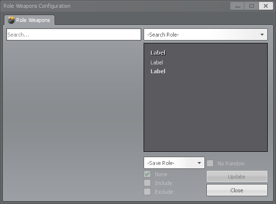

#### **Explanation**

This window was made to closely resemble the role equipment shop so parts of it should be fairly intuitive to use. For example: the search bar, the weapon list, and the weapon info panel are all directly copied from the weapon shop.

Apart from those familiar pieces, this window also adds a few more controls specifically for configuring the role weapons shops:
- *Search Role* - This dropdown in the top right of the window allows you to choose which role's shop to display and search through
- The bottom right of the window houses the controls for targeting and saving the configuration changes
  - *Save Role* - This dropdown allows you to choose which role you would update
  - *Weapon State Checkboxes* - These checkboxes allow you to change how a weapon behaves in the role's shop
    - *None* - Use the default buying configuration for the weapon
    - *Include* - Mark this weapon as explicitly buyable
    - *Exclude* - Mark this weapon as explicitly NOT buyable
  - *No Random* - Ensure this weapon stays in the shop, regardless of randomization
  - *Loadout* - Give this weapon to the target role for free each round
  - *Update* - Save the configuration changes
  - *Close* - This button will close the window, discarding any unsaved changes

#### **Example**

To help understand the functionality of this window it might be easier to walk through an example: we are going to find the Health Station (which we know the Detective can buy) and add it to the Veteran's shop. The Veteran gets a shop when they are activated, but only if weapons are actually available to them. This is where the role weapons system comes into play.

First things first: we open the window and select "Detective" from the "Search Roles" dropdown. From there we can either scroll through the list of weapons or use the search text box to search for "health". We then choose "Veteran" from the "Save Role" dropdown and click the "Include" checkbox. With all that done the window should look like this:

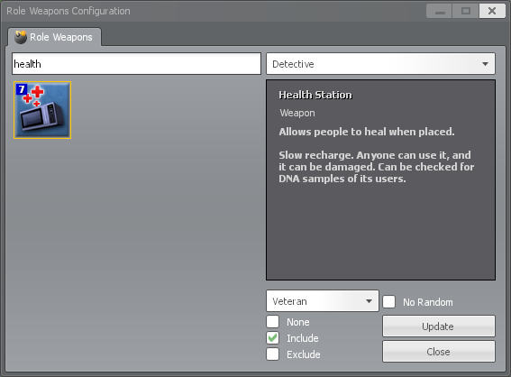

From here, the last step is to click the "Update" button and we're done -- The Veteran now has the ability to buy a Health Station.

### Configuration by Files

If you cannot or do not want to use the in-game UI to set up the role shop, it is also doable by manual file manipulation. This may be useful for server operators using Docker who want to have the configurations embedded in their server image. 

*NOTE*: Using the configuration UI still creates and deletes files in the backend. Given that, you can use the UI on your local game and then copy the files to a server or Docker image build as needed.

#### **Preparing a Role for Configuration**

Before a role's shop can be modified, the initial folder and file structure will need to be created. Follow the steps below to accomplish this:
1. If the _roleweapons_ folder does not already exist in garrysmod/data, create it.
1. If the there is no .json file for the role you want to modify, create an empty text file and rename it to be {rolename}.json. For example: _detective.json_
    1. Make sure the file extension is _.json_ and not _.json.txt_. By default, Windows hides known file extensions like .txt so be careful.
    1. Once the .json file is created, open it in a text editor (like Notepad++) and copy the following empty data structure into it: `{"Excludes":[],"Buyables":[],"NoRandoms":[],"Loadouts":[]}`

**NOTE**: The name of the role must be all lowercase for cross-operating system compatibility. For example: garrysmod/data/roleweapons/detective.json

#### **Weapons**

#### *Adding Weapons*

To add weapons to a role (that already has a shop), modify the garrysmod/data/roleweapons/{rolename}.json file (using a text editor like Notepad++) and add the class name of the weapon wrapped in double quotes (e.g. "weapon_ttt_somethingcool") to the `Buyables` array. For example, `{"Excludes":[],"Buyables":["weapon_ttt_somethingcool"],"NoRandoms":[],"Loadouts":[]}`

Also note the ttt_shop_* ConVars that are available above which can help control some of the role weapon shop lists.

#### *Removing Weapons*

At the same time, there are some workshop weapons that are given to multiple roles that maybe you don't want to be available to certain roles. In order to handle that case, the ability to exclude weapons from a role's weapon shop has been added.

To remove weapons from a role's shop, modify the garrysmod/data/roleweapons/{rolename}.json file (using a text editor like Notepad++) and add the class name of the weapon wrapped in double quotes (e.g. "weapon_ttt_somethingcool") to the `Excludes` array. For example, `{"Excludes":["weapon_ttt_somethingcool"],"Buyables":[],"NoRandoms":[],"Loadouts":[]}`

#### *Bypassing Weapon Randomization*

With the addition of the Shop Randomization feature (and the ttt_shop_random_* ConVars), weapons may not always appear in the shop (which is the point). If, however, you want certain weapons to _always_ be in the shop while other weapons are randomized, the ability to bypass shop randomization for a weapon in a role's weapon shop has been added.

To stop a weapon from being removed from a role's shop via randomization, modify the garrysmod/data/roleweapons/{rolename}.json file (using a text editor like Notepad++) and add the class name of the weapon wrapped in double quotes (e.g. "weapon_ttt_somethingcool") to the `NoRandoms` array. For example, `{"Excludes":[],"Buyables":[],"NoRandoms":["weapon_ttt_somethingcool"],"Loadouts":[]}`.

#### *Adding Weapons to a Role's Loadout*

You can also use the roleweapons system to add a weapon to a role's loadout, meaning they would get that weapon automatically at the beginning of each round.

To add a weapon to a role's loadout, modify the garrysmod/data/roleweapons/{rolename}.json file (using a text editor like Notepad++) and add the class name of the weapon wrapped in double quotes (e.g. "weapon_ttt_somethingcool") to the `Loadouts` array. For example, `{"Excludes":[],"Buyables":[],"NoRandoms":[],"Loadouts":["weapon_ttt_somethingcool"]}`.

#### *Finding a Weapon's Class*

To find the class name of a weapon to use above, follow the steps below
1. Start a local server with TTT as the selected gamemode
2. Spawn 1 bot by using the _bot_ command in console
3. Obtain the weapon whose class you want. If it is already available to buy from a certain role's shop, either force yourself to be that role via the _ttt\_force\_*_ commands or via a ULX plugin.
4. Run the following command in console to get a list of all of your weapon classes: `lua_run PrintTable(player.GetHumans()[1]:GetWeapons())`

#### **Equipment**

Equipment are items that a role can use that do not take up a weapon slot, such as the body armor or radar.

#### *Adding Equipment*

To add equipment items to a role (that already has a shop), modify the garrysmod/data/roleweapons/{rolename}.json file (using a text editor like Notepad++) and add the name of the equipment item wrapped in double quotes (e.g. "bruh bunker") to the `Buyables` array. For example, `{"Excludes":[],"Buyables":["bruh bunker"],"NoRandoms":[],"Loadouts":[]}`

#### *Removing Equipment*

Similarly there are some equipment items that you want to prevent a specific role from buying. To handle that case, the addon has the ability to exclude specific equipment items from the shop in a similar way.

To remove equipment from a role's shop, modify the garrysmod/data/roleweapons/{rolename}.json file (using a text editor like Notepad++) and add the name of the equipment item wrapped in double quotes (e.g. "bruh bunker") to the `Excludes` array. For example, `{"Excludes":["bruh bunker"],"Buyables":[],"NoRandoms":[],"Loadouts":[]}`

#### *Adding Equipment to a Role's Loadout*

You can also use the roleweapons system to add an equipment item to a role's loadout, meaning they would get that equipment item automatically at the beginning of each round.

To add a weapon to a role's loadout, modify the garrysmod/data/roleweapons/{rolename}.json file (using a text editor like Notepad++) and add the name of the equipment item wrapped in double quotes (e.g. "bruh bunker") to the `Loadouts` array. For example, `{"Excludes":[],"Buyables":[],"NoRandoms":[],"Loadouts":["bruh bunker"]}`.

#### *Finding an Equipment Item's Name*

To find the name of an equipment item to use above, follow the steps below
1. Start a local server with TTT as the selected gamemode
2. Spawn 1 bot by using the _bot_ command in console
3. Obtain the equipment item whose name you want. If it is already available to buy from a certain role's shop, either force yourself to be that role via the _ttt\_force\_*_ commands or via a ULX plugin.
4. Run the following command in console to get a full list of your equipment item names: `lua_run GetEquipmentItemById(EQUIP_RADAR); lua_run for id, e in pairs(EquipmentCache) do if player.GetHumans()[1]:HasEquipmentItem(id) then print(id .. " = " .. e.name) end end`

## Role Packs

Role packs are a new way of configuring roles, weapons, and additional ConVars all in one place. First and foremost, role packs give you much more control over how you want specific roles to spawn that our current system just can't handle. Want to always have a certain role spawn each round? Want multiple copies of some roles? Want to enable two different roles but never have them spawn together? Role packs will let you do all of this and way more!

On top of all this, role packs allow you to configure which weapons are available to specific roles in the shop, and any additional ConVars you might only want enabled in certain situations. These roles, weapons, and ConVars are bundled up into a role pack that you can enable or disable at any time, however only one role pack can be enabled at a time. Role packs are entirely optional, so if you don't enable any role packs you can still continue to play as you always have.

Role packs are created using the new UI, accessible by admins using the `ttt_rolepacks` command. Once a role pack has been created in the UI, it is saved as a folder of .json files in the *data/rolepacks* folder. Role packs can then be backed up or copied from server-to-server just by transferring those folders.

To enable a role pack, set the `ttt_role_pack` ConVar to the name role pack you want to use.

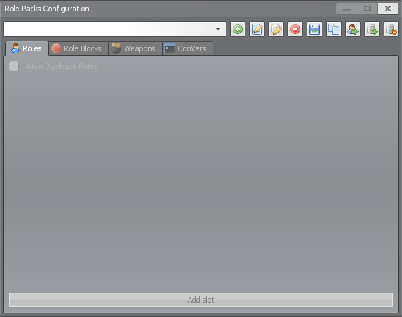

### Role Pack Overall

At the top of the role packs window are the overall controls that are available regardless of the selected tab. The components of this section of the window are:
1. **Role packs dropdown** - List of current role packs available on the server. Select an entry from the list to edit it.
1. **Add button** - Creates a new role pack when clicked, first prompting for the name of the role pack being created.
1. **Rename button** - Renames the currently selected role pack, prompting for the new name.
1. **Edit Details button** - Allows editing extra details such as the display name and description that are shown on the cheat sheet window.
1. **Delete button** - Deletes the currently selected role pack, prompting for confirmation.
1. **Save button** - Saves the changes made to the currently selected role pack.
1. **Save As button** - Saves the currently selected role pack and any unsaved changes as a new role pack with a new given name.
1. **Test Role Pack button** - Applies (but does *not* save) the currently selected role pack, fills the empty player slots on the server with bots, and restarts the round (if one is currently active).
1. **Apply to Server button** - Activates the currently selected role pack on the server.
1. **Disable Active Role Pack button** - Disables the current active role pack on the server.


### Role Pack Roles

The roles tab is where most configuration of the role pack will occur. On this tab, you can create role "slots" which represent a single player in the round. Within each slot you can configure a pool of 0 or more roles for that player to be randomly assigned from. If a slot has 0 roles assigned to it, the normal (e.g. non-role pack) random role selection logic will be used for that slot instead. Each role within a slot can also have a weight assigned to it, making that role more likely than the others to be selected.

#### Adding a new Role Slot

To add a new role slot, click the "Add Slot" button on the bottom of the tab.
One a slot has been added, you will be presented with three buttons:
1. **Add role button** - Adds a new role entry to the role slot
1. **Delete role button** - Deletes the last role entry in the role slot
1. **Delete slot button** - Deletes the entire role slot
1. **Duplicate slot button** - Duplicates the entire role slot

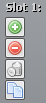

### Reordering Role Slots

To change the order of the role slots, click and hold the mouse down on the title (e.g. "Slot 2:") of the role slot you want to reorder and move your mouse to drag it around. While you're dragging the slot, a ghost (partially-opaque) version of it will appear to the left of the window. A pink line will show in the role slots list where the dragged slot will go when it is dropped. Release the mouse to drop the slot in the new location. 

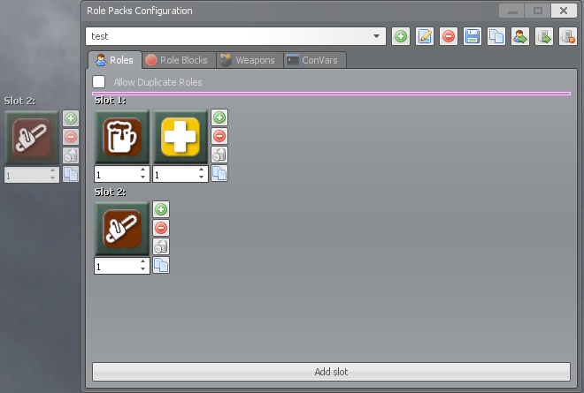

#### Configuring a Role Slot Role

When a new role entry has been added to a lot it defaults to the "NONE" or "?" role. When this placeholder role is along in a slot, behaves the same as if the slot was empty: The player in this slot will have their role randomly assigned by the normal role selection logic.

Two other things to note about the role slot usage:
1. If there are more slots than players (e.g., 8 configured slots but only 7 players) than the extra slot(s) will not be used.
1. If there are fewer slots than players (e.g., 6 configured slots but 7 players) than the extra player(s) will have their role randomly assigned by the normal role selection logic.

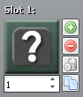

To change the role that the slot belongs to, click the role icon and select the new role from the dropdown.

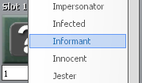

To change the weight of a role (how often this role should be selected relative to the other roles in this slot), change the number in the box below the role icon by typing or using the adjustment arrows.

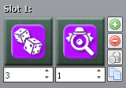

### Role Pack Role Blocks
This tab is nearly identical to the Role Blocks UI described in the [Role Blocks](#role-blocks) tutorial. The only differences are the "Use Default Role Blocks" checkbox and the ability for a role to block itself.

Checking the "Use Default Role Blocks" box will cause role blocks configured through the Role Blocks UI described in the [Role Blocks](#role-blocks) tutorial to also take effect on top of any that are added to this role pack. Leaving this box unchecked means only role blocks configured for this role pack will work.

When configuring role blocks for a role pack, it is also possible for a role to be able to block itself. This can be useful if you would like the same role to have the possibility to spawn in multiple slots without the possibility of having duplicates of that specific role. To do this, create a blocking group with only two copies of the same role. Having any other roles in the same blocking group will not work. In the example below it would not be possible for more than one Mercenary to spawn, even if there were multiple slots in which the Mercenary could spawn and "Allow Duplicate Roles" was enabled on the "Roles" tab.
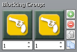

### Role Pack Weapons

This tab is nearly identical to the [Role Weapons UI](#configuration-by-ui) described above. The only differences are the removal of the "Update" and "Close" buttons (which are not needed in this UI), and the rename of the "None" checkbox to "Use Default". All of the functionality in this tab is identical to that in the role weapons UI, except it only takes effect when the specific role pack is enabled

### Role Pack ConVars

The ConVars tab allows you to specify configuration values to set only when the specified role pack is enabled. Add each ConVar on their own line along with the value you would like to set.

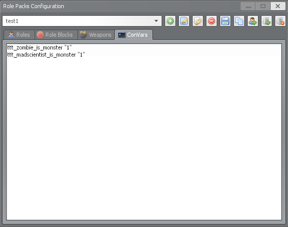

## Role Blocks
Role blocks let you prevent specific roles from spawning together in the same round. Previously this functionality was only available to a few select pairs of roles using ConVars such as `ttt_single_paramedic_hypnotist`, but these have been removed as role blocks can achieve everything these ConVars could, and more.

Role blocks are configured using the UI, accessible by admins using the `ttt_roleblocks` command. Role blocks are saved in the *data/rolepacks.json* file so that they can then be backed up or copied from server-to-server just by transferring that file. Once a role block is created and saved, it automatically takes effect.

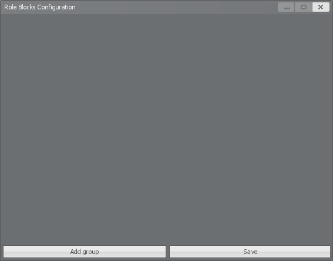

By default, your role blocks window should be mostly empty. (If you were previously using ConVars such as `ttt_single_paramedic_hypnotist` prior to Beta 2.1.4 or Release 2.3.0, you will see those options have already copied over.)

Here you will be able to create "blocking groups" which determine which roles cannot spawn together. Roles that are in the same blocking group will be unable to spawn together at the start of a round, but will still have the ability to appear later in the round through other means. (e.g. Marshal deputizing, Drunk sobering, etc.) Each role within a blocking group can have a weight assigned to it, making it more likely to block other roles in the same blocking group from spawning.

### Adding a new Blocking Group
To add a new role blocking group, start by clicking the "Add group" button. Once a group has been added, you will be presented with three buttons:\
- **Add role button** - Adds a new role entry to the blocking group
- **Delete role button** - Deletes the last role entry in the blocking group
- **Delete group button** - Deletes the entire blocking group
- **Duplicate group button** - Duplicates the entire blocking group

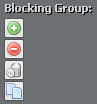

### Reordering Blocking Groups
To change the order of the blocking groups, click and hold the mouse down on the title (e.g. "Blocking Group:") of the blocking group you want to reorder and move your mouse to drag it around. While you're dragging the group, a ghost (partially-opaque) version of it will appear to the left of the window. A pink line will show in the blocking groups list where the dragged group will go when it is dropped. Release the mouse to drop the group in the new location. 

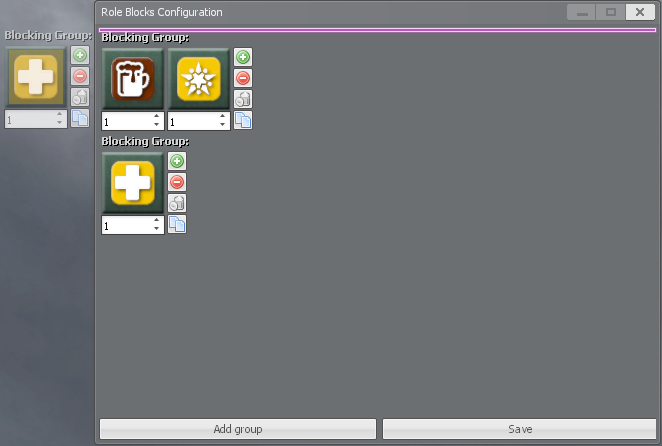

### Configuring a Blocking Group Role
When a new role entry has been added to a blocking group it defaults to the "NONE" or "?" role. When this placeholder role is alone in a blocking group, it behaves the same as if the blocking group was empty and will do nothing.\
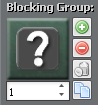

To change the role that the slot belongs to, click the role icon and select the new role from the dropdown.\
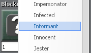

To change the weight of a role (how often this role should be selected relative to the other roles in this blocking group), change the number in the box below the role icon by typing or using the adjustment arrows.\
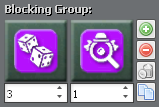

## Renaming Roles

If you would like to rename roles in game you can do so with specific ConVars. This effect works server side ONLY and will automatically network the role names with any clients playing on your server.\
To rename a role set the ConVar ttt_ROLENAME_name to whatever you would like that role to be called. (e.g. _ttt_quack_name "Death Doctor"_ will rename the Quack to the Death Doctor.)

**NOTE**: The game will try its best to automatically generate articles and plurals for any new names but it is not always successful. If this is the case you can use ttt_ROLENAME_name_article and ttt_ROLENAME_name_plural to manually fix this.
* Setting the Old Man's name to "Old Woman" will show "Old Womans" as the plural form by default. Setting _ttt_oldman_name_plural_ to "Old Women" will fix this.
* Setting the Innocent's name to "Honest Man" will show "a Honest Man" with "a" as the article by default. Setting _ttt_innocent_name_article_ to "an" will fix this and properly show "an Honest Man".
