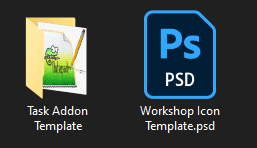
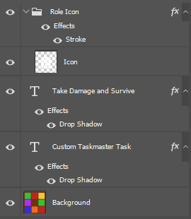
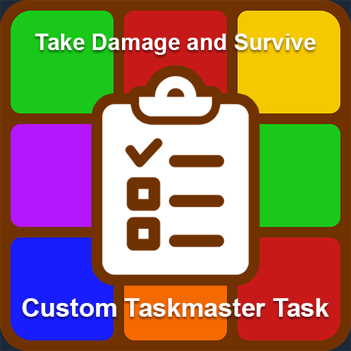

# Creating Your Own Custom Task for the Taskmaster

## Table of Contents
1. [Before You Start](#Before-You-Start)
1. [Code](#Code)
   1. [Task Table](#Task-Table)
   1. [Task Properties](#Task-Properties)
   1. [Name](#Name)
   1. [Description](#Description)
   1. [Initialize](#Initialize)
   1. [Server-Side](#Server-Side)
        1. [CanAssignTask](#CanAssignTask)
        1. [RequiredFeatures](#RequiredFeatures)
        1. [OnTaskAssigned](#OnTaskAssigned)
        1. [OnTaskRemoved](#OnTaskRemoved)
        1. [OnTaskComplete](#OnTaskComplete)
   1. [Task Registration](#Task-Registration)
   1. [Example File](#Example-File)
1. [Uploading Your Addon](#Uploading-Your-Addon)
   1. [addon.json](#addonjson)
   1. [Workshop Icon](#Workshop-Icon)
   1. [Folder Name](#Folder-Name)
   1. [Final Checks](#Final-Checks)
   1. [Uploading](#Uploading)
1. [Wrapping Up](#Wrapping-Up)

## Before You Start
In order to create your own tasks you will need to make sure you have downloaded tools to edit the following file types:

- **.psd** - For this guide we will be using Photoshop but [GIMP](https://www.gimp.org/) is a great free alternative.
- **.lua** - This can be done in Notepad in a pinch but at the very least we would recommend [Notepad++](https://notepad-plus-plus.org/).

In this guide we will be walking through how to make a basic task and you can download all the templates we are using [here](/templates/taskmaster).

Last thing to do before you are ready to get started is to unzip that file which should give you 1 .psd file and a folder like this:



## Code
Open up 'Task Addon Template' > 'lua' > 'taskmastertasks' and rename '%TASKNAME%.lua' to whatever you want the name of your task to be. In this case we will be creating a task to have a player take damage and survive, so we'll rename it to 'takedamage.lua'.

Open up that file and you should see something like this:

```lua
local TASK = {}

TASK.id = ""
TASK.IsKillTask = false
TASK.CompleteOnRoundEnd = false

TASK.Name = function(ply)
    return ""
end

TASK.Description = function(ply)
    return ""
end

TASK.Initialize = function()
end

if SERVER then
    TASK.CanAssignTask = function(ply)
        return true
    end

    TASK.RequiredFeatures = {}

    TASK.OnTaskAssigned = function(ply)
    end

    TASK.OnTaskRemoved = function(ply)
    end

    TASK.OnTaskComplete = function(ply)
    end
end

TASKMASTER.RegisterTask(TASK)
```

Lets break that down piece by piece.

### Task Table
First we have this line here:

```lua
local TASK = {}
```

You don't need to touch this line. The TASK table will store everything CR for TTT needs to understand your task.

### Task Properties
The next chunk here is all about the properties of your task:

```lua
TASK.id = ""  
TASK.IsKillTask = false
TASK.CompleteOnRoundEnd = false
```

`id` is the unique identifier for the task and is used to create the the necessary ConVars for the task. It should only contain lowercase characters a-z, without spaces or punctuation.

`IsKillTask` marks this task as to whether this task requires the Taskmaster to kill another player themselves.

`CompleteOnRoundEnd` determines whether this task automatically completes when the round ends. Tasks with this set will not stop the round from ending to give the Taskmaster additional time to complete their tasks (if it is configured to do so).

For our task that block of code will now look like this.

```lua
TASK.id = "takedamage"
TASK.IsKillTask = false
TASK.CompleteOnRoundEnd = false
```

### Name
The first function in the task file is defining the task's name. This is shown in multiple places in the Taskmaster's UI and is generally used as a quick way of tracking task progress.

For the task we are creating, we'll start with a basic name and update it with progress later. For now, it should look something like this:

```lua
TASK.Name = function(ply)
    return "Take Damage and Survive"
end
```

### Description
The next function cares about the description of your task that shows up on the Taskmaster's UI. The description should give information on how the complete the task. Try to keep the length of the description under 75 characters so it doesn't take up too much space.

The description, much like the task, will start out with a basic sentence and will be updated with progress and more info later. Let's start with just this:

```lua
TASK.Description = function(ply)
    return "Get another player to deal damage to you and survive"
end
```

### Initialize
This function is used to set up code for the task that needs to run before it has been assigned. The most common usage for this function is creating translation strings on the client side for use in UI displays.

At this point we're not using an UIs so we'll just leave this empty for now:

```lua
TASK.Initialize = function()
end
```

### Server-Side
The next group of lines only run in server-side code, so they are defined within a `if SERVER then` block:

```lua
if SERVER then
    TASK.CanAssignTask = function(ply)
        return true
    end

    TASK.RequiredFeatures = {}

    TASK.OnTaskAssigned = function(ply)
    end

    TASK.OnTaskRemoved = function(ply)
    end

    TASK.OnTaskComplete = function(ply)
    end
end
```

#### CanAssignTask
The first function is used to determine whether our task can be be assigned to the target player. Some examples of things that could be checked for is the presence of a particular role in the round, the number of living players, or whether the current map has the correct features (props, traitor traps, etc.).

This task does not have any restrictions, so we'll just leave it as-is:

```lua
TASK.CanAssignTask = function(ply)
    return true
end
```

#### RequiredFeatures
The `TASK.RequiredFeatures` property represents a table of values indicating which shared task features are being used by this task. Only one task with a specific feature can be active at any given time so this table is used by the task assignment logic to accomplish that.

See below for the current supported features:
| Option                             | Description                                                             | Added in |
|------------------------------------|-------------------------------------------------------------------------|----------|
| `TASKMASTER_TF_TARGETID_PLAYERICON`| This task adds an icon over the head of a targeted player               | 2.3.5    |
| `TASKMASTER_TF_TARGETID_PLAYERTEXT`| This task adds text to the mouseover text of a targeted player          | 2.3.5    |
| `TASKMASTER_TF_PROGRESSBAR`        | This task displays a progress bar on the player's screen                | 2.3.5    |
| `TASKMASTER_TF_PARTICLERADIUS`     | This task draws a radius around some entity or location using particles | 2.3.5    |

For now we are not using any features so we'll leave this empty:

```lua
TASK.RequiredFeatures = {}
```

#### OnTaskAssigned
The majority of the logic for a task is set up in this function, called when this task is assigned to a particular player. This method is often used for setting up hooks and timers which track progress and handle task completion.

As mentioned earlier, this task is for a player to take damage and then survive some number of seconds. With that in mind, our logic can be split into this parts:
1. Keep track of when this player takes damage
1. If the player is still alive after some number of seconds, mark the task as complete

To accomplish this, we will be adding a hook to track damage to this player and a timer to track survival time. Be sure to name the hook with the player's Steam ID so it is unique across different players (just in case):

```lua
TASK.OnTaskAssigned = function(ply)
    timer.Create("TTTTaskmasterTakeDamageTimer_" .. ply:SteamID64(), 0.1, 0, function()
        if not IsPlayer(ply) then return end
        if not ply:Alive() or ply:IsSpec() then return end
    end)

    hook.Add("PostEntityTakeDamage", "Taskmaster_TakeDamage_PostEntityTakeDamage_" .. ply:SteamID64(), function(entity, dmginfo, wasDamageTaken)
        if not wasDamageTaken then return end
        if entity ~= ply then return end

        local attacker = dmginfo:GetAttacker()
        if not IsPlayer(attacker) or attacker == entity then return end
    end)
end
```

We need to know how long they have survived so we will also be tracking when that damage occurred using the [SYNC](./API/METHODS_SYNC.md) system.

```lua
TASK.OnTaskAssigned = function(ply)
    local time = 30
    timer.Create("TTTTaskmasterTakeDamageTimer_" .. ply:SteamID64(), 0.1, 0, function()
        if not IsPlayer(ply) then return end
        if not ply:Alive() or ply:IsSpec() then return end
        if not ply.Task_TakeDamageStart then return end
        if CurTime() <= ply.Task_TakeDamageStart + time then return end

        ply:CompleteTask(TASK.id)
    end)

    hook.Add("PostEntityTakeDamage", "Taskmaster_TakeDamage_PostEntityTakeDamage_" .. ply:SteamID64(), function(entity, dmginfo, wasDamageTaken)
        if not wasDamageTaken then return end
        if entity ~= ply then return end

        local attacker = dmginfo:GetAttacker()
        if not IsPlayer(attacker) or attacker == entity then return end

        ply:SetProperty("Task_TakeDamageStart", CurTime(), ply)
    end)
end
```

Now that we have the basics of the logic in place, let's make the survival time configurable instead of a hardcoded 30 seconds. To do that we'll create a ConVar and then we can use it in the timer as well as our `TASK.Name` and `TASK.Description` functions from before.

First things first, we'll create the ConVar and add it to the Taskmaster's ConVars table to show on ULX. Back toward the top of the file, we'll add these lines:

```lua
local taskmaster_takedamage_time = CreateConVar("ttt_taskmaster_takedamage_time", "60", FCVAR_REPLICATED, "The time (in seconds) a player must survive without taking further damage to complete the 'Take Damage' task", 1, 240)
table.insert(ROLE_CONVARS[ROLE_TASKMASTER], {
    cvar = "ttt_taskmaster_takedamage_time",
    type = ROLE_CONVAR_TYPE_NUM,
    decimal = 0
})
```

Note how the ConVar has the ID of the task in it, to differentiate between the possible tasks.

Now that the ConVar exists, let's update the `TASK.Name` and `TASK.Description` functions to use it. The `TASK.Name` function will be a little bit more complicated because we're also going to add progress tracking:

```lua
TASK.Name = function(ply)
    local name = "Take Damage and Survive"

    -- If this function is being used without a player (like in the tutorial screen, for example) don't show progress
    if not ply then return name end

    local time = taskmaster_takedamage_time:GetInt()
    local progress = 0
    -- If this task is already completed, just show the total time instead of "0/30" in case the tracking variable is cleared
    if table.HasValue(ply.TaskmasterCompletedTasks, TASK.id) then
        progress = time
    else
        -- If we have a start time saved, use that to determine the total progress
        local startTime = ply.Task_TakeDamageStart
        if startTime then
            progress = math.floor(math.max(0, CurTime() - startTime))
        end
    end

    return name .. " (" .. progress .. "/" .. time .. ")"
end

TASK.Description = function(ply)
    local time = taskmaster_takedamage_time:GetInt()
    local desc = "Get another player to deal damage to you and survive for " .. time .. " second"
    if time ~= 1 then
        desc = desc .. "s"
    end
    return desc
end
```

And of course, we should update the timer to use the ConVar for tracking survival length as well:

```lua
local time = taskmaster_takedamage_time:GetInt()
timer.Create("TTTTaskmasterTakeDamageTimer_" .. ply:SteamID64(), 0.1, 0, function()
    if not IsPlayer(ply) then return end
    if not ply:Alive() or ply:IsSpec() then return end
    if not ply.Task_TakeDamageStart then return end
    if CurTime() <= ply.Task_TakeDamageStart + time then return end

    ply:CompleteTask(TASK.id)
end)
```
A nice quality-of-life feature would be to show the player a progress bar of how much longer they need to survive, so we'll add that too. Since the progress bar is a shared feature, we first need to update `TASK.RequiredFeatures`:

```lua
TASK.RequiredFeatures = {
    TASKMASTER_TF_PROGRESSBAR
}
```

The progress bar itself has to be handled in the client logic, so we'll want to set up a `net` message to tell the client to start doing that and call it inside `TASK.OnTaskAssigned`.
```lua
if SERVER then
    util.AddNetworkString("TTT_Taskmaster_TakeDamage_Assigned")

    TASK.OnTaskAssigned = function(ply)
        local time = taskmaster_takedamage_time:GetInt()
        timer.Create("TTTTaskmasterTakeDamageTimer_" .. ply:SteamID64(), 0.1, 0, function()
            if not IsPlayer(ply) then return end
            if not ply:Alive() or ply:IsSpec() then return end
            if not ply.Task_TakeDamageStart then return end
            if CurTime() <= ply.Task_TakeDamageStart + time then return end

            ply:CompleteTask(TASK.id)
        end)

        hook.Add("PostEntityTakeDamage", "Taskmaster_TakeDamage_PostEntityTakeDamage_" .. ply:SteamID64(), function(entity, dmginfo, wasDamageTaken)
            if not wasDamageTaken then return end
            if entity ~= ply then return end

            local attacker = dmginfo:GetAttacker()
            if not IsPlayer(attacker) or attacker == entity then return end

            ply:SetProperty("Task_TakeDamageStart", CurTime(), ply)
        end)

        net.Start("TTT_Taskmaster_TakeDamage_Assigned")
        net.Send(ply)
    end
end
```

In the client code, we need to receive the `net` message and add a hook to show the UI elements. We also need to modify the `TASK.Initialize` function to add a translation to show on the UI inside client code. Something like this:

```lua
TASK.Initialize = function()
    if CLIENT then
        LANG.AddToLanguage("english", "taskmaster_takedamage", "AVOID DAMAGE - {time}")
    end
end

if CLIENT then
    net.Receive("TTT_Taskmaster_TakeDamage_Assigned", function()
        local client = LocalPlayer()
        local time = taskmaster_takedamage_time:GetInt()

        hook.Add("HUDPaint", "Taskmaster_TakeDamage_HUDPaint_" .. client:SteamID64(), function()
            if not client:IsActiveTaskmaster() then return end

            local startTime = client.Task_TakeDamageStart
            if not startTime then return end

            local PT = LANG.GetParamTranslation
            local elapsed = math.max(0, CurTime() - startTime)
            local remaining = time - elapsed
            local message = PT("taskmaster_takedamage", { time = util.SimpleTime(remaining, "%02i:%02i") })
            local color = Color(0, 255, 0, 155)

            local x = ScrW() / 2.0
            local y = ScrH() / 2.0
            y = y + (y / 3)

            local w = 300
            local progress = elapsed / time

            CRHUD:PaintProgressBar(x, y, w, color, message, progress)
        end)
    end)
end
```

With that, our main logic for the task is done! We just have to clean things up, and that's where the next two functions come into play.

#### OnTaskRemoved
This function is called when a task is removed, whether it's from the round ending, a player's role changing, or that player rerolling a task. It is used to stop any timers, remove any hooks, and cleanup and tracking variables that were used.

In the case of this task, we have a timer, a hook, a tracking variable, and some client code that also needs to be cleaned up so we'll be sending another `net` message. All told, that looks something like this:

```lua
if SERVER then
    util.AddNetworkString("TTT_Taskmaster_TakeDamage_Cleanup")

    TASK.OnTaskRemoved = function(ply)
        timer.Remove("TTTTaskmasterTakeDamageTimer_" .. ply:SteamID64())

        hook.Remove("PostEntityTakeDamage", "Taskmaster_TakeDamage_PostEntityTakeDamage_" .. ply:SteamID64())

        ply:ClearProperty("Task_TakeDamageStart", ply)

        net.Start("TTT_Taskmaster_TakeDamage_Cleanup")
        net.Send(ply)
    end
end

if CLIENT then
    net.Receive("TTT_Taskmaster_TakeDamage_Cleanup", function()
        local client = LocalPlayer()
        hook.Remove("HUDPaint", "Taskmaster_TakeDamage_HUDPaint_" .. client:SteamID64())
    end)
end
```

#### OnTaskComplete
As compared to `TASK.OnTaskRemoved`, this function is called when a task has been completed successfully. In a majority of cases the logic when a task is complete will be the same as when it is removed so you can just piggy-back on `TASK.OnTaskRemoved` like this:

```lua
if SERVER then
    TASK.OnTaskComplete = TASK.OnTaskRemoved
end
```

### Task Registration
The last line simply tells CR for TTT to register your task and passes through all the relevant information. You do not need to edit this line. CR for TTT automatically creates an "enabled" convar for your task in the form of `ttt_taskmaster_%TASKNAME%_enabled`.

```lua
TASKMASTER.RegisterTask(TASK)
```

### Example File
Once you have done that you are finished with coding. You can close your file and move on to creating your workshop icon. One last time before moving on to that, here is the full `takedamage.lua` file for reference after some consolidation and cleanup:

```lua
local TASK = {}

TASK.id = "takedamage"
TASK.IsKillTask = false
TASK.CompleteOnRoundEnd = false

local taskmaster_takedamage_time = CreateConVar("ttt_taskmaster_takedamage_time", "60", FCVAR_REPLICATED, "The time (in seconds) a player must survive without taking further damage to complete the 'Take Damage' task", 1, 240)
table.insert(ROLE_CONVARS[ROLE_TASKMASTER], {
    cvar = "ttt_taskmaster_takedamage_time",
    type = ROLE_CONVAR_TYPE_NUM,
    decimal = 0
})

TASK.Name = function(ply)
    local name = "Take Damage and Survive"

    -- If this function is being used without a player (like in the tutorial screen, for example) don't show progress
    if not ply then return name end

    local time = taskmaster_takedamage_time:GetInt()
    local progress = 0
    -- If this task is already completed, just show the total time instead of "0/30" in case the tracking variable is cleared
    if table.HasValue(ply.TaskmasterCompletedTasks, TASK.id) then
        progress = time
    else
        -- If we have a start time saved, use that to determine the total progress
        local startTime = ply.Task_TakeDamageStart
        if startTime then
            progress = math.floor(math.max(0, CurTime() - startTime))
        end
    end

    return name .. " (" .. progress .. "/" .. time .. ")"
end

TASK.Description = function(ply)
    local time = taskmaster_takedamage_time:GetInt()
    local desc = "Get another player to deal damage to you and survive for " .. time .. " second"
    if time ~= 1 then
        desc = desc .. "s"
    end
    return desc
end

TASK.Initialize = function()
    if CLIENT then
        LANG.AddToLanguage("english", "taskmaster_takedamage", "AVOID DAMAGE - {time}")
    end
end

if SERVER then
    util.AddNetworkString("TTT_Taskmaster_TakeDamage_Assigned")
    util.AddNetworkString("TTT_Taskmaster_TakeDamage_Cleanup")

    TASK.CanAssignTask = function(ply)
        return true
    end

    TASK.RequiredFeatures = {
        TASKMASTER_TF_PROGRESSBAR
    }

    TASK.OnTaskAssigned = function(ply)
        local time = taskmaster_takedamage_time:GetInt()
        timer.Create("TTTTaskmasterTakeDamageTimer_" .. ply:SteamID64(), 0.1, 0, function()
            if not IsPlayer(ply) then return end
            if not ply:Alive() or ply:IsSpec() then return end
            if not ply.Task_TakeDamageStart then return end
            if CurTime() <= ply.Task_TakeDamageStart + time then return end

            ply:CompleteTask(TASK.id)
        end)

        hook.Add("PostEntityTakeDamage", "Taskmaster_TakeDamage_PostEntityTakeDamage_" .. ply:SteamID64(), function(entity, dmginfo, wasDamageTaken)
            if not wasDamageTaken then return end
            if entity ~= ply then return end

            local attacker = dmginfo:GetAttacker()
            if not IsPlayer(attacker) or attacker == entity then return end

            ply:SetProperty("Task_TakeDamageStart", CurTime(), ply)
        end)

        net.Start("TTT_Taskmaster_TakeDamage_Assigned")
        net.Send(ply)
    end

    TASK.OnTaskRemoved = function(ply)
        timer.Remove("TTTTaskmasterTakeDamageTimer_" .. ply:SteamID64())

        hook.Remove("PostEntityTakeDamage", "Taskmaster_TakeDamage_PostEntityTakeDamage_" .. ply:SteamID64())

        ply:ClearProperty("Task_TakeDamageStart", ply)

        net.Start("TTT_Taskmaster_TakeDamage_Cleanup")
        net.Send(ply)
    end

    TASK.OnTaskComplete = TASK.OnTaskRemoved
end

if CLIENT then
    net.Receive("TTT_Taskmaster_TakeDamage_Assigned", function()
        local client = LocalPlayer()
        local time = taskmaster_takedamage_time:GetInt()

        hook.Add("HUDPaint", "Taskmaster_TakeDamage_HUDPaint_" .. client:SteamID64(), function()
            if not client:IsActiveTaskmaster() then return end

            local startTime = client.Task_TakeDamageStart
            if not startTime then return end

            local PT = LANG.GetParamTranslation
            local elapsed = math.max(0, CurTime() - startTime)
            local remaining = time - elapsed
            local message = PT("taskmaster_takedamage", { time = util.SimpleTime(remaining, "%02i:%02i") })
            local color = Color(0, 255, 0, 155)

            local x = ScrW() / 2.0
            local y = ScrH() / 2.0
            y = y + (y / 3)

            local w = 300
            local progress = elapsed / time

            CRHUD:PaintProgressBar(x, y, w, color, message, progress)
        end)
    end)

    net.Receive("TTT_Taskmaster_TakeDamage_Cleanup", function()
        local client = LocalPlayer()
        hook.Remove("HUDPaint", "Taskmaster_TakeDamage_HUDPaint_" .. client:SteamID64())
    end)
end

TASKMASTER.RegisterTask(TASK)
```

## Uploading Your Addon
Your task is almost ready to go! The last thing you need to do is upload your addon to the steam workshop. Before you can do that there are 2 more files you need to make: 'addon.json' and your workshop icon.
addon.json

'addon.json' is found inside the 'Task Addon Template' folder. Open it up and set `%TASKNAME%` to whatever the name of your role is.

For example 'addon.json' for the Summoner role looks like this:
```
{
  "title": "'Take Damage and Survive' Task for Taskmaster (CR for TTT)",
  "type": "ServerContent",
  "ignore": []
}
```       

### Workshop Icon
Now is the time to open the last template. This step is completely optional, you can use whatever workshop icon you want! However, if you want to keep it consistent with CR for TTT roles and related addons open up 'Workshop Icon Template.psd'.

The icon is already set up to have the Taskmaster icon and team color set, so all you have to do is add text with your task name.

In the case of the task we're working on it will look something like this:  


Once you have done that you are ready to hit save. You want to put your icon in the same folder as 'Task Addon Template', not inside it! Steam workshop needs the icon file to be a .jpg so make sure you save it as the right format.

Here is my finalised 'TakeDamageTask.jpg':  


### Folder Name
While we are at it now is a good time to rename 'Task Addon Template' because it's not a template anymore, it's yours! Name it the same thing as whatever you named your workshop icon.

Before you get to uploading now is a great time to test your addon. In Steam right click on Garry's Mod and click 'Manage' > 'Browse local files'. A folder should open up which contains your GMod files. Open 'garrysmod' > 'addons' and paste the folder you just renamed in here. When you next boot up GMod your addon should load and you can test it out before uploading to the workshop.
Final Checks

Before you upload your addon, now is a great time to check that your file structure is all correct! For reference here is the file structure of my completed task addon:
```
├─ TakeDamageTask.jpg
└─ TakeDamageTask
   ├─ addon.json
   └─ lua
      └─ taskmastertasks
         └─ takedamage.lua
```

### Uploading
Now you are ready to upload your addon. In Steam right click on Garry's Mod and click 'Manage' > 'Browse local files'. A folder should open up which contains your GMod files. Open 'bin' and you should see a file called 'gmad.exe'. Drag and drop your addon folder onto 'gmad.exe'. You should see a new file appear next to your addon folder. It should have the same name as your folder but with the file extension '.gma'. In my case we now have a new file called 'TakeDamageTask.gma'.

Go back to the same folder where you found 'gmad.exe'. Click on the address bar up the top and type 'cmd'. This should open up the command prompt where you need to type this command to upload your addon.
```
gmpublish.exe create -addon %PATHTOGMA% -icon %PATHTOJPG%
```

Replace %PATHTOGMA% and %PATHTOJPG% with the file paths to your .gma addon file and .jpg workshop icon respectively.

For my Summoner addon it looks like this:
```
gmpublish.exe create -addon "C:\Development\GMod\TakeDamageTask.gma" -icon "C:\Development\GMod\TakeDamageTask.jpg"
```

Hit enter and you should see your addon upload to Steam! Once it is done you can view your addon by opening steam, hovering over your name up the top and clicking 'Content'. Click the 'Workshop Items' tab and your addon should be there! Here you can give your addon a description and then change its visibility to public. (Note: If you ever need to update a pre-existing addon you can read how to do that here.)

Once you have made your addon public, we would love to hear about it! Jump into [our discord server](https://discord.gg/BAPZrykC3F) and show us what you have made!

## Wrapping Up
If you have any problems or questions please jump into the [Custom Roles for TTT Discord Server](https://discord.gg/BAPZrykC3F)! We love to see what everyone has making and there are almost always people online willing to help out if you need a hand.