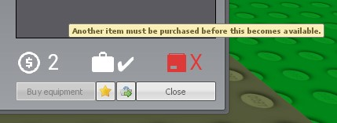

# Creating a Custom Weapon

## Table of Contents
1. [Creating a Custom Weapon](#Creating-a-Custom-Weapon)
1. [Custom SWEP Properties](#Custom-SWEP-Properties)
   1. [Required Items](#Required-Items)

## Creating a Custom Weapon
This tutorial will not go in-depth on how to create custom weapons in general, for that please see the official TTT SWEP tutorial [here](https://www.troubleinterroristtown.com/development/sweps/).

## Custom SWEP Properties
While created SWEPs do not need anything special to be compatible with Custom Roles for TTT, there are properties that we have added that can be used to integrate with or change the behavior of how SWEPs interact with Custom Roles for TTT features.\
The custom and modified default SWEP properties are defined in our API, [here](./API/SWEPS.md).\
A majority of the properties do not require more explanation than what's in the API documentation. For the properties that are more in-depth, see below for a tutorial of their usage:

### Required Items
This added property (`SWEP.RequiredItems` for SWEPs and `req` for equipment) allows weapon and equipment developers to set other weapons and equipment as being required. That means this weapon or equipment cannot be purchased if the player does not own the required items first.\
This value of this property can be a weapon class name, an equipment ID, or a table containing weapon class names and equipment IDs. See below for examples:

```lua
-- Add the Mad Scientist's Death Radar, and make it dependent on the normal Radar
table.insert(EquipmentItems[ROLE_MADSCIENTIST], {
    id = EQUIP_MAD_DEATHRADAR,
    type = "item_active",
    material = "vgui/ttt/icon_death_radar",
    name = "item_death_radar",
    desc = "item_death_radar_desc",
    req = { EQUIP_RADAR } -- Make the Death Radar dependent on  the normal radar
})

-- Set up a SWEP requiring binoculars and body armor
SWEP.RequiredItems = { "weapon_ttt_binoculars", EQUIP_ARMOR }
```

We recommend listing the weapon's required items in its description to make it easier for the player to know what they need to buy. When a shop item's requirements are not met, the following will show to let the player know:\
